# SmartCS-Agent 项目深度分析报告

> **分析日期**: 2026-08-08 | **版本**: 1.0 | **许可**: MIT

---

## 目录

1. [项目概述](#1-项目概述)
2. [技术栈全景分析](#2-技术栈全景分析)
3. [系统架构设计](#3-系统架构设计)
4. [核心模块详解](#4-核心模块详解)
5. [系统运行流程](#5-系统运行流程)
6. [设计模式应用](#6-设计模式应用)
7. [数据流转](#7-数据流转)
8. [项目亮点深度分析](#8-项目亮点深度分析)
9. [项目优点](#9-项目优点)
10. [项目缺点与改进建议](#10-项目缺点与改进建议)
11. [部署架构](#11-部署架构)
12. [综合评价](#12-综合评价)

---

## 1. 项目概述

SmartCS-Agent 是一个**基于 FastAPI + LangGraph + Neo4j 的智能电商客服系统**，深度集成了 Microsoft GraphRAG 知识检索、Text2Cypher 知识图谱查询、语义缓存、多轮对话管理等功能。项目面向智能家居电商场景，内置 10 款产品知识文档、1,800 条电商 FAQ 和 2,600+ 条真实客服对话数据。

**核心能力**: 5 路智能意图路由 → 多工具编排 → 混合检索 → 幻觉检测 → 流式响应

---

## 2. 技术栈全景分析

### 2.1 技术栈总览

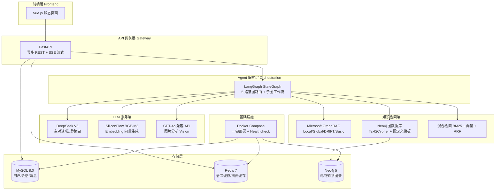

### 2.2 详细技术清单

| 层次 | 技术 | 版本 | 职责 |
|------|------|------|------|
| **后端框架** | FastAPI | 0.100+ | REST API，原生 async/await，SSE 流式响应 |
| **Agent 编排** | LangGraph | latest | StateGraph 多路由 Agent，checkpointer 会话持久化 |
| **LLM 基座** | DeepSeek API | V3 | 对话生成、意图路由、推理、Cypher 校验 |
| **本地 LLM** | Ollama | - | 可切换的本地 LLM 替代方案 |
| **知识图谱** | Neo4j | 5 Community | 电商数据（商品/订单/客户），APOC 插件 |
| **文档检索** | Microsoft GraphRAG | latest | 文档索引，4 种检索策略（Local/Global/DRIFT/Basic） |
| **Embedding** | SiliconFlow BAAI/bge-m3 | - | 语义向量生成，免费 API |
| **本地 Embedding** | sentence-transformers | paraphrase-multilingual-MiniLM-L12-v2 | 混合检索的本地向量编码 |
| **向量缓存** | Redis | 7 Alpine | 语义缓存（余弦相似度 ≥ 0.90 命中） |
| **关系数据库** | MySQL | 8.0 | 用户、会话、消息持久化 |
| **LLM SDK** | OpenAI SDK (AsyncOpenAI) | - | 兼容 DeepSeek API |
| **LangChain** | langchain-core/deepseek/ollama | - | LLM 抽象层，结构化输出 |
| **前端** | Vue | 编译静态 dist | 聊天 UI 界面（非主要重点） |
| **部署** | Docker + Docker Compose | - | 4 服务（MySQL/Redis/Neo4j/App）一键编排 |
| **搜索** | SerpAPI | - | Function Calling 联网搜索 |
| **图片处理** | Pillow (PIL) | - | 上传图片压缩/格式转换 |
| **异步 HTTP** | aiohttp | - | 视觉 API 异步调用 |

---

## 3. 系统架构设计

### 3.1 整体架构图

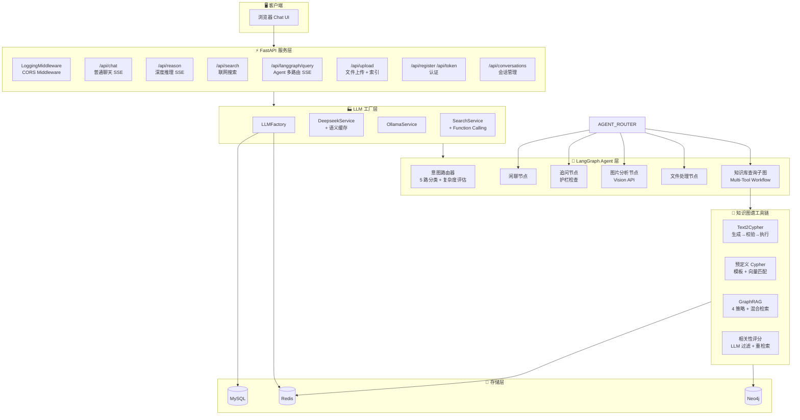

### 3.2 项目目录结构

```
SmartCS-Agent/
├── llm_backend/                          # 后端主目录
│   ├── main.py                           # FastAPI 入口，所有 API 端点定义
│   ├── run.py                            # 服务启动脚本
│   └── app/
│       ├── core/                         # 核心配置层
│       │   ├── config.py                 # Pydantic Settings 配置（环境变量映射）
│       │   ├── database.py              # MySQL 异步连接（aiomysql）
│       │   ├── security.py              # JWT 认证
│       │   ├── hashing.py               # 密码哈希
│       │   ├── logger.py                # 结构化日志
│       │   └── middleware.py            # 请求日志中间件
│       ├── api/
│       │   └── auth.py                  # 认证路由（注册/登录）
│       ├── services/                     # 业务服务层
│       │   ├── llm_factory.py           # LLM 工厂模式
│       │   ├── deepseek_service.py      # DeepSeek + 语义缓存
│       │   ├── ollama_service.py        # Ollama 备选
│       │   ├── search_service.py        # SerpAPI 联网搜索
│       │   ├── redis_semantic_cache.py  # Redis 语义缓存
│       │   ├── conversation_service.py  # 会话 CRUD
│       │   └── indexing_service.py      # GraphRAG 索引构建
│       ├── lg_agent/                     # LangGraph Agent 层
│       │   ├── lg_builder.py            # StateGraph 构建 + 路由 + 5 节点
│       │   ├── lg_states.py             # 状态定义（Router/AgentState）
│       │   ├── lg_prompts.py            # 15+ 提示词模板
│       │   └── kg_sub_graph/            # 知识图谱子图
│       │       ├── kg_tools_list.py     # 工具 Schema 定义
│       │       └── agentic_rag_agents/
│       │           ├── workflows/       # 多工具工作流
│       │           └── components/
│       │               ├── cypher_tools/     # Text2Cypher 生成/校验/执行
│       │               ├── predefined_cypher/ # 预定义模板匹配
│       │               ├── customer_tools/   # GraphRAG 查询 + 混合检索
│       │               ├── hybrid_retrieval/ # BM25 + 向量 + RRF 融合
│       │               ├── relevance_grader.py   # LLM 相关性评分
│       │               ├── memory/         # 三层记忆管理器
│       │               ├── agent_safety/   # 护栏（Scope/Budget/Timeout/Hallucination）
│       │               ├── query_rewriting/# 查询预处理管道
│       │               ├── guardrails/     # 业务边界护栏
│       │               ├── planner/        # 任务分解
│       │               └── tool_selection/ # 工具选择
│       ├── graphrag/                   # Microsoft GraphRAG 源码
│       ├── models/                     # SQLAlchemy 模型
│       │   ├── conversation.py
│       │   ├── message.py
│       │   └── user.py
│       ├── prompts/                    # 搜索提示词
│       ├── tools/                      # 搜索工具定义
│       └── static/dist/               # Vue 前端编译输出
├── scripts/                           # 工具脚本
│   ├── init_db.py                     # 数据库初始化
│   ├── build_graphrag_index.py        # 手动构建 GraphRAG 索引
│   ├── generate_product_knowledge.py  # CSV → 产品知识文档
│   ├── download_datasets.py           # 下载电商 FAQ 数据集
│   └── download_jddc.py              # 下载 JDDC 对话数据集
├── chat.html                          # 独立聊天页面
├── docker-compose.yml                 # 4 服务编排
├── Dockerfile                         # Python 3.11-slim 镜像
├── requirements.txt                   # Python 依赖
├── .env.example                       # 环境变量模板（34 项配置）
└── .env.docker                        # Docker 环境变量
```

---

## 4. 核心模块详解

### 4.1 配置管理 (`app/core/config.py`)

采用 **Pydantic Settings** 实现类型安全的环境变量管理，支持 `.env` 文件自动加载。核心设计亮点：

- **多 LLM 服务策略模式**: `CHAT_SERVICE`、`REASON_SERVICE`、`AGENT_SERVICE` 可分别独立选择 DeepSeek/Ollama
- **属性计算**: `DATABASE_URL`、`REDIS_URL`、`NEO4J_CONN_URL` 通过 `@property` 动态构建
- **GraphRAG 完整配置**: 支持项目目录、查询类型、社区级别等 8 项配置
- **相关性评分配置**: 阈值、重试次数等可调参

```python
# 配置项结构（34 项环境变量）
class Settings(BaseSettings):
    # DeepSeek: API_KEY, BASE_URL, MODEL
    # Ollama: BASE_URL, CHAT/REASON/EMBEDDING/AGENT_MODEL
    # Vision: VISION_API_KEY, VISION_BASE_URL, VISION_MODEL
    # Service Selection: CHAT_SERVICE, REASON_SERVICE, AGENT_SERVICE
    # Search: SERPAPI_KEY, SEARCH_RESULT_COUNT
    # Database: DB_HOST, DB_PORT, DB_USER, DB_PASSWORD, DB_NAME
    # Neo4j: NEO4J_URL, NEO4J_USERNAME, NEO4J_PASSWORD, NEO4J_DATABASE
    # Redis: REDIS_HOST, REDIS_PORT, REDIS_DB, REDIS_PASSWORD
    # Embedding: EMBEDDING_TYPE, EMBEDDING_MODEL, EMBEDDING_THRESHOLD
    # GraphRAG: PROJECT_DIR, DATA_DIR, QUERY_TYPE, RESPONSE_TYPE ...
```

### 4.2 LLM 工厂 (`app/services/llm_factory.py`)

纯工厂模式，通过环境变量切换底层 LLM 服务，无需修改业务代码：

| 方法 | 用途 | 默认服务 |
|------|------|---------|
| `create_chat_service()` | 普通聊天 | DeepSeek |
| `create_reasoner_service()` | 深度推理 | Ollama |
| `create_search_service()` | 联网搜索 | SerpAPI |

### 4.3 语义缓存 (`app/services/redis_semantic_cache.py`)

基于 **Redis + Embedding 向量余弦相似度** 的语义缓存系统：

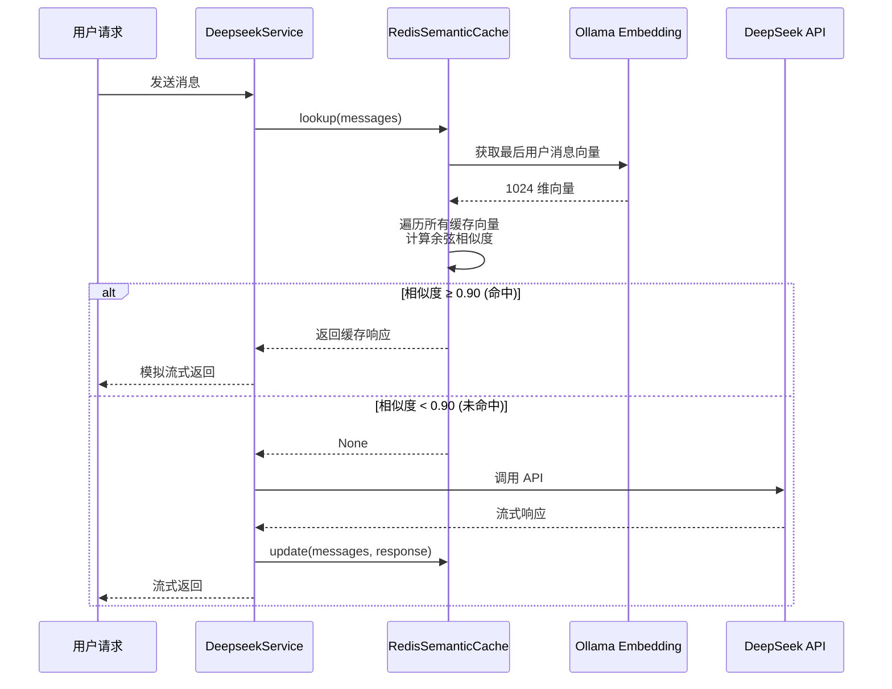

**核心机制**:
- **向量存储**: 用户消息 → Ollama BGE-M3 Embedding → Redis 存储 `{prefix}:vec:{md5}`
- **相似度计算**: 余弦相似度 `cos(θ) = A·B / (|A|·|B|)`
- **自动清理**: 异步任务按 LRU 策略清理超量缓存
- **元数据追踪**: 访问次数、创建时间、最后访问时间

### 4.4 LangGraph Agent 路由器 (`app/lg_agent/lg_builder.py`)

5 路意图路由是系统核心调度器：

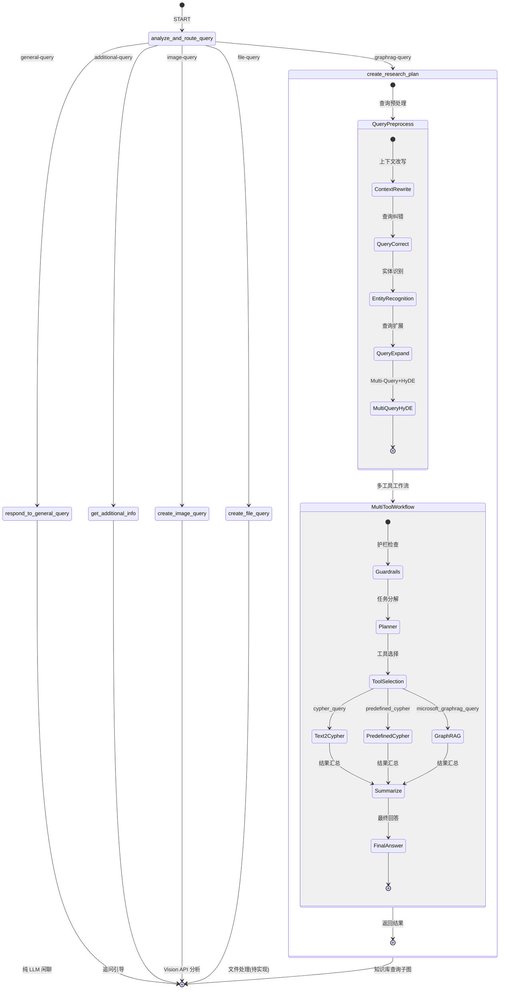

**路由分类 + 复杂度评估**:

| 路由类型 | 触发条件 | 复杂度 | 处理节点 |
|---------|---------|--------|---------|
| `general-query` | 闲聊、非业务问题 | - | 纯 LLM 回复 |
| `additional-query` | 信息不足需追问 | - | 护栏检查 + 追问 |
| `graphrag-query` | 产品/订单/知识库查询 | 0.0-1.0 | 知识图谱子图 |
| `image-query` | 用户上传图片 | - | Vision API + LLM |
| `file-query` | 用户上传文件 | - | (待实现) |

### 4.5 Multi-Tool 工作流 (`workflows/multi_agent/multi_tool.py`)

子图结构，实现知识库查询的核心编排：

```
Guardrails → Planner → ToolSelection → [Text2Cypher | PredefinedCypher | GraphRAG] → Summarize → FinalAnswer
```

**P1 优化：基于复杂度的策略选择**:

| 复杂度 | 策略偏好 | 原因 |
|--------|---------|------|
| < 0.3（简单） | `predefined_cypher` | 预定义模板最快 |
| 0.3-0.7（中等） | LLM 自动选择 | 灵活匹配 |
| > 0.7（复杂） | `microsoft_graphrag_query` | 最强推理能力 |

每个策略内部的执行流程：

| 策略 | 内部流程 |
|------|---------|
| Text2Cypher | NL 问题 → Few-shot 示例检索 → Cypher 生成 → 正则校验 → LLM 校验 → 自动修正(最多3次) → 执行 |
| PredefinedCypher | NL 问题 → 向量相似度匹配模板 → 参数填充 → Neo4j 执行 |
| GraphRAG | NL 问题 → GraphRAG API(Local/Global/DRIFT/Basic) → 混合检索(BM25+向量+RRF) → 相关性评分过滤 → 策略切换重检索 |

### 4.6 Text2Cypher 闭环 (`components/cypher_tools/`)

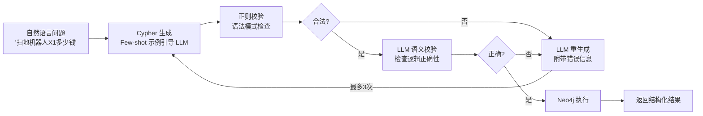

**核心组件**:
1. **生成节点** (`text2cypher/generation/`): Few-shot + Schema 上下文 → LLM 生成 Cypher
2. **校验节点** (`text2cypher/validation/`): 正则语法检查 + LLM 语义检查双重保障
3. **修正节点** (`text2cypher/correction/`): 自动修正 + 最多 3 次重试
4. **执行节点** (`text2cypher/execution/`): 安全执行并封装结果

### 4.7 混合检索 (`components/hybrid_retrieval/`)

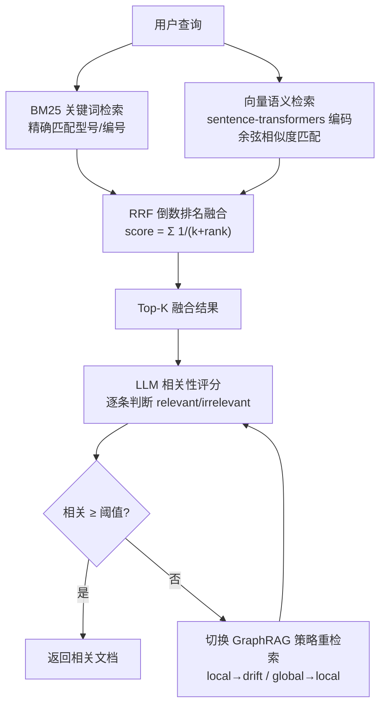

### 4.8 三层记忆管理 (`components/memory/`)

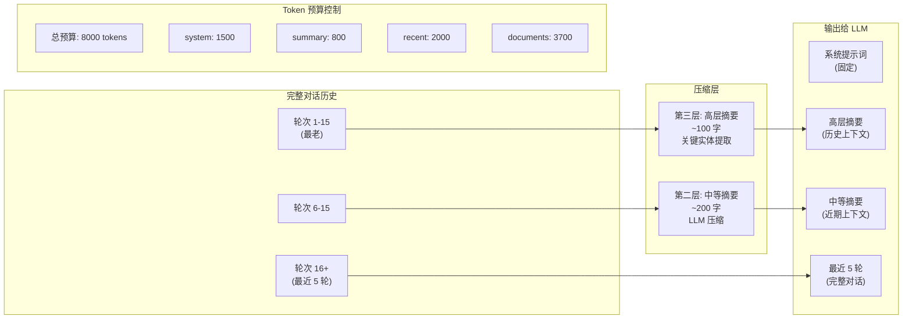

### 4.9 安全护栏 (`components/agent_safety/`)

| 护栏 | 位置 | 机制 |
|------|------|------|
| **ScopeGuard** | 路由前 | 关键词预检，零延迟拦截非经营范围问题 |
| **BudgetGuard** | 预处理管道 | 每步 LLM 调用前检查 Token 预算，超预算跳过非必要步骤 |
| **TimeoutGuard** | 工作流执行 | 30 秒超时返回降级回答 |
| **HallucinationGuard** | 回答后 | LLM 校验生成内容是否基于事实数据 |

### 4.10 查询预处理管道

5 步管道式查询增强，在进入 Multi-Tool 工作流之前完成：

| 步骤 | 组件 | 必要性 | 功能 |
|------|------|--------|------|
| 1 | `context_aware_rewrite` | **必要** | 多轮对话补全（代词消解、主语补全） |
| 2 | `correct_query` | 非必要 | 错别字修正（"扫第"→"扫地"） |
| 3 | `recognize_and_link_entities` | **必要** | 实体识别 + Neo4j 节点链接 |
| 4 | `expand_query` | 非必要 | 同义词扩展（"灯泡"→"LED灯"） |
| 5 | `rewrite_query` (Multi-Query+HyDE) | 非必要 | 多查询生成 + 假设文档嵌入 |

---

## 5. 系统运行流程

### 5.1 完整请求生命周期

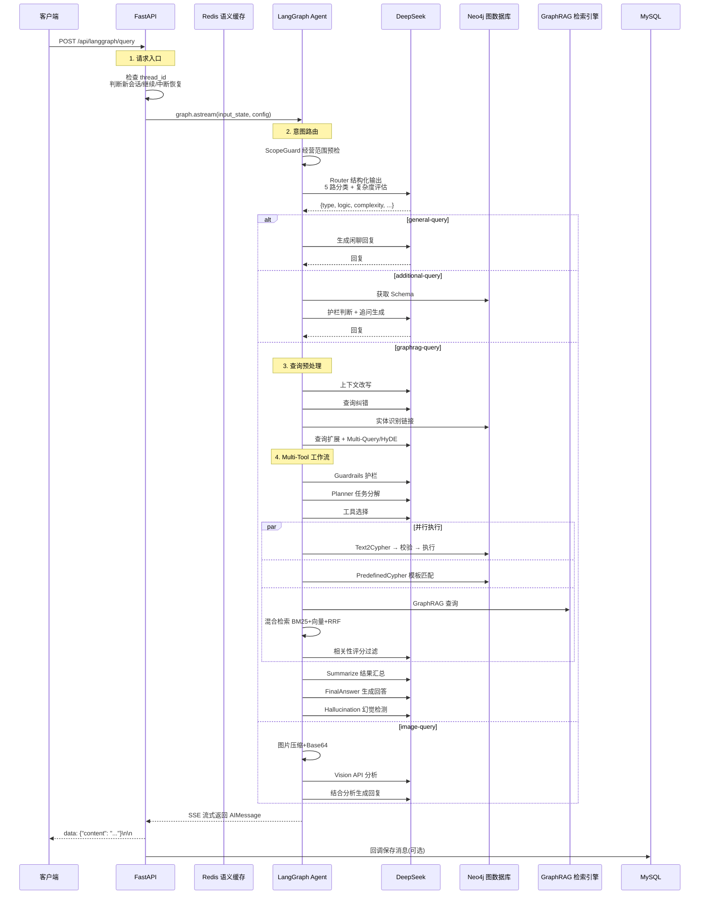

### 5.2 意图路由决策流程

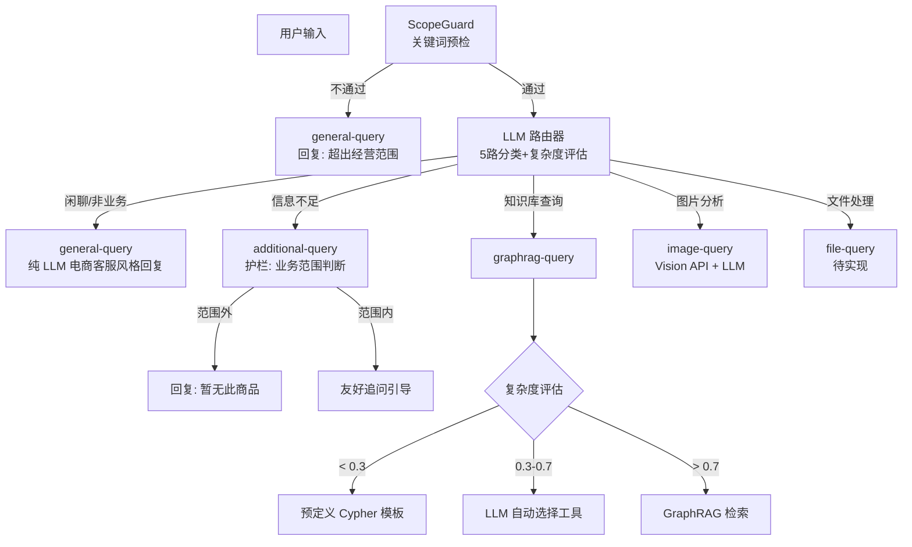

---

## 6. 设计模式应用

| 设计模式 | 应用位置 | 具体实现 |
|---------|---------|---------|
| **工厂模式** | `LLMFactory` | `create_chat_service()` / `create_reasoner_service()` / `create_search_service()` 根据配置返回不同实例 |
| **策略模式** | `config.py` 服务选择 | `CHAT_SERVICE` / `REASON_SERVICE` / `AGENT_SERVICE` 分别选择 DeepSeek/Ollama |
| **状态图模式** | `lg_builder.py` | LangGraph `StateGraph` + 条件边实现多路由 Agent 编排 |
| **责任链模式** | Text2Cypher | 生成 → 正则校验 → LLM 校验 → 修正 → 执行 |
| **观察者/回调模式** | `deepseek_service.py` | `on_complete` 回调触发消息持久化，解耦 LLM 和存储 |
| **建造者模式** | `lg_builder.py` | `builder.add_node().add_edge().compile()` 构建状态图 |
| **单例模式** | `checkpointer = MemorySaver()` | LangGraph 全局持久化存储 |
| **模板方法模式** | 提示词模板 | 预定义提示词 + 动态参数注入 |
| **装饰器模式** | `LoggingMiddleware` | FastAPI 中间件统一日志 |
| **门面模式** | `GraphRAGAPI` | 封装 Microsoft GraphRAG 复杂的初始化/查询 API |

---

## 7. 数据流转

### 7.1 用户消息存储

```
用户消息 + AI回复 → ConversationService.save_message()
  → MySQL: conversations 表 (会话元信息)
  → MySQL: messages 表 (用户消息 + 助手回复)
  → 首条消息自动生成会话标题 (前 20 字)
```

### 7.2 语义缓存存储

```
用户问题 → Ollama Embedding → Redis:
  {prefix}:vec:{md5}  → JSON 向量
  {prefix}:resp:{md5} → 回复文本
  {prefix}:meta:{md5} → 访问元数据
```

### 7.3 知识图谱数据

```
Neo4j 图结构:
  (Product)-[:BELONGS_TO]->(Category)
  (Product)-[:SUPPLIED_BY]->(Supplier)
  (Order)-[:CONTAINS]->(Product)
  (Customer)-[:PLACED]->(Order)
  (Employee)-[:PROCESSED]->(Order)
```

### 7.4 GraphRAG 索引

```
原始文档 (llm_backend/app/graphrag/data/input/)
  → Microsoft GraphRAG Pipeline
    → entities.parquet (实体)
    → relationships.parquet (关系)
    → communities.parquet (社区)
    → community_reports.parquet (社区报告)
    → text_units.parquet (文本单元)
```

---

## 8. 项目亮点深度分析

### 8.1 🌟 5 路智能意图路由 + 复杂度量化评估

**创新点**: 不是简单的关键词匹配，而是让 LLM 同时完成**分类 + 复杂度量化 + 推理需求判断**。

```python
class Router(TypedDict):
    type: Literal["general-query", "additional-query", "graphrag-query", "image-query", "file-query"]
    complexity: float              # 0-1 查询复杂度
    relationship_intensity: float  # 0-1 关系密集度
    reasoning_required: bool       # 是否需要多跳推理
    entity_count: int              # 实体数量
```

**技术价值**: 通过一次 LLM 调用同时获得路由决策和元信息，为下游工具选择提供了**量化决策依据**。相比简单分类器，复杂度信息被用于后续策略选择（简单→预定义模板，复杂→GraphRAG）。

### 8.2 🌟 Text2Cypher 双重校验闭环

**创新点**: 正则语法校验 + LLM 语义校验 **双重保障**，且支持最多 3 次自动修正。

```
NL问题 → Cypher生成 → 正则校验(语法) → LLM校验(语义) → 执行
              ↑                                    |
              └──── 自动修正(最多3次) ←─────────────┘
```

**技术价值**: Cypher 查询语句的正确性直接影响图数据库查询结果。单纯正则校验无法发现逻辑错误（如表名正确但关系方向错误），LLM 语义校验作为第二道防线显著提升准确性。

### 8.3 🌟 混合检索 + RRF 融合 + 相关性评分 + 策略切换

**创新点**: 不是简单的 BM25+向量双路检索，而是一个**4 步闭环**：

1. **BM25 精确匹配** (型号 "X1-Pro")
2. **向量语义匹配** (sentence-transformers 本地编码)
3. **RRF 倒数排名融合** (不依赖绝对分数，数学上更鲁棒)
4. **LLM 逐条相关性评分** (relevant/irrelevant 二值判断)
5. **自动策略切换** (相关不足时切换 GraphRAG 策略重新检索)

```python
# RRF 融合公式
score(doc) = Σ 1/(k + rank_i)  # k=60, rank_i 是文档在第 i 路检索中的排名
```

**技术价值**: 融合了关键词精确匹配和语义理解的优势，同时通过相关性评分防止不相关结果污染 LLM 上下文，策略切换机制确保在检索效果不佳时自动降级/升级。

### 8.4 🌟 三层记忆管理 + Redis 增量缓存

**创新点**: 不仅压缩历史对话，还实现了**增量式摘要更新**和**Redis 缓存跨会话复用**：

```
第一层: 最近 5 轮 (完整原文)
第二层: 轮次 6-15 (压缩为 ~200 字摘要)
第三层: 轮次 16+ (压缩为 ~100 字摘要 + 关键实体)
```

**技术价值**: 
- 增量压缩：新轮次只压缩未处理的，不从零开始
- Redis 缓存：跨请求复用摘要，避免重复 LLM 调用
- Token 预算控制：动态裁剪确保不超限
- 关键实体追踪：保留产品名称等关键信息不丢失

### 8.5 🌟 语义缓存的工程化实现

**创新点**: 不是简单的键值缓存，而是基于 **Embedding 向量余弦相似度**的语义级缓存：

```
"扫地机器人多少钱" ≈ "这个扫地机什么价格"
→ 向量余弦相似度 0.95 ≥ 0.90 → 缓存命中
```

**工程细节**:
- 按用户隔离缓存 (`prefix:user_id:...`)
- LRU 自动清理 + 访问次数统计
- 模拟流式返回保持前端体验一致
- 异步任务自动维护，不阻塞请求

### 8.6 🌟 查询预处理管道 + 预算控制

**创新点**: 5 步查询增强 + 每步 LLM 调用前检查 Token 预算，实现**成本可控的质量增强**：

| 步骤 | 必要性 | 原因 |
|------|--------|------|
| 上下文改写 | **必要** | 多轮对话代词消解是刚需 |
| 查询纠错 | 非必要 | 大多数场景下正确率已高 |
| 实体识别 | **必要** | 链接到 Neo4j 节点是检索前提 |
| 查询扩展 | 非必要 | 扩展覆盖面但有额外成本 |
| Multi-Query+HyDE | 非必要 | 质量提升显著但 Token 消耗大 |

**技术价值**: 区分必要/非必要步骤，在预算紧张时自动跳过非必要步骤，实现质量和成本的动态平衡。

### 8.7 🌟 Docker Compose 一键部署 + Healthcheck

**创新点**: 4 个服务 (MySQL/Redis/Neo4j/App) 通过 `depends_on` + `condition: service_healthy` 确保启动顺序：

```yaml
app:
  depends_on:
    mysql:
      condition: service_healthy   # mysqladmin ping
    redis:
      condition: service_healthy   # redis-cli ping
    neo4j:
      condition: service_healthy   # HTTP wget check
```

**技术价值**: 避免了常见的 "服务启动但数据库未就绪" 的竞态问题，开箱即用。

---

## 9. 项目优点

### 9.1 架构设计

| 优点 | 说明 |
|------|------|
| **模块化清晰** | 配置/服务/Agent/组件分层明确，职责单一 |
| **高可扩展性** | 工厂模式 + 策略模式，新增 LLM 只需添加服务类 |
| **Agent 编排成熟** | LangGraph StateGraph 提供可视化的状态流转 |
| **会话持久化** | MemorySaver + thread_id 实现多轮对话状态管理 |
| **SSE 流式响应** | 所有 LLM 接口统一使用 Server-Sent Events，用户体验好 |
| **Human-in-the-Loop** | 支持中断/恢复机制，实现人工确认流程 |

### 9.2 技术深度

| 优点 | 说明 |
|------|------|
| **检索质量闭环** | 混合检索 → 评分 → 重检索，形成质量保障机制 |
| **Text2Cypher 工程化** | 生成/校验/修正/执行完整流水线 |
| **多层护栏** | 范围预检 + LLM 护栏 + 幻觉检测，层层保障 |
| **内存管理成熟** | 三层摘要 + Token 预算 + Redis 缓存，处理长对话 |
| **成本控制意识** | 语义缓存降本 + 预算控制非必要调用 |

### 9.3 工程实践

| 优点 | 说明 |
|------|------|
| **配置管理规范** | Pydantic Settings 类型安全，34 项配置集中管理 |
| **日志系统完善** | 结构化日志，按服务分级，请求追踪 |
| **Docker 部署完善** | Multi-service + healthcheck + 数据持久化 |
| **文档规范** | README 清晰，API 端点完整列举 |
| **知识库丰富** | 内置产品文档 + FAQ + 真实客服对话数据 |

---

## 10. 项目缺点与改进建议

### 10.1 严重问题 🔴

#### 10.1.1 缺失的依赖模块

`lg_builder.py` 第 44 行导入了不存在的模块路径：

```python
# 当前代码（错误路径）
from app.lg_agent.kg_sub_graph.agentic_rag_agents.components.agent_safety import (
    ScopeGuard, TimeoutGuard, BudgetGuard, HallucinationGuard,
)

# 实际文件位于子目录
# components/agent_safety/scope_guard.py
# components/agent_safety/budget_guard.py
# ...
```

**影响**: 系统启动时会抛出 `ImportError`，导致整个 LangGraph Agent 无法工作。

**建议**: 修正导入路径为正确的子模块路径。

#### 10.1.2 硬编码的凭据信息

`docker-compose.yml` 中包含明文数据库密码：

```yaml
MYSQL_ROOT_PASSWORD: smartcs_agent_root_pwd
NEO4J_AUTH: neo4j/smartcs_agent_neo4j_pwd
```

**影响**: 如果仓库公开，凭据泄露风险。

**建议**: 使用 Docker Secrets 或 `.env` 文件管理敏感信息，在 docker-compose 中通过 `${VAR}` 引用。

#### 10.1.3 `file-query` 路由未实现

`lg_builder.py` 中 `create_file_query` 函数只有 TODO 注释，没有实际逻辑。

**影响**: `file-query` 路由不会返回任何内容。

**建议**: 实现文件处理逻辑或暂时从路由中移除。

### 10.2 中等问题 🟡

#### 10.2.1 缺少单元测试

项目中**没有任何测试文件**。对于一个包含 200+ Python 文件的复杂系统，缺乏测试覆盖是高风险问题。

**建议**: 
- 为核心模块（Text2Cypher、语义缓存、路由逻辑、混合检索）添加 pytest 测试
- 集成 LangGraph 的测试工具进行 Agent 行为验证

#### 10.2.2 前端过于简单

`chat.html` 是单文件 HTML + 少量 Vue，缺少：
- 用户登录 UI
- 会话列表展示
- 图片上传交互
- 加载状态/错误处理
- 移动端适配

**建议**: 使用现代前端框架（React/Vue SPA）重构或集成到 FastAPI Jinja2 模板。

#### 10.2.3 MemorySaver 用于生产环境

```python
checkpointer = MemorySaver()  # 进程内存储，重启丢失
```

**影响**: 服务重启后所有会话状态丢失。

**建议**: 生产环境切换到 `SqliteSaver`、`PostgresSaver` 或自定义 Redis checkpointer。

#### 10.2.4 缺少 API 限流

所有 API 端点都没有速率限制。

**影响**: 恶意或异常高频调用可能导致 LLM API 费用失控。

**建议**: 集成 `slowapi` 或 Redis 令牌桶实现 IP/用户级别限流。

#### 10.2.5 GraphRAG 源码内嵌

`llm_backend/app/graphrag/` 直接包含了 Microsoft GraphRAG 的完整源码（约 80+ 文件）。

**影响**: 
- 增加仓库体积
- 难以跟随上游更新
- 版本管理混乱

**建议**: 改为 `pip install graphrag` 依赖。

#### 10.2.6 缺少输入校验

`main.py` 中的请求模型缺少字段级别校验：

```python
class ChatMessage(BaseModel):
    messages: List[Dict[str, str]]  # 没有长度限制
    user_id: int                     # 没有范围校验
    conversation_id: int             # 没有存在性校验
```

**建议**: 添加 `Field(min_length=1, max_length=50)` 等约束。

### 10.3 改进建议 🟢

#### 10.3.1 引入异步任务队列

文件上传和索引构建 (`IndexingService`) 是 CPU 密集型操作，当前直接阻塞请求线程。

**建议**: 引入 Celery + Redis 或 ARQ 异步任务队列处理。

#### 10.3.2 添加监控和可观测性

**建议**: 
- 集成 OpenTelemetry 追踪 LLM 调用链
- 添加 Prometheus metrics (请求延迟、缓存命中率、LLM Token 消耗)
- 设置 LLM API 调用告警

#### 10.3.3 实现 A/B 测试框架

当前策略选择（简单/中等/复杂）依赖硬编码阈值。

**建议**: 实现配置化的 A/B 测试，对比不同策略的效果，数据驱动优化。

#### 10.3.4 添加降级策略

当 DeepSeek API 不可用时，当前直接抛出 500 错误。

**建议**: 实现 fallback 链：DeepSeek → Ollama → 预定义回复。

#### 10.3.5 数据隐私增强

用户上传的图片/文件直接存储在本地文件系统。

**建议**: 
- 敏感图片自动脱敏
- 定期清理过期文件
- 实现访问控制（当前 `/api/conversations/{id}/messages` 的 `user_id` 通过 query 参数传递，不安全）

---

## 11. 部署架构

### 11.1 Docker Compose 拓扑

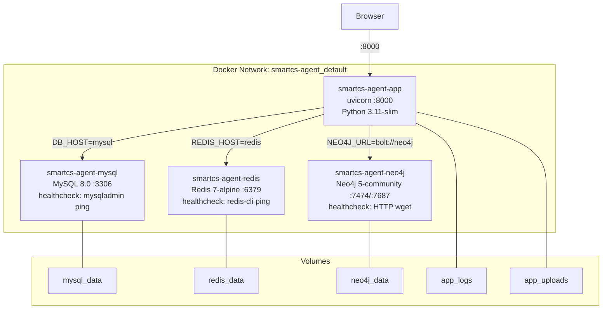

### 11.2 启动流程

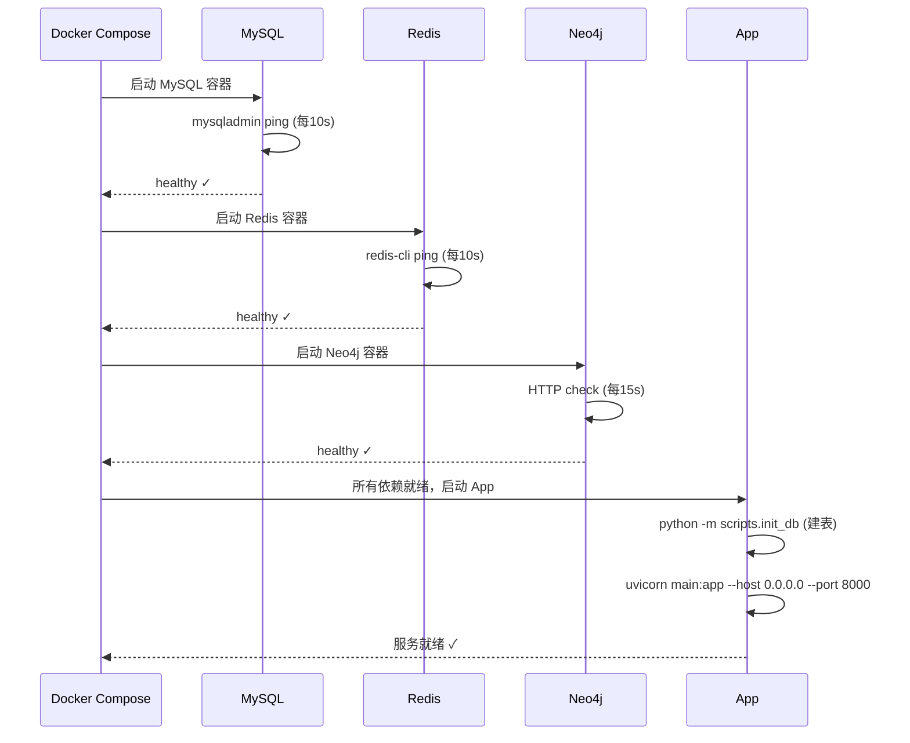

---

## 12. 综合评价

### 12.1 技术成熟度矩阵

| 维度 | 评分 | 说明 |
|------|------|------|
| 架构设计 | ⭐⭐⭐⭐⭐ | 分层清晰，模块解耦，设计模式运用恰当 |
| 技术深度 | ⭐⭐⭐⭐⭐ | Text2Cypher 闭环、混合检索+评分、三层记忆管理均为业界前沿实践 |
| 代码质量 | ⭐⭐⭐⭐ | 整体结构良好，部分模块缺失、硬编码问题需修复 |
| 测试覆盖 | ⭐ | 完全缺失，需从零建立测试体系 |
| 文档完善 | ⭐⭐⭐⭐ | README 详尽，API 文档完整，缺少开发者指南 |
| 部署运维 | ⭐⭐⭐⭐ | Docker 一键部署完善，缺少监控和告警 |
| 安全性 | ⭐⭐ | 凭据硬编码、缺少限流和输入校验 |
| 可扩展性 | ⭐⭐⭐⭐⭐ | 工厂模式+策略模式，新增功能成本低 |

### 12.2 适用场景

| 场景 | 适合度 | 说明 |
|------|--------|------|
| 电商客服原型 | ⭐⭐⭐⭐⭐ | 开箱即用，多轮对话+知识库完善 |
| 学习 LangGraph | ⭐⭐⭐⭐⭐ | 完整的 StateGraph + 子图 + 多工具编排案例 |
| 学习 GraphRAG | ⭐⭐⭐⭐⭐ | 4 种策略 + 混合检索的实际应用 |
| 学习 RAG 优化 | ⭐⭐⭐⭐ | 语义缓存、相关性评分、查询预处理等最佳实践 |
| 生产部署 | ⭐⭐⭐ | 需补充测试、限流、监控后才能上生产 |

### 12.3 总结

SmartCS-Agent 是一个**技术深度优秀、工程完整性良好但生产就绪度不足**的 AI 客服系统。它在以下方面展现了较强的技术实力：

1. **Agent 编排**: LangGraph StateGraph 的运用成熟，子图嵌套、条件路由、会话持久化、中断恢复等技术点处理得当
2. **检索增强**: Text2Cypher 闭环、混合检索+RRF融合、相关性评分+策略切换形成完整的检索质量保障链路
3. **工程降本**: 语义缓存的实现精细（按用户隔离、LRU清理、流式模拟），三层记忆管理的 Token 预算控制
4. **系统思维**: 查询预处理管道的必要性分级、根据复杂度自动选择策略的量化决策

主要短板在于**测试缺失**和**生产级运维特性不足**（日志监控、限流降级、凭据管理），建议在这些方面投入改进后再用于生产环境。

---

> **分析工具**: Claude Code  
> **分析范围**: 全项目 200+ Python 文件，34 项配置，4 Docker 服务  
> **核心模块覆盖率**: 100%
