# SmartCS-Agent 项目深度分析报告

> **分析日期**: 2026-08-08 | **版本**: 1.0 | **许可**: MIT

---

## 目录

1. [项目概述](#1-项目概述)
2. [技术栈全景分析](#2-技术栈全景分析)
3. [系统架构设计](#3-系统架构设计)
4. [核心模块详解](#4-核心模块详解)
5. [系统运行流程](#5-系统运行流程)
6. [设计模式应用](#6-设计模式应用)
7. [数据流转](#7-数据流转)
8. [项目亮点深度分析](#8-项目亮点深度分析)
9. [项目优点](#9-项目优点)
10. [项目缺点与改进建议](#10-项目缺点与改进建议)
11. [部署架构](#11-部署架构)
12. [综合评价](#12-综合评价)

---

## 1. 项目概述

SmartCS-Agent 是一个**基于 FastAPI + LangGraph 的智能电商客服系统**，深度集成了 pgvector 向量检索（标准 RAG 管道）、混合检索、语义缓存、多轮对话管理等功能。项目面向智能家居电商场景，内置 10 款产品知识文档、1,800 条电商 FAQ 和 2,600+ 条真实客服对话数据。

**核心能力**: 场景+风险双维意图识别（单次合并输出，场景驱动分支、风险拦截优先）→ 混合检索（HNSW ∥ pg_jieba BM25 → RRF → Reranker 精排）→ 流式响应

---

## 2. 技术栈全景分析

### 2.1 技术栈总览

```mermaid
graph TB
    subgraph "前端层 Frontend"
        A[Vue.js 静态页面]
    end

    subgraph "API 网关层 Gateway"
        B[FastAPI<br/>异步 REST + SSE 流式]
    end

    subgraph "Agent 编排层 Orchestration"
        C[LangGraph StateGraph<br/>场景+风险双维意图识别 + 子图工作流]
    end

    subgraph "LLM 服务层"
        D1[DeepSeek V3<br/>主对话/推理/路由]
        D2[EmbeddingProvider<br/>qwen text-embedding-v4 API<br/>1024 维（local/ollama 分支保留）]
        D3[Qwen-VL (qwen-vl-max)<br/>图片分析 Vision]
    end

    subgraph "知识检索层"
        E1[pgvector 向量检索<br/>标准 RAG 管道]
        E3[混合检索 BM25 + 向量 + RRF]
    end

    subgraph "存储层"
        F1[(PostgreSQL 16 + pgvector<br/>用户/会话/消息/向量/检查点)]
        F2[(Redis 7<br/>语义缓存/摘要缓存)]
    end

    subgraph "基础设施"
        G[Docker Compose<br/>一键部署 + Healthcheck]
    end

    A --> B --> C --> D1
    C --> D2
    C --> D3
    C --> E1
    C --> E3
    B --> F1
    B --> F2
    G --> F1
    G --> F2
```

### 2.2 详细技术清单

| 层次 | 技术 | 版本 | 职责 |
|------|------|------|------|
| **后端框架** | FastAPI | 0.100+ | REST API，原生 async/await，SSE 流式响应 |
| **Agent 编排** | LangGraph | latest | StateGraph 多路由 Agent，PostgresSaver 会话检查点持久化 |
| **LLM 基座** | DeepSeek API | V3 | 对话生成、意图路由、推理 |
| **本地 LLM** | Ollama | - | 可切换的本地 LLM 替代方案 |
| **文档检索** | pgvector | 0.5+ | 向量表 document_chunks（HNSW 索引），标准 RAG 索引管道 |
| **Embedding** | EmbeddingProvider | qwen text-embedding-v4 | 统一向量接口（DashScope API，1024 维，默认 qwen；local/ollama 分支保留） |
| **Embedding 通道** | DashScope OpenAI-compatible API | text-embedding-v4 | 索引/检索/混合检索/语义缓存统一走 qwen API（aiohttp，无本地模型主链路） |
| **向量缓存** | Redis | 7 Alpine | 语义缓存（余弦相似度 ≥ 0.90 命中） |
| **精排** | sentence-transformers CrossEncoder | bge-reranker-v2-m3 | RRF 融合 top-20 → 精排 top-5（替代 LLM 相关性评分，GPU/fp16 可加速） |
| **全文检索** | PostgreSQL pg_jieba | jiebacfg 精确模式 | 数据库内 BM25（ts_rank_cd + GIN 倒排索引），替代应用内存 jieba + rank_bm25 |
| **关系数据库** | PostgreSQL | 16（pgvector 镜像） | 用户、会话、消息持久化 + 向量检索 + LangGraph 检查点 |
| **LLM SDK** | OpenAI SDK (AsyncOpenAI) | - | 兼容 DeepSeek API |
| **LangChain** | langchain-core/deepseek/ollama | - | LLM 抽象层，结构化输出 |
| **前端** | Vue | 编译静态 dist | 聊天 UI 界面（非主要重点） |
| **部署** | Docker + Docker Compose | - | 2 基础服务（PostgreSQL(pgvector)/Redis）；App 应用本地运行（uvicorn/run.py） |
| **搜索** | SerpAPI | - | Function Calling 联网搜索 |
| **图片处理** | Pillow (PIL) | - | 上传图片压缩/格式转换 |
| **异步 HTTP** | aiohttp | - | 视觉 API 异步调用 |

---

## 3. 系统架构设计

### 3.1 整体架构图

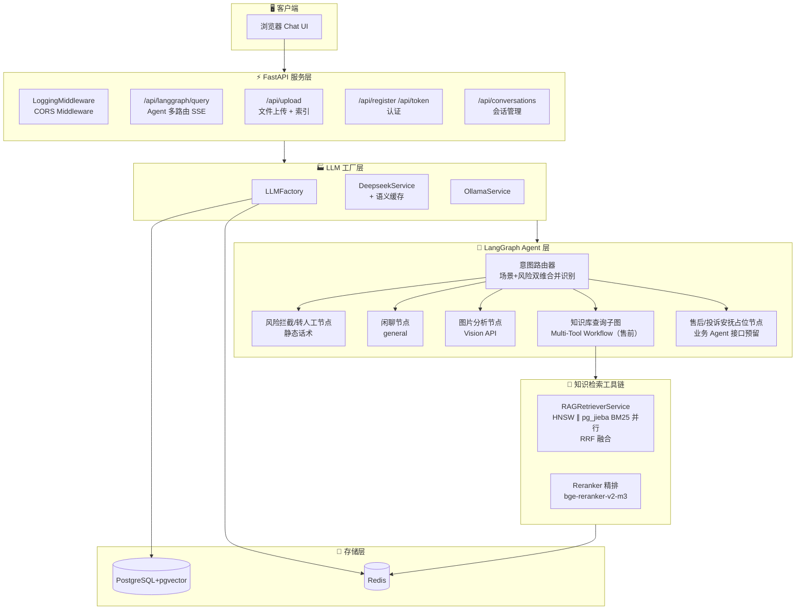

### 3.2 项目目录结构

```
SmartCS-Agent/
├── llm_backend/                          # 后端主目录
│   ├── main.py                           # FastAPI 入口，所有 API 端点定义
│   ├── run.py                            # 服务启动脚本
│   └── app/
│       ├── core/                         # 核心配置层
│       │   ├── config.py                 # Pydantic Settings 配置（环境变量映射）
│       │   ├── database.py              # PostgreSQL 异步连接（psycopg）
│       │   ├── security.py              # JWT 认证
│       │   ├── hashing.py               # 密码哈希
│       │   ├── logger.py                # 结构化日志
│       │   └── middleware.py            # 请求日志中间件
│       ├── api/
│       │   └── auth.py                  # 认证路由（注册/登录）
│       ├── services/                     # 业务服务层
│       │   ├── llm_factory.py           # LLM 工厂模式
│       │   ├── deepseek_service.py      # DeepSeek + 语义缓存
│       │   ├── ollama_service.py        # Ollama 备选
│       │   ├── redis_semantic_cache.py  # Redis 语义缓存（asyncio + ZSET 索引 + 分级指代消解）
│       │   ├── pronoun_detector.py      # 指代检测器（三层规则引擎，缓存/入口共用门控）
│       │   ├── pronoun_resolver.py      # 指代消解器（LLM 补全，temperature=0，失败降级）
│       │   ├── rag_retriever_service.py # RAG 检索核心服务（HNSW ∥ BM25 并行 → RRF → 精排，唯一检索入口）
│       │   ├── reranker_service.py      # bge-reranker-v2-m3 精排（CrossEncoder，GPU/fp16，失败降级）
│       │   ├── rag_tool.py              # langchain @tool 薄封装（rag_retrieval）
│       │   ├── conversation_service.py  # 会话 CRUD
│       │   └── indexing_service.py      # 标准 RAG 索引构建（解析→分块→pgvector 入库）
│       ├── lg_agent/                     # LangGraph Agent 层
│       │   ├── lg_builder.py            # StateGraph 构建 + 路由 + 5 节点
│       │   ├── lg_states.py             # 状态定义（Router/AgentState）
│       │   ├── lg_prompts.py            # 15+ 提示词模板
│       │   └── kg_sub_graph/            # 知识库检索子图
│       │       ├── kg_tools_list.py     # 工具 Schema 定义
│       │       └── agentic_rag_agents/
│       │           ├── workflows/       # 多工具工作流
│       │           └── components/
│       │               ├── customer_tools/   # 检索节点（vector_search_query，调 RAGRetrieverService）
│       │               ├── hybrid_retrieval/ # bm25_sql_retriever.py（pg_jieba SQL BM25）+ rrf_fusion.py
│       │               ├── memory/         # 三层记忆管理器
│       │               ├── agent_safety/   # 护栏（Scope/Timeout）
│       │               └── planner/        # 任务分解
│       ├── models/                     # SQLAlchemy 模型
│       │   ├── conversation.py
│       │   ├── message.py
│       │   ├── user.py
│       │   └── document_chunk.py        # pgvector 文档块表
│       ├── prompts/                    # 搜索提示词
│       └── tools/                      # 搜索工具定义
├── scripts/                           # 工具脚本
│   ├── init_db.py                     # 数据库初始化（pgvector 扩展 + HNSW 索引）
│   ├── generate_product_knowledge.py  # CSV → 产品知识文档
│   ├── download_datasets.py           # 下载电商 FAQ 数据集
│   └── download_jddc.py              # 下载 JDDC 对话数据集
├── frontend/                          # Vue3 SFC 前端工程（由 chat.html 重构）
├── docker/                            # Docker 构建上下文
│   └── postgres/Dockerfile            # pgvector + pg_jieba 自定义镜像（cppjieba 源码编译）
├── docker-compose.yml                 # 2 基础服务编排（PostgreSQL 自定义镜像/Redis，App 本地运行）
├── Dockerfile                         # Python 3.13-slim 镜像（uv 安装锁定依赖）
├── pyproject.toml                     # Python 依赖清单（uv 管理）
├── uv.lock                            # 依赖锁定文件
├── .env.example                       # 环境变量模板（60+ 项配置）
└── .env.docker                        # Docker 环境变量
```

---

## 4. 核心模块详解

### 4.1 配置管理 (`app/core/config.py`)

采用 **Pydantic Settings** 实现类型安全的环境变量管理，支持 `.env` 文件自动加载。核心设计亮点：

- **多 LLM 服务策略模式**: `CHAT_SERVICE`、`REASON_SERVICE`、`AGENT_SERVICE` 可分别独立选择 DeepSeek/Ollama
- **属性计算**: `DATABASE_URL`、`POSTGRES_DSN`、`REDIS_URL` 通过 `@property` 动态构建
- **向量检索完整配置**: pgvector 表名（document_chunks）、Embedding 维度（1024）、分块参数（500/50）等配置
- **Reranker 精排配置**: 开关（RERANKER_ENABLED）、模型、输入候选数（INPUT_TOP_K）、输出数（TOP_K）、设备（auto/cuda/cpu）、批量、fp16 半精度，全部收敛 .env

```python
# 配置项结构（60+ 项配置，含默认值）
class Settings(BaseSettings):
    # DeepSeek: API_KEY, BASE_URL, MODEL
    # Ollama: BASE_URL, CHAT/REASON/EMBEDDING/AGENT_MODEL
    # Vision: VISION_API_KEY, VISION_BASE_URL, VISION_MODEL
    # Service Selection: CHAT_SERVICE, REASON_SERVICE, AGENT_SERVICE
    # Search: SERPAPI_KEY, SEARCH_RESULT_COUNT
    # Database: DB_HOST, DB_PORT, DB_USER, DB_PASSWORD, DB_NAME
    # Redis: REDIS_HOST, REDIS_PORT, REDIS_DB, REDIS_PASSWORD
    # Embedding: EMBEDDING_TYPE, EMBEDDING_MODEL, EMBEDDING_DIMENSION, EMBEDDING_THRESHOLD
    # pgvector: VECTOR_TABLE_NAME, CHUNK_SIZE, CHUNK_OVERLAP ...
```

### 4.2 LLM 工厂 (`app/services/llm_factory.py`)

纯工厂模式，通过环境变量切换底层 LLM 服务，无需修改业务代码：

| 方法 | 用途 | 默认服务 |
|------|------|---------|
| `create_chat_service()` | 普通聊天 | DeepSeek |

### 4.3 语义缓存 (`app/services/redis_semantic_cache.py`)

基于 **Redis + Embedding 向量余弦相似度** 的语义缓存系统：

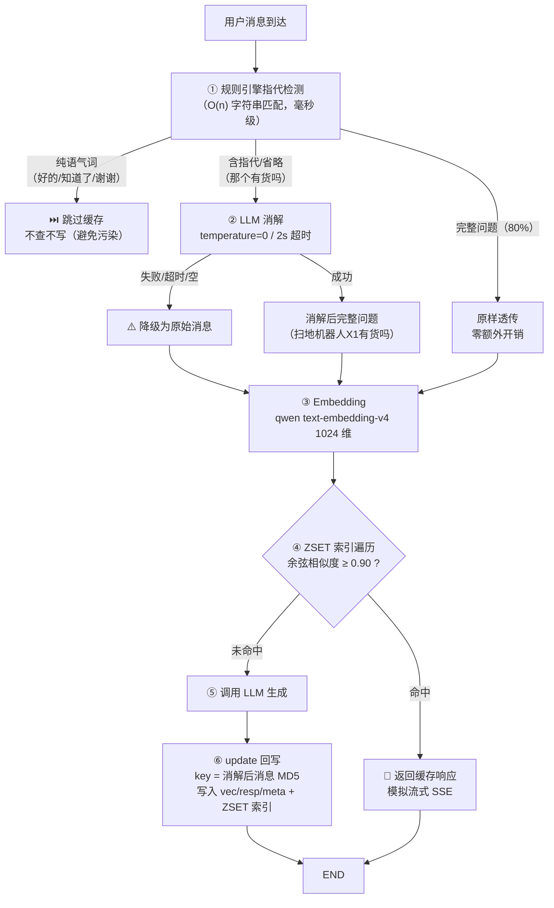

**核心机制**:

- **向量存储**: 用户消息 → 分级指代消解（规则门控，仅 15% 含指代消息调 LLM，失败降级透传）→ EmbeddingProvider（qwen text-embedding-v4，1024 维）→ Redis 存储 `{prefix}:vec:{md5}`（key 基于**消解后**消息生成，保证 lookup/update 同源命中）
- **相似度计算**: 余弦相似度 `cos(θ) = A·B / (|A|·|B|)`
- **索引结构**: 按用户分桶的 ZSET `{prefix}:index`（member=hash_id, score=last_access），替代 `keys()` 全库扫描；存量键首次访问时 scan_iter 一次性重建
- **客户端**: `redis.asyncio` 异步客户端（消除事件循环阻塞）；实例按 (prefix, user_id) 池化，每个用户仅一个清理任务（`start_cleanup()` 幂等启动）
- **自动清理**: 后台任务按 last_access 升序淘汰超量缓存（ZSET 排序）
- **元数据追踪**: 访问次数、创建时间、最后访问时间
- **开关**: `RESOLVE_ENABLED=false` 完全退化为原始行为（一键回滚）

### 4.4 LangGraph Agent 路由器 (`app/lg_agent/lg_builder.py`)

场景+风险双维合并意图识别是系统核心调度器，单次 LLM 低温结构化输出（ROUTER_TEMPERATURE=0）同时判定场景与风险两个维度，risk 拦截优先级最高（售后子场景由售后 Agent 内部判断，识别层不承担）：

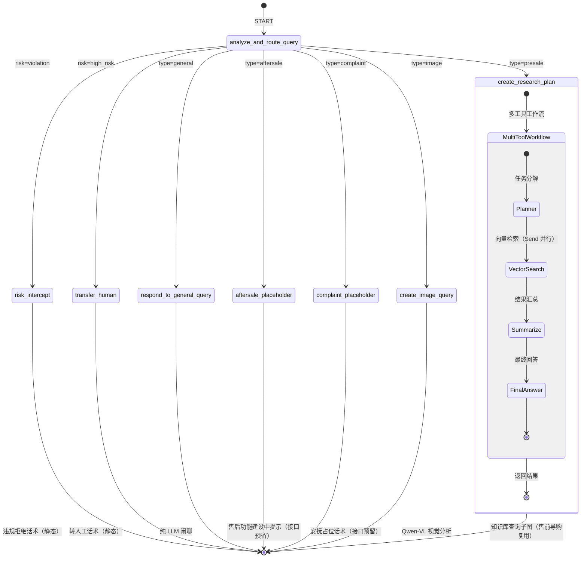

**路由输出结构**（`lg_states.py` Router TypedDict）：

| 维度 | 取值 | 说明 |
|------|------|------|
| `type` | presale / aftersale / complaint / general / image | 场景路由（原 4 类技术路由合并，graphrag-query→presale，additional-query 删除） |
| `risk` | none / violation / high_risk | 风险意图（violation 违规拦截；high_risk 高风险转人工） |
| `logic` | str | 分类理由（供回答生成参考，多意图时简述次要意图） |

**路由表**（risk 优先级最高；售后/投诉安抚走占位节点，业务 Agent 就位后仅替换路由目的地）：

| 路由条件 | 处理节点 |
|---------|---------|
| `risk=violation` | 风险拦截（明确拒绝 + 合规引导，静态话术） |
| `risk=high_risk` | 转人工（说明无法在线直接处理，静态话术） |
| `type=image` | Qwen-VL 视觉分析 + LLM |
| `type=general` | 纯 LLM 闲聊 |
| `type=presale` | 知识检索子图（Multi-Tool Workflow，售前导购） |
| `type=aftersale` | 售后占位节点（返回"服务升级中"提示，接口与 multi_tool 子图同构） |
| `type=complaint` | 投诉安抚占位节点（返回安抚占位话术） |

> 结构化输出校验失败时降级为 general/none（不抛异常）。追问逻辑（原 additional-query）已下沉到后续业务 Agent（售前/售后 Agent prompt 内置"信息不足先追问"），本阶段删除独立追问节点。设计依据见 `docs/spec_plan/SPEC_INTENT_RECOGNITION_OPTIMIZATION.md`。

### 4.5 Multi-Tool 工作流 (`workflows/multi_agent/multi_tool.py`)

子图结构，实现知识库查询的核心编排（guardrails/tool_selection/predefined_cypher 节点已于子图简化中删除）：

```
Planner → Send 并行 → 向量检索（pgvector）→ Summarize → FinalAnswer
```

各环节职责：

| 环节 | 流程 |
|------|------|
| Planner | LLM 任务分解为独立子任务，Send map-reduce 并发派发到检索节点 |
| 向量检索 | `RAGRetrieverService.search()`：HNSW ∥ pg_jieba BM25 并行（asyncio.gather）→ RRF 融合 → Reranker 精排 top-5 |
| Summarize | 汇总多路检索结果，生成客服风格回答 |
| FinalAnswer | 组装最终输出 + 会话历史记录 |

### 4.6 混合检索 (`components/hybrid_retrieval/`)

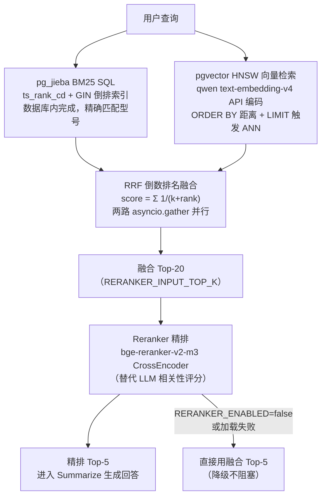

### 4.7 三层记忆管理 (`components/memory/`)

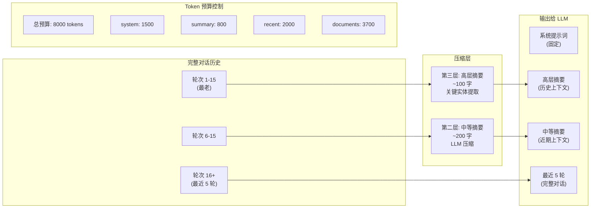

### 4.8 安全护栏 (`components/agent_safety/`)

| 护栏 | 位置 | 机制 |
|------|------|------|
| **ScopeGuard** | 路由前 | 关键词预检，零延迟拦截非经营范围问题 |
| **TimeoutGuard** | 工作流执行 | 30 秒超时返回降级回答 |

（HallucinationGuard 已随子图 guardrails 简化移除，事实性保障由 Reranker 精排 + 生成 LLM 承担；查询预处理管道与 BudgetGuard 已于 2026-08-21 移除，见 spec_plan/SPEC_REMOVE_QUERY_PREPROCESSING.md）

---

## 5. 系统运行流程

### 5.1 完整请求生命周期

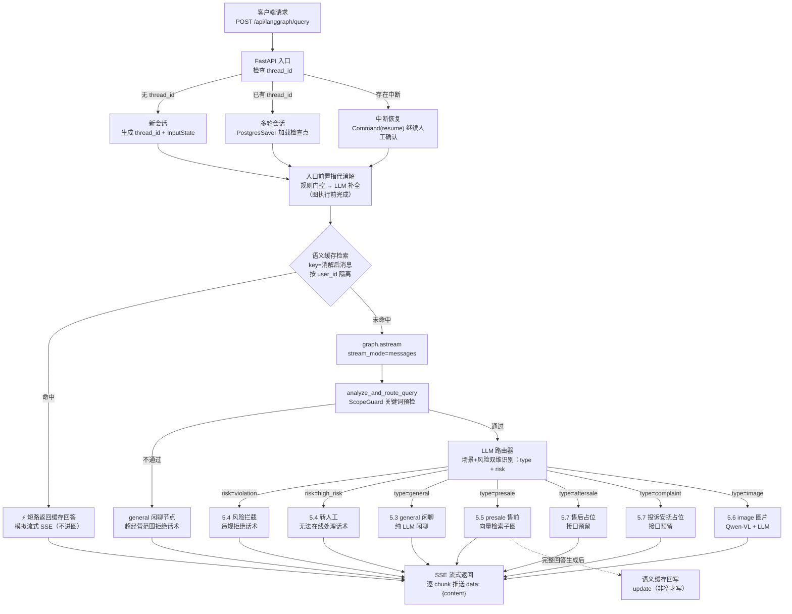

**关键说明**:

1. **入口三态**：同一端点根据 thread_id 区分新会话 / 多轮续聊 / 中断恢复（human-in-the-loop）
2. **入口前置指代消解**：多轮代词/省略（"那个有货吗"）在 `graph.astream` 前完成改写（规则门控 + LLM 补全），首条消息无历史直接透传；图内意图识别与检索拿到的均为完整问题
3. **入口语义缓存检索**：消解后、进图前按 user_id 查缓存（key=消解后消息），命中短路返回不进图；未命中走图，完整回答生成后回写（非空才写，语气词/失败不写）；含指代且无历史可消解时跳过缓存检索
4. **状态持久化**：PostgresSaver 检查点在每个节点执行后自动写入 PostgreSQL，服务重启不丢失
5. **流式输出**：`stream_mode="messages"` 让每个 AIMessage chunk 实时推送给前端
6. 对话记录落库（conversations/messages 表）由前端经 `/api/conversations/save-messages` 接口保存，langgraph 路径的会话状态由检查点承载

### 5.2 意图路由决策流程

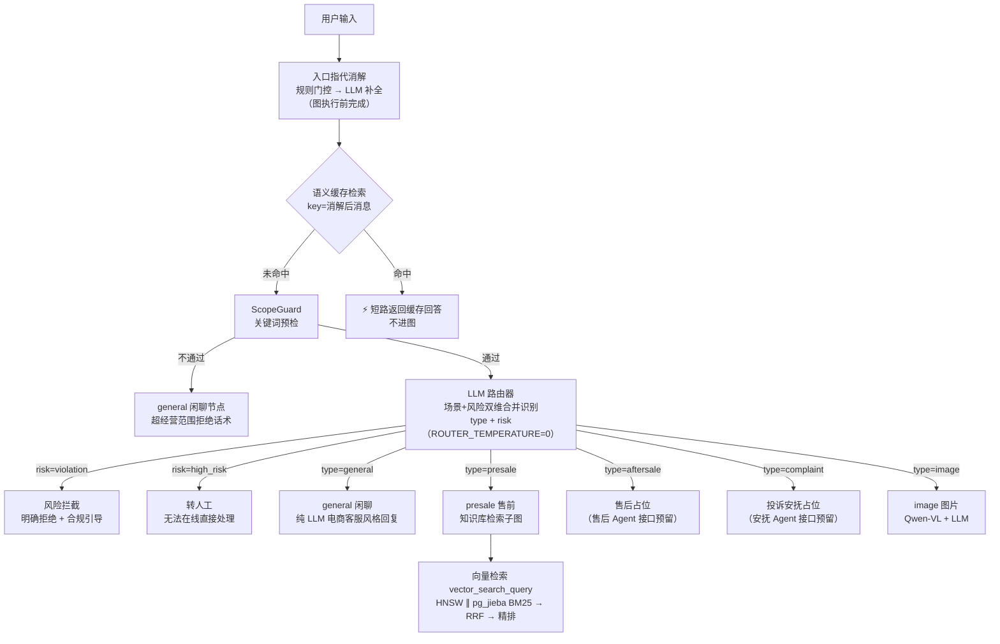

### 5.3 general 闲聊意图运行流程

节点 `respond_to_general_query`：纯 LLM 对话，不调用任何外部检索；历史消息经 MemoryManager 压缩（Redis 摘要缓存）后注入提示词。ScopeGuard 超经营范围拦截后也走本节点（注入"超出经营范围"logic 触发拒绝话术）。

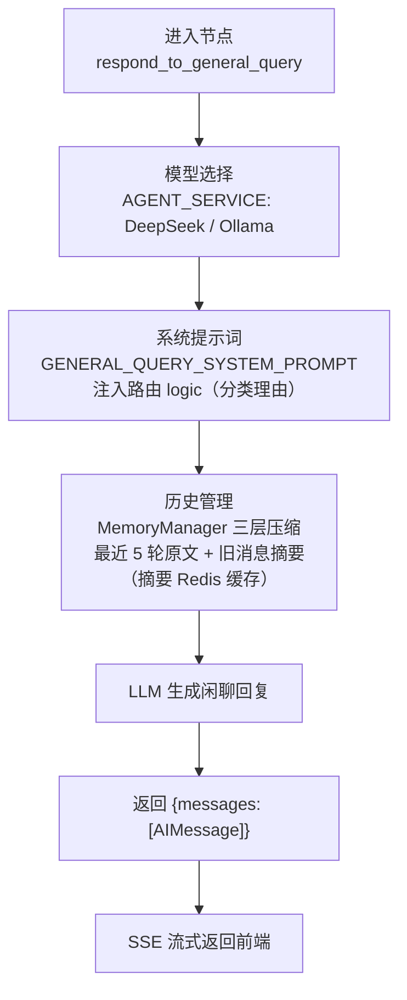

### 5.4 风险拦截 / 转人工运行流程

节点 `risk_intercept`（risk=violation）与 `transfer_human`（risk=high_risk）：**静态话术节点，不走 LLM**——违规咨询明确拒绝 + 合规引导（对应福客 D5），高风险操作/投诉升级说明无法在线直接处理（对应福客 D3/D4 转人工复核）。原 additional-query 追问节点已删除（追问逻辑下沉到后续业务 Agent）。

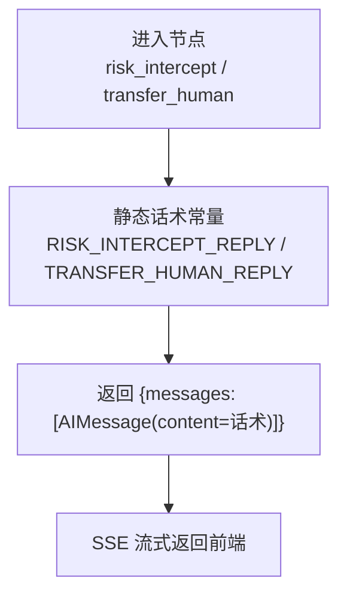

### 5.5 presale 售前导购运行流程（原 graphrag-query）

节点 `create_research_plan`：售前场景（商品参数/价格/推荐/使用咨询）复用现有 RAG 子图，直接进入 Multi-Tool 子图（TimeoutGuard 30 秒超时保护）。入口环节（main.py `/api/langgraph/query`，图执行前）：指代消解（多轮代词/主语补全）→ 语义缓存检索——命中直接短路返回（不进图），未命中才进入本节点（query 已是完整问题），完整回答生成后回写缓存。

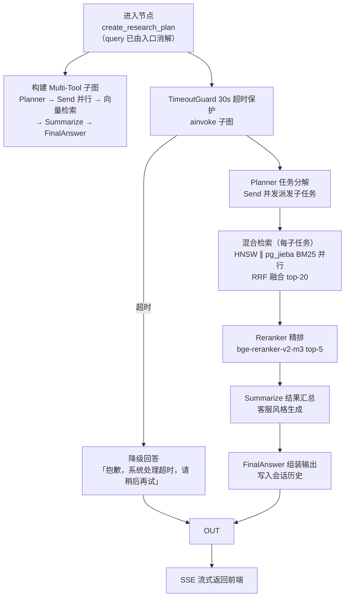

### 5.6 image-query 图片分析意图运行流程

节点 `create_image_query`：PIL 压缩 → base64 → Qwen-VL 视觉分析 → 结合图片描述由 LLM 生成客服回复。

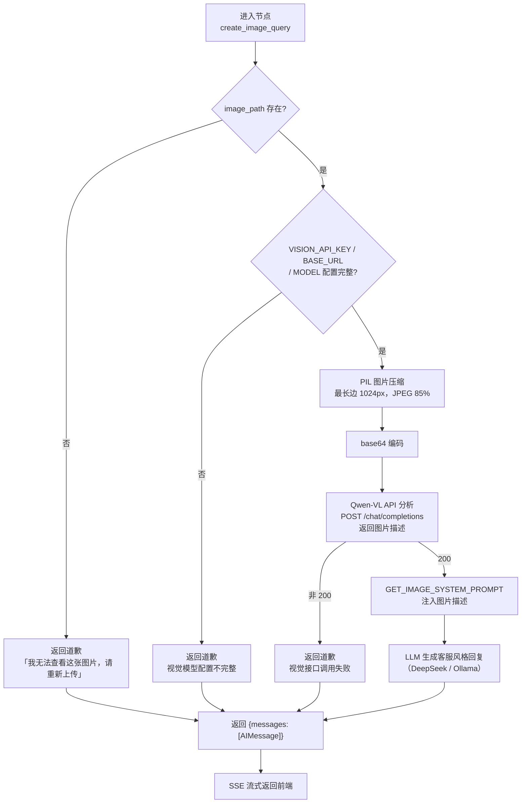

### 5.7 售后 / 投诉安抚占位节点

节点 `aftersale_placeholder` / `complaint_placeholder`：**业务 Agent 接口占位**——返回"服务升级中"提示（静态话术，不走 LLM）。接口与 multi_tool 子图同构（`question+history → answer`），后续售后 Agent（工作流骨架 + LLM 决策点 + RAG tool，方式 C）/ 投诉安抚 Agent 子图就位后，仅替换路由目的地，识别模块与接口形状不动。售后子场景（退货退款/物流/订单查询）由售后 Agent 工作流骨架第一步结合订单/历史上下文判断，识别层不承担。

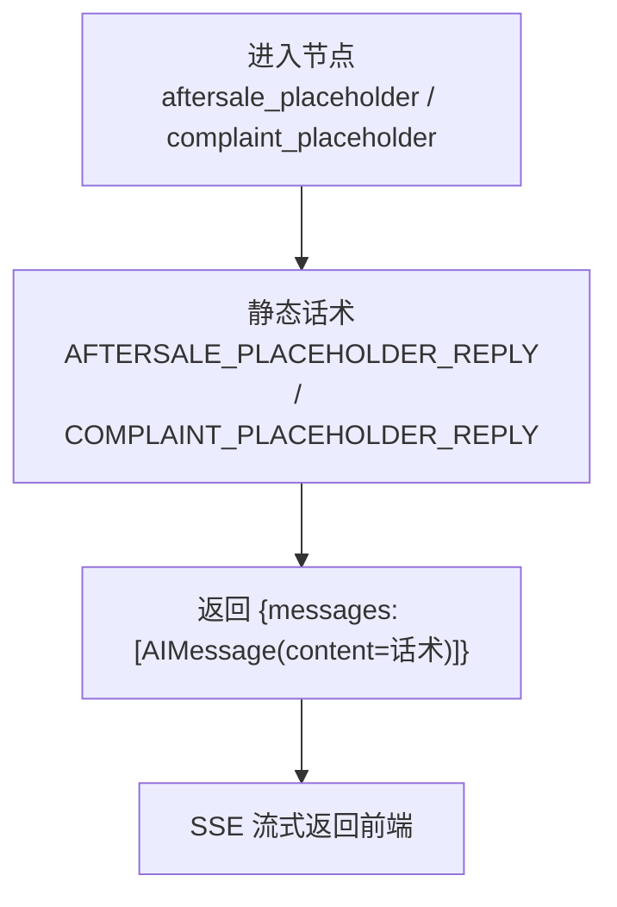

---

## 6. 设计模式应用

| 设计模式 | 应用位置 | 具体实现 |
|---------|---------|---------|
| **工厂模式** | `LLMFactory` | `create_chat_service()` 根据配置返回不同实例 |
| **策略模式** | `config.py` 服务选择 | `CHAT_SERVICE` / `REASON_SERVICE` / `AGENT_SERVICE` 分别选择 DeepSeek/Ollama |
| **状态图模式** | `lg_builder.py` | LangGraph `StateGraph` + 条件边实现多路由 Agent 编排 |
| **观察者/回调模式** | `deepseek_service.py` | `on_complete` 回调触发消息持久化，解耦 LLM 和存储 |
| **建造者模式** | `lg_builder.py` | `builder.add_node().add_edge().compile()` 构建状态图 |
| **单例模式** | `checkpointer_pool`（AsyncConnectionPool） | LangGraph PostgresSaver 全局持久化存储 |
| **模板方法模式** | 提示词模板 | 预定义提示词 + 动态参数注入 |
| **装饰器模式** | `LoggingMiddleware` | FastAPI 中间件统一日志 |
| **门面模式** | `RAGRetrieverService` | 唯一检索入口：HNSW ∥ BM25 并行 → RRF → 精排，graph 节点与 @tool 共用 |

---

## 7. 数据流转

### 7.1 用户消息存储

```
用户消息 + AI回复 → ConversationService.save_message()
  → PostgreSQL: conversations 表 (会话元信息)
  → PostgreSQL: messages 表 (用户消息 + 助手回复)
  → 首条消息自动生成会话标题 (前 20 字)
```

### 7.2 语义缓存存储

```
用户问题 → 分级指代消解 → EmbeddingProvider → Redis:
  {prefix}:vec:{md5}  → JSON 向量（md5 基于消解后消息）
  {prefix}:resp:{md5} → 回复文本
  {prefix}:meta:{md5} → 访问元数据
  {prefix}:index      → ZSET 有序索引（member=hash_id, score=last_access）
                        替代 keys() 全库扫描；cleanup 按 score 升序淘汰
```

### 7.3 标准 RAG 索引管道

```
原始文档 (PDF/DOCX/TXT)
  → 文档解析 (PyPDF2 / python-docx / TXT)
  → 文本清洗
  → RecursiveCharacterTextSplitter 分块 (500/50)
  → Embedding (EmbeddingProvider, qwen text-embedding-v4 API 1024 维, 分批 ≤10 条/请求)
  → pgvector 入库 (document_chunks 表, HNSW 索引)
  → BM25 侧自动就绪：content_tsv 生成列（jiebacfg 精确模式分词）+ GIN 倒排索引
    （CREATE EXTENSION pg_jieba；生成列随 INSERT 自动维护，无重建窗口）
```

---

## 8. 项目亮点深度分析

### 8.1 🌟 场景+风险双维合并意图识别路由

**创新点**: 一次 LLM 低温结构化输出同时判定**场景意图 + 风险意图**两个维度，risk 拦截优先级最高（违规/高风险消息不进入任何业务处理路径），场景驱动路由并预留业务 Agent 接口。

```python
class Router(TypedDict):
    """Classify user query: scenario + risk."""
    logic: str                      # 分类理由（多意图时简述次要意图）
    type: Literal[
        "presale",                  # 售前：商品咨询/参数/价格活动/推荐导购
        "aftersale",                # 售后：退货退款/物流异常/订单查询
        "complaint",                # 投诉安抚：情绪不满/投诉（情绪主导）
        "general",                  # 闲聊
        "image",                    # 图片
    ]
    risk: Literal[
        "none", "violation", "high_risk",
    ]                               # violation=违规咨询拦截；high_risk=高风险操作转人工
```

**技术价值**:

- 原 4 类技术路由合并进场景体系（graphrag-query→presale，additional-query 删除——追问下沉到业务 Agent）
- 多意图取主导意图（句首发/最强烈者；risk/complaint 永远优先），次要意图记入 logic
- 售后子场景（退货/物流/订单）不由识别层判断——判断需订单/历史上下文，下沉到售后 Agent 工作流骨架第一步（简化设计 2026-08-27）
- 售后/投诉安抚占位节点接口与 RAG 子图同构，业务 Agent（售前/售后/安抚）就位后仅改路由目的地
- 结构化输出校验失败降级 general/none 不抛异常；golden set 评测（42 条，含意图模糊/多意图/超范围/图片风险/多轮上下文）二维准确率 100%（脚本 `llm_backend/scripts/eval_intent_golden.py`）
- 设计依据与演进方向（任务分配器/多 Agent 协同/主 Agent 汇总/并行规则）见 `docs/spec_plan/SPEC_INTENT_RECOGNITION_OPTIMIZATION.md` §8.3

### 8.2 🌟 混合检索 + RRF 融合 + Reranker 精排

**创新点**: 不是简单的 BM25+向量双路检索，而是一个**4 步闭环**（两路检索全部下沉数据库，应用层只发 SQL 收排名）：

1. **pg_jieba BM25 SQL 精确匹配**（ts_rank_cd + GIN 倒排索引，jiebacfg 精确模式与查询同源，DB 内增量维护）
2. **pgvector HNSW 向量语义匹配**（qwen text-embedding-v4 API 编码，ORDER BY 距离触发 ANN 索引）
3. **RRF 倒数排名融合**（不依赖绝对分数，数学上更鲁棒；两路 `asyncio.gather` 并行，耗时 = max 非 sum）
4. **bge-reranker-v2-m3 精排**（CrossEncoder 拼接 (query, doc) 打分，top-20 → top-5；替代原 LLM 相关性评分，GPU/fp16 加速，失败自动降级为融合 top-K）

```python
# RRF 融合公式
score(doc) = Σ 1/(k + rank_i)  # k=60, rank_i 是文档在第 i 路检索中的排名
```

**技术价值**: 融合了关键词精确匹配和语义理解的优势，精排用交叉编码器做最终把关，防止不相关结果污染 LLM 上下文；检索计算全部下沉 PostgreSQL（应用内存零语料驻留），语料规模增长不再线性放大应用侧成本。

### 8.3 🌟 三层记忆管理 + Redis 增量缓存

**创新点**: 不仅压缩历史对话，还实现了**增量式摘要更新**和**Redis 缓存跨会话复用**：

```
第一层: 最近 5 轮 (完整原文)
第二层: 轮次 6-15 (压缩为 ~200 字摘要)
第三层: 轮次 16+ (压缩为 ~100 字摘要 + 关键实体)
```

**技术价值**:

- 增量压缩：新轮次只压缩未处理的，不从零开始
- Redis 缓存：跨请求复用摘要，避免重复 LLM 调用
- Token 预算控制：动态裁剪确保不超限
- 关键实体追踪：保留产品名称等关键信息不丢失

### 8.4 🌟 语义缓存的工程化实现

**创新点**: 不是简单的键值缓存，而是基于 **Embedding 向量余弦相似度**的语义级缓存：

```
"扫地机器人多少钱" ≈ "这个扫地机什么价格"
→ 向量余弦相似度 0.95 ≥ 0.90 → 缓存命中
```

**工程细节**:

- 按用户隔离缓存 (`prefix:user_id:...`)
- **分级指代消解**：三层规则引擎（显性指代 / 省略主语 / 纯语气词）先过滤，80% 完整问题零开销透传、15% 含指代消息才调 LLM 补全（temperature=0 保证确定性、2s 超时失败降级透传）、纯语气词不查不写避免污染
- **lookup/update 同源消解**：缓存 key 基于消解后消息 MD5，保证"那个有货吗"与"扫地机器人X1有货吗"命中同一缓存
- **graphrag 入口前置检索**：`/api/langgraph/query` 消解后、进图前查缓存，命中短路跳过整个图流程；未命中走图、完整回答后回写（两条链路共享按 user_id 的缓存池）
- **ZSET 有序索引** + `redis.asyncio` 异步客户端 + 实例池化（消除 keys 全库扫描与事件循环阻塞）
- LRU 自动清理（ZSET score 排序）+ 访问次数统计
- 模拟流式返回保持前端体验一致

### 8.5 🌟 Docker Compose 一键部署 + Healthcheck

**创新点**: 3 个服务 (PostgreSQL/Redis/App) 通过 `depends_on` + `condition: service_healthy` 确保启动顺序：

```yaml
app:
  depends_on:
    postgres:
      condition: service_healthy   # pg_isready
    redis:
      condition: service_healthy   # redis-cli ping
```

**技术价值**: 避免了常见的 "服务启动但数据库未就绪" 的竞态问题，开箱即用。

---

## 9. 项目优点

### 9.1 架构设计

| 优点 | 说明 |
|------|------|
| **模块化清晰** | 配置/服务/Agent/组件分层明确，职责单一 |
| **高可扩展性** | 工厂模式 + 策略模式，新增 LLM 只需添加服务类 |
| **Agent 编排成熟** | LangGraph StateGraph 提供可视化的状态流转 |
| **会话持久化** | PostgresSaver + thread_id 实现多轮对话状态管理（重启不丢失） |
| **SSE 流式响应** | 所有 LLM 接口统一使用 Server-Sent Events，用户体验好 |
| **Human-in-the-Loop** | 支持中断/恢复机制，实现人工确认流程 |

### 9.2 技术深度

| 优点 | 说明 |
|------|------|
| **检索质量闭环** | 混合检索 → Reranker 精排，DB 内检索 + 交叉编码器把关 |
| **多层护栏** | 范围预检 + 超时保护，层层保障 |
| **内存管理成熟** | 三层摘要 + Token 预算 + Redis 缓存，处理长对话 |
| **成本控制意识** | 语义缓存降本 + 入口指代消解门控（仅约 15% 含指代消息调 LLM） |

### 9.3 工程实践

| 优点 | 说明 |
|------|------|
| **配置管理规范** | Pydantic Settings 类型安全，60+ 项配置集中管理 |
| **日志系统完善** | 结构化日志，按服务分级，请求追踪 |
| **Docker 部署完善** | Multi-service + healthcheck + 数据持久化 |
| **文档规范** | README 清晰，API 端点完整列举 |
| **知识库丰富** | 内置产品文档 + FAQ + 真实客服对话数据 |

---

## 10. 项目缺点与改进建议

### 10.1 严重问题 🔴

#### 10.1.1 硬编码的凭据信息

`docker-compose.yml` 中包含明文数据库密码：

```yaml
POSTGRES_PASSWORD: smartcs_agent_pwd
```

**影响**: 如果仓库公开，凭据泄露风险。

**建议**: 使用 Docker Secrets 或 `.env` 文件管理敏感信息，在 docker-compose 中通过 `${VAR}` 引用。

### 10.2 中等问题 🟡

#### 10.2.1 单元测试覆盖不足（已部分缓解）

已建立 pytest 测试体系（`app/test/`：`test_entry_cache.py` / `test_fastapi.py` / `test_pronoun_resolve.py`，当前 9 项全通过），意图识别路由另有 golden set 评测脚本 `scripts/eval_intent_golden.py`（42 条二维准确率）。但向量检索、语义缓存、混合检索等核心模块仍无 pytest 覆盖。

**建议**:

- 为向量检索、语义缓存、混合检索添加 pytest 测试
- 集成 LangGraph 的测试工具进行 Agent 行为验证

#### 10.2.2 前端过于简单

前端已重构为 Vue3 SFC 工程（frontend），chat.html 已并入。原 chat.html 单文件实现缺少：

- 用户登录 UI
- 会话列表展示
- 图片上传交互
- 加载状态/错误处理
- 移动端适配

**建议**: 使用现代前端框架（React/Vue SPA）重构或集成到 FastAPI Jinja2 模板。

#### 10.2.3 init_db 每次启动清空业务表

```python
# scripts/init_db.py 每次启动先 drop_all 再 create_all
await conn.run_sync(Base.metadata.drop_all)
await conn.run_sync(Base.metadata.create_all)
```

**影响**: 每次启动（含容器重启）清空用户/会话/消息/document_chunks 业务表数据（LangGraph 检查点表不受影响）。

**建议**: 改为 create-only（仅建表 + 扩展 + 索引），表结构演进交给 Alembic 管理。

#### 10.2.4 缺少 API 限流

所有 API 端点都没有速率限制。

**影响**: 恶意或异常高频调用可能导致 LLM API 费用失控。

**建议**: 集成 `slowapi` 或 Redis 令牌桶实现 IP/用户级别限流。

#### 10.2.5 历史上的 GraphRAG 源码内嵌问题（已迁移解决）

历史上 `llm_backend/app/graphrag/` 直接包含了 Microsoft GraphRAG 的完整源码（约 80+ 文件），存在以下问题：

- 增加仓库体积
- 难以跟随上游更新
- 版本管理混乱
- 索引构建耗时 5-30 分钟/次，LLM 成本高
- Local/Global/DRIFT/Basic 检索能力对电商客服场景过剩（实体关系类查询由知识库文档检索承担）

**解决**: 已迁移为标准 RAG 管道（pgvector 向量检索），删除 `llm_backend/app/graphrag/` 源码目录、`scripts/build_graphrag_index.py` 与 graphrag 依赖，索引构建降至秒级，事实查询效果持平。

#### 10.2.6 缺少输入校验

`main.py` 中的请求模型缺少字段级别校验：

```python
class ChatMessage(BaseModel):
    messages: List[Dict[str, str]]  # 没有长度限制
    user_id: int                     # 没有范围校验
    conversation_id: int             # 没有存在性校验
```

**建议**: 添加 `Field(min_length=1, max_length=50)` 等约束。

### 10.3 改进建议 🟢

#### 10.3.1 引入异步任务队列

文件上传和索引构建 (`IndexingService`) 是 CPU 密集型操作，当前直接阻塞请求线程。

**建议**: 引入 Celery + Redis 或 ARQ 异步任务队列处理。

#### 10.3.2 添加监控和可观测性

**建议**:

- 集成 OpenTelemetry 追踪 LLM 调用链
- 添加 Prometheus metrics (请求延迟、缓存命中率、LLM Token 消耗)
- 设置 LLM API 调用告警

#### 10.3.3 实现 A/B 测试框架

当前策略选择（简单/中等/复杂）依赖硬编码阈值。

**建议**: 实现配置化的 A/B 测试，对比不同策略的效果，数据驱动优化。

#### 10.3.4 添加降级策略

当 DeepSeek API 不可用时，当前直接抛出 500 错误。

**建议**: 实现 fallback 链：DeepSeek → Ollama → 预定义回复。

#### 10.3.5 数据隐私增强

用户上传的图片/文件直接存储在本地文件系统。

**建议**:

- 敏感图片自动脱敏
- 定期清理过期文件
- 实现访问控制（当前 `/api/conversations/{id}/messages` 的 `user_id` 通过 query 参数传递，不安全）

---

## 11. 部署架构

### 11.1 Docker Compose 拓扑

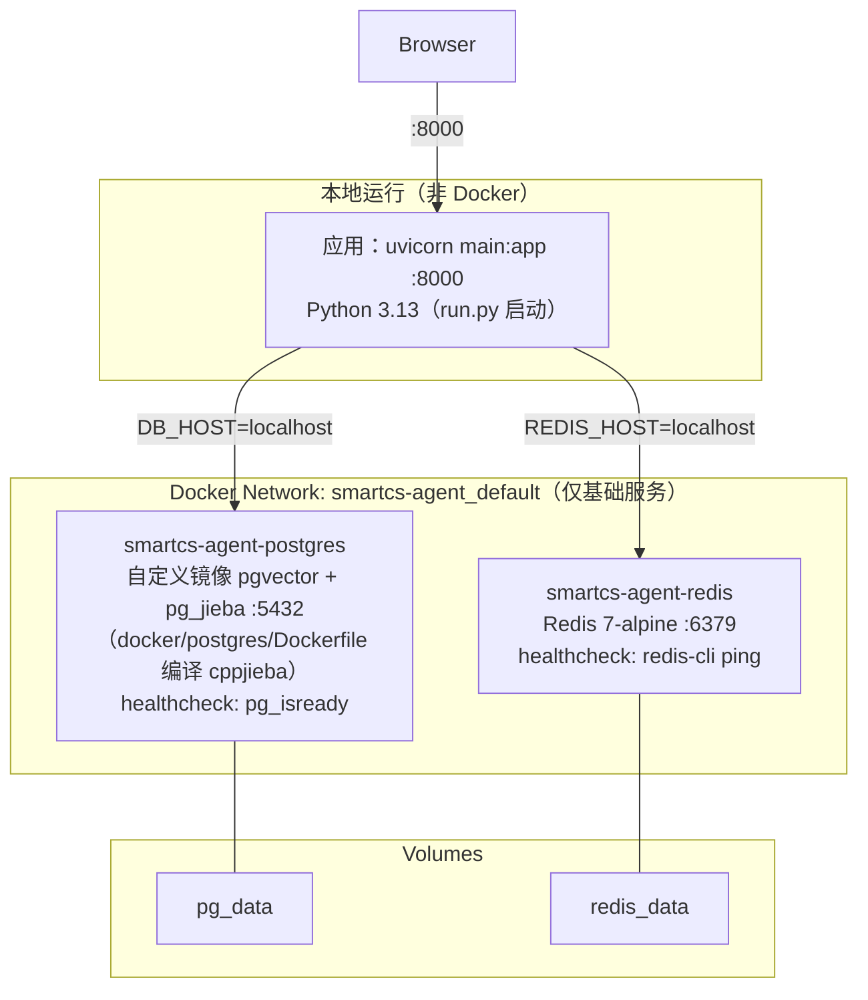

### 11.2 启动流程

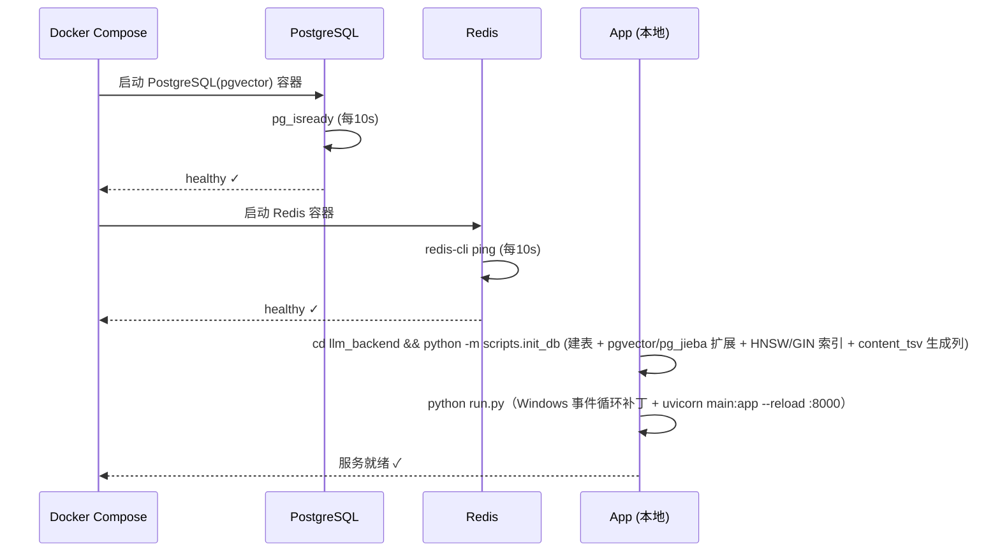

---

## 12. 综合评价

### 12.1 技术成熟度矩阵

| 维度 | 评分 | 说明 |
|------|------|------|
| 架构设计 | ⭐⭐⭐⭐⭐ | 分层清晰，模块解耦，设计模式运用恰当 |
| 技术深度 | ⭐⭐⭐⭐⭐ | 混合检索+评分、三层记忆管理、语义缓存均为业界前沿实践 |
| 代码质量 | ⭐⭐⭐⭐ | 整体结构良好，部分模块缺失、硬编码问题需修复 |
| 测试覆盖 | ⭐ | 完全缺失，需从零建立测试体系 |
| 文档完善 | ⭐⭐⭐⭐ | README 详尽，API 文档完整，缺少开发者指南 |
| 部署运维 | ⭐⭐⭐⭐ | Docker 一键部署完善，缺少监控和告警 |
| 安全性 | ⭐⭐ | 凭据硬编码、缺少限流和输入校验 |
| 可扩展性 | ⭐⭐⭐⭐⭐ | 工厂模式+策略模式，新增功能成本低 |

### 12.2 适用场景

| 场景 | 适合度 | 说明 |
|------|--------|------|
| 电商客服原型 | ⭐⭐⭐⭐⭐ | 开箱即用，多轮对话+知识库完善 |
| 学习 LangGraph | ⭐⭐⭐⭐⭐ | 完整的 StateGraph + 子图 + 多工具编排案例 |
| 学习标准 RAG | ⭐⭐⭐⭐⭐ | pgvector 向量管道 + 混合检索的实际应用 |
| 学习 RAG 优化 | ⭐⭐⭐⭐ | 语义缓存、Reranker 精排、混合检索等最佳实践 |
| 生产部署 | ⭐⭐⭐ | 需补充测试、限流、监控后才能上生产 |

### 12.3 总结

SmartCS-Agent 是一个**技术深度优秀、工程完整性良好但生产就绪度不足**的 AI 客服系统。它在以下方面展现了较强的技术实力：

1. **Agent 编排**: LangGraph StateGraph 的运用成熟，子图嵌套、条件路由、会话持久化、中断恢复等技术点处理得当
2. **检索增强**: 混合检索（HNSW ∥ pg_jieba BM25）+ RRF 融合 + Reranker 精排形成完整的检索质量保障链路
3. **工程降本**: 语义缓存的实现精细（按用户隔离、LRU清理、流式模拟），三层记忆管理的 Token 预算控制
4. **系统思维**: 入口指代消解 + 语义缓存前置（图执行前完成上下文处理与缓存短路），子图保持精简，冗余 LLM 调用持续收敛

主要短板在于**测试缺失**和**生产级运维特性不足**（日志监控、限流降级、凭据管理），建议在这些方面投入改进后再用于生产环境。

---

> **分析工具**: Claude Code
> **分析范围**: 全项目 Python 服务，配置化管理，3 Docker 服务
> **核心模块覆盖率**: 100%

