# SmartCS-Agent 项目深度分析报告

> **分析日期**: 2026-08-08（§4 核心模块详解于 2026-09-02 按代码实测状态重写） | **版本**: 1.1 | **许可**: MIT

---

## 目录

1. [项目概述](#1-项目概述)
2. [技术栈全景分析](#2-技术栈全景分析)
3. [系统架构设计](#3-系统架构设计)
4. [核心模块详解](#4-核心模块详解)
5. [系统运行流程](#5-系统运行流程)
6. [设计模式应用](#6-设计模式应用)
7. [数据流转](#7-数据流转)
8. [项目亮点深度分析](#8-项目亮点深度分析)
9. [项目优点](#9-项目优点)
10. [项目缺点与改进建议](#10-项目缺点与改进建议)
11. [部署架构](#11-部署架构)
12. [综合评价](#12-综合评价)

---

## 1. 项目概述

SmartCS-Agent 是一个**基于 FastAPI + LangGraph 的智能电商客服系统**，深度集成了 pgvector 向量检索（标准 RAG 管道）、混合检索、语义缓存、多轮对话管理等功能。项目面向智能家居电商场景，内置 10 款产品知识文档、1,800 条电商 FAQ 和 2,600+ 条真实客服对话数据。

**核心能力**: 场景+风险双维意图识别（单次合并输出，场景驱动分支、风险拦截优先）→ 混合检索（HNSW ∥ pg_jieba BM25 → RRF → Reranker 精排）→ 流式响应

---

## 2. 技术栈全景分析

### 2.1 技术栈总览

```mermaid
graph TB
    subgraph "前端层 Frontend"
        A[Vue.js 静态页面]
    end

    subgraph "API 网关层 Gateway"
        B[FastAPI<br/>异步 REST + SSE 流式]
    end

    subgraph "Agent 编排层 Orchestration"
        C[LangGraph StateGraph<br/>场景+风险双维意图识别 + 子图工作流]
    end

    subgraph "LLM 服务层"
        D1[DeepSeek V3<br/>主对话/推理/路由]
        D2[EmbeddingProvider<br/>qwen text-embedding-v4 API<br/>1024 维（local/ollama 分支保留）]
        D3[Qwen-VL (qwen-vl-max)<br/>图片分析 Vision]
    end

    subgraph "知识检索层"
        E1[pgvector 向量检索<br/>标准 RAG 管道]
        E3[混合检索 BM25 + 向量 + RRF]
    end

    subgraph "存储层"
        F1[(PostgreSQL 16 + pgvector<br/>用户/会话/消息/向量/检查点)]
        F2[(Redis 7<br/>语义缓存/摘要缓存)]
    end

    subgraph "基础设施"
        G[Docker Compose<br/>一键部署 + Healthcheck]
    end

    A --> B --> C --> D1
    C --> D2
    C --> D3
    C --> E1
    C --> E3
    B --> F1
    B --> F2
    G --> F1
    G --> F2
```

### 2.2 详细技术清单

| 层次 | 技术 | 版本 | 职责 |
|------|------|------|------|
| **后端框架** | FastAPI | 0.100+ | REST API，原生 async/await，SSE 流式响应 |
| **Agent 编排** | LangGraph | latest | StateGraph 多路由 Agent，PostgresSaver 会话检查点持久化 |
| **LLM 基座** | DeepSeek API | V3 | 对话生成、意图路由、推理 |
| **本地 LLM** | Ollama | - | 可切换的本地 LLM 替代方案 |
| **文档检索** | pgvector | 0.5+ | 向量表 document_chunks（HNSW 索引），标准 RAG 索引管道 |
| **Embedding** | EmbeddingProvider | qwen text-embedding-v4 | 统一向量接口（DashScope API，1024 维，默认 qwen；local/ollama 分支保留） |
| **Embedding 通道** | DashScope OpenAI-compatible API | text-embedding-v4 | 索引/检索/混合检索/语义缓存统一走 qwen API（aiohttp，无本地模型主链路） |
| **向量缓存** | Redis | 7 Alpine | 语义缓存（余弦相似度 ≥ 0.90 命中） |
| **精排** | sentence-transformers CrossEncoder | bge-reranker-v2-m3 | RRF 融合 top-20 → 精排 top-5（替代 LLM 相关性评分，GPU/fp16 可加速） |
| **全文检索** | PostgreSQL pg_jieba | jiebacfg 精确模式 | 数据库内 BM25（ts_rank_cd + GIN 倒排索引），替代应用内存 jieba + rank_bm25 |
| **关系数据库** | PostgreSQL | 16（pgvector 镜像） | 用户、会话、消息持久化 + 向量检索 + LangGraph 检查点 |
| **LLM SDK** | OpenAI SDK (AsyncOpenAI) | - | 兼容 DeepSeek API |
| **LangChain** | langchain-core/deepseek/ollama | - | LLM 抽象层，结构化输出 |
| **前端** | Vue | 编译静态 dist | 聊天 UI 界面（非主要重点） |
| **部署** | Docker + Docker Compose | - | 2 基础服务（PostgreSQL(pgvector)/Redis）；App 应用本地运行（uvicorn/run.py） |
| **搜索** | SerpAPI | - | Function Calling 联网搜索 |
| **图片处理** | Pillow (PIL) | - | 上传图片压缩/格式转换 |
| **异步 HTTP** | aiohttp | - | 视觉 API 异步调用 |

---

## 3. 系统架构设计

### 3.1 整体架构图

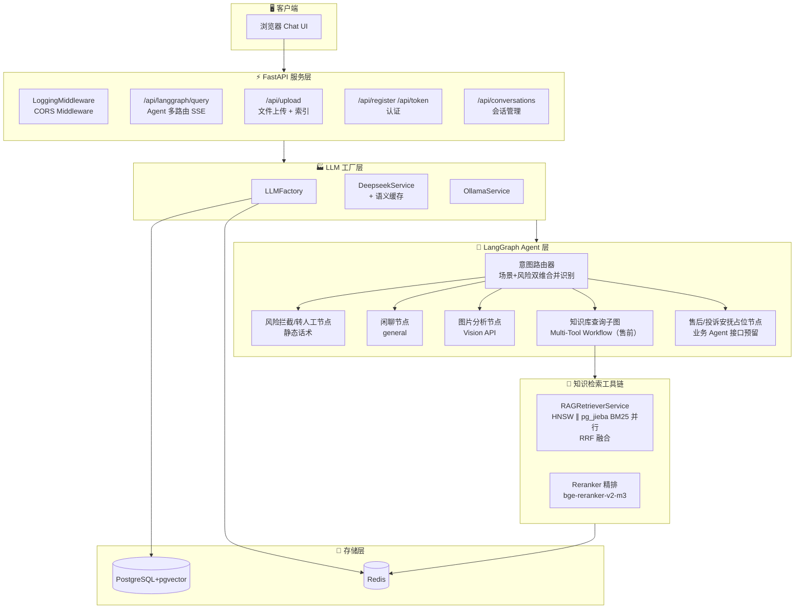
```mermaid
flowchart TB
    subgraph Client["🖥️ 客户端"]
        Browser["浏览器 Chat UI"]
    end

    subgraph FastAPI["⚡ FastAPI 服务层"]
        direction TB
        MW["LoggingMiddleware<br/>CORS Middleware"]
        LG["/api/langgraph/query<br/>Agent 多路由 SSE"]
        UPLOAD["/api/upload<br/>文件上传 + 索引"]
        AUTH["/api/register /api/token<br/>认证"]
        CONV["/api/conversations<br/>会话管理"]
    end

    subgraph Factory["🏭 LLM 工厂层"]
        LLMF["LLMFactory"]
        DS["DeepseekService<br/>+ 语义缓存"]
        OS["OllamaService"]
    end

    subgraph Agent["🤖 LangGraph Agent 层"]
        direction TB
        ROUTER["意图路由器<br/>场景+风险双维合并识别"]
        RISK["风险拦截/转人工节点<br/>静态话术"]
        GEN["闲聊节点<br/>general"]
        IMG["图片分析节点<br/>Vision API"]
        KG["知识库查询子图<br/>Multi-Tool Workflow（售前）"]
        PLACE["售后/投诉安抚占位节点<br/>业务 Agent 接口预留"]
    end

    subgraph KGTools["🔧 知识检索工具链"]
        direction LR
        GRAG["RAGRetrieverService<br/>HNSW ∥ pg_jieba BM25 并行<br/>RRF 融合"]
        RG["Reranker 精排<br/>bge-reranker-v2-m3"]
    end

    subgraph Store["💾 存储层"]
        PostgreSQL[(PostgreSQL+pgvector)]
        Redis[(Redis)]
    end

    Browser --> FastAPI
    FastAPI --> Factory
    Factory --> Agent
    ROUTER --> RISK & GEN & IMG & KG & PLACE
    KG --> KGTools
    KGTools --> Redis
    LLMF --> PostgreSQL
    LLMF --> Redis
```

### 3.2 项目目录结构

```
SmartCS-Agent/
├── llm_backend/                          # 后端主目录
│   ├── main.py                           # FastAPI 入口，所有 API 端点定义
│   ├── run.py                            # 服务启动脚本
│   └── app/
│       ├── core/                         # 核心配置层
│       │   ├── config.py                 # Pydantic Settings 配置（环境变量映射）
│       │   ├── database.py              # PostgreSQL 异步连接（psycopg）
│       │   ├── security.py              # JWT 认证
│       │   ├── hashing.py               # 密码哈希
│       │   ├── logger.py                # 结构化日志
│       │   └── middleware.py            # 请求日志中间件
│       ├── api/
│       │   └── auth.py                  # 认证路由（注册/登录）
│       ├── services/                     # 业务服务层
│       │   ├── llm_factory.py           # LLM 工厂模式
│       │   ├── deepseek_service.py      # DeepSeek + 语义缓存
│       │   ├── ollama_service.py        # Ollama 备选
│       │   ├── redis_semantic_cache.py  # Redis 语义缓存（asyncio + ZSET 索引 + 分级指代消解）
│       │   ├── pronoun_detector.py      # 指代检测器（三层规则引擎，缓存/入口共用门控）
│       │   ├── pronoun_resolver.py      # 指代消解器（LLM 补全，temperature=0，失败降级）
│       │   ├── rag_retriever_service.py # RAG 检索核心服务（HNSW ∥ BM25 并行 → RRF → 精排，唯一检索入口）
│       │   ├── reranker_service.py      # bge-reranker-v2-m3 精排（CrossEncoder，GPU/fp16，失败降级）
│       │   ├── rag_tool.py              # langchain @tool 薄封装（rag_retrieval）
│       │   ├── conversation_service.py  # 会话 CRUD
│       │   └── indexing_service.py      # 标准 RAG 索引构建（解析→分块→pgvector 入库）
│       ├── lg_agent/                     # LangGraph Agent 层
│       │   ├── lg_builder.py            # StateGraph 构建 + 路由 + 5 节点
│       │   ├── lg_states.py             # 状态定义（Router/AgentState）
│       │   ├── lg_prompts.py            # 15+ 提示词模板
│       │   └── kg_sub_graph/            # 知识库检索子图
│       │       ├── kg_tools_list.py     # 工具 Schema 定义
│       │       └── agentic_rag_agents/
│       │           ├── workflows/       # 多工具工作流
│       │           └── components/
│       │               ├── customer_tools/   # 检索节点（vector_search_query，调 RAGRetrieverService）
│       │               ├── hybrid_retrieval/ # bm25_sql_retriever.py（pg_jieba SQL BM25）+ rrf_fusion.py
│       │               ├── memory/         # 三层记忆管理器
│       │               ├── agent_safety/   # 护栏（Scope/Timeout）
│       │               └── planner/        # 任务分解
│       ├── models/                     # SQLAlchemy 模型
│       │   ├── conversation.py
│       │   ├── message.py
│       │   ├── user.py
│       │   └── document_chunk.py        # pgvector 文档块表
│       ├── prompts/                    # 搜索提示词
│       └── tools/                      # 搜索工具定义
├── scripts/                           # 工具脚本
│   ├── init_db.py                     # 数据库初始化（pgvector 扩展 + HNSW 索引）
│   ├── generate_product_knowledge.py  # CSV → 产品知识文档
│   ├── download_datasets.py           # 下载电商 FAQ 数据集
│   └── download_jddc.py              # 下载 JDDC 对话数据集
├── frontend/                          # Vue3 SFC 前端工程（由 chat.html 重构）
├── docker/                            # Docker 构建上下文
│   └── postgres/Dockerfile            # pgvector + pg_jieba 自定义镜像（cppjieba 源码编译）
├── docker-compose.yml                 # 2 基础服务编排（PostgreSQL 自定义镜像/Redis，App 本地运行）
├── Dockerfile                         # Python 3.13-slim 镜像（uv 安装锁定依赖）
├── pyproject.toml                     # Python 依赖清单（uv 管理）
├── uv.lock                            # 依赖锁定文件
├── .env.example                       # 环境变量模板（60+ 项配置）
└── .env.docker                        # Docker 环境变量
```

---

## 4. 核心模块详解（2026-09-02 按代码实测状态重写，总分结构）

> **写作口径**：本章按 2026-09-02 仓库源码逐文件核对 + `logs/` 现网日志抽查的**真实运行状态**撰写（意图澄清、指代消解/语义缓存入口链路、RAG 检索收敛、工具层三态协议均已落地）。讲解采用**总分结构**：先 §4.0 给出全链路总览图与模块清单（总），再按"入口 → 出口"的请求流向逐个模块展开（分）；复杂模块（§4.4 售前导购）先给模块总流程图，再在其下按子图粒度拆解（如 ragTool 检索运行流程）。与本报告 §2/§3/§5 中较早描述不一致之处，以本章为准。

### 4.0 模块总览（总）

SmartCS-Agent 的可执行程序只有一个：`llm_backend/` 下的 FastAPI 应用（`uvicorn main:app :8000`）。一次"用户提问 → AI 回复"的请求，按序穿过以下模块：

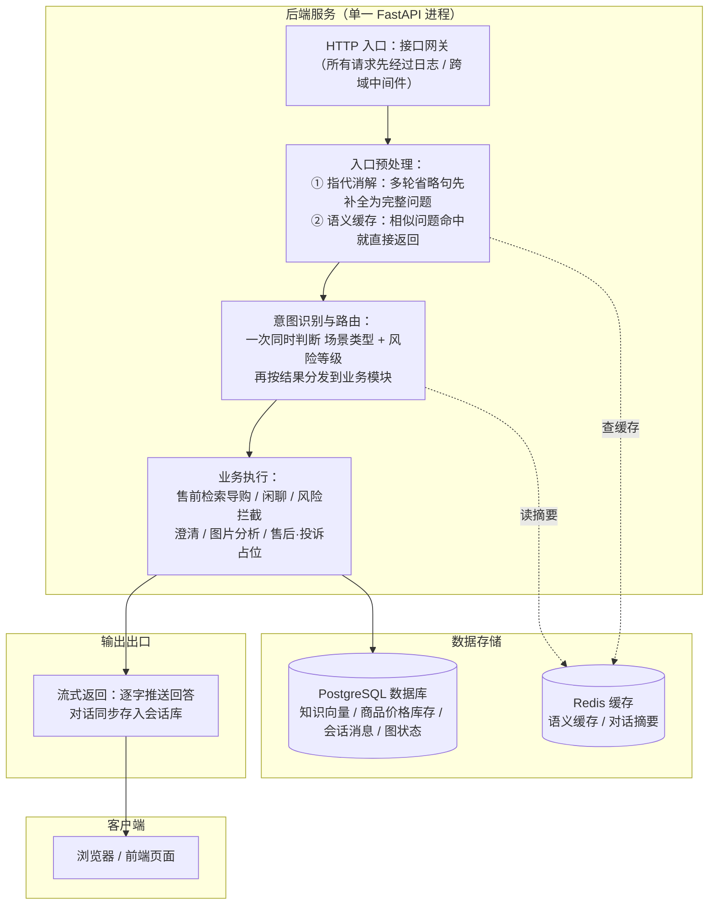
```mermaid
flowchart TB
    subgraph Client["客户端"]
        FE["浏览器 / 前端页面"]
    end
    subgraph Backend["后端服务（单一 FastAPI 进程）"]
        API["HTTP 入口：接口网关<br/>（所有请求先经过日志 / 跨域中间件）"]
        PREP["入口预处理：<br/>① 指代消解：多轮省略句先补全为完整问题<br/>② 语义缓存：相似问题命中就直接返回"]
        ROUTER["意图识别与路由：<br/>一次同时判断 场景类型 + 风险等级<br/>再按结果分发到业务模块"]
        BIZ["业务执行：<br/>售前检索导购 / 闲聊 / 风险拦截<br/>澄清 / 图片分析 / 售后·投诉占位"]
        API --> PREP --> ROUTER --> BIZ
    end
    subgraph Out["输出出口"]
        SSE["流式返回：逐字推送回答<br/>对话同步存入会话库"]
    end
    subgraph Store["数据存储"]
        PG[("PostgreSQL 数据库<br/>知识向量 / 商品价格库存 / 会话消息 / 图状态")]
        REDIS[("Redis 缓存<br/>语义缓存 / 对话摘要")]
    end
    BIZ --> SSE --> FE
    PREP -.查缓存.-> REDIS
    ROUTER -.读摘要.-> REDIS
    BIZ --> PG
```

**模块清单**（与下文章节一一对应；"运行流程"列即该模块的运行流程图位置）：

| 阶段 | 模块 | 核心文件 | 运行流程 |
|------|------|---------|---------|
| ① 入口 | HTTP 网关与应用装配 | `llm_backend/main.py`、`run.py`、`app/core/middleware.py`、`app/core/config.py` | §4.1（应用启动 + 请求分发） |
| ② 前置 | 入口指代消解 + 语义缓存 | `main.py` 入口段、`app/services/pronoun_detector.py`、`pronoun_resolver.py`、`redis_semantic_cache.py` | §4.2（模块总图 + 检测/缓存子图） |
| ③ 主图 | 双维意图识别与路由 | `app/lg_agent/lg_builder.py`、`lg_states.py`、`lg_prompts.py`；检查点 `psycopg_pool` + `AsyncPostgresSaver` | §4.3（主图运行 + 识别节点/路由子图） |
| ④ 业务 | 售前导购（RAG 检索） | `lg_builder.py:create_research_plan`、`kg_sub_graph/.../workflows/multi_agent/multi_tool.py`、`edges.py`、`components/{planner,customer_tools,summarize,final_answer}/`、`app/services/rag_retriever_service.py`、`reranker_service.py` | §4.4（模块总图 → 子图① 工作流 → 子图② 工具层 → 子图③ ragTool @tool → 子图④ 混合检索管线） |
| ④ 业务 | 业务应答节点群 | `lg_builder.py` 各节点、`lg_prompts.py` 话术/模板 | §4.5 |
| ⑤ 出口 | LLM 服务与 SSE 流式出口 | `app/services/llm_factory.py`、`deepseek_service.py`、`ollama_service.py`；`main.py process_stream` | §4.8 |
| 支撑 | 三层记忆管理 | `components/memory/{memory_manager,memory_compressor,memory_cache,token_budget}.py` | §4.6 |
| 支撑 | 安全护栏 | `components/agent_safety/{scope_guard,safety_guards}.py` | §4.7 |
| 支撑 | 会话存储 / 认证 / 知识索引 / 商品数据 / 前端 | `conversation_service.py`、`api/auth.py`、`indexing_service.py` 等 | §4.9 |

### 4.1 入口与 HTTP 网关模块

**模块职责**：进程入口与请求面。`run.py` 负责启动（Windows 事件循环补丁），`main.py` 装配 FastAPI 应用、挂中间件与全部 HTTP 端点，`lifespan` 在启动时初始化 LangGraph 检查点连接池并编译主图（`_LazyGraph` 延迟代理）。

**运行流程图（启动装配 → 请求分发）**：

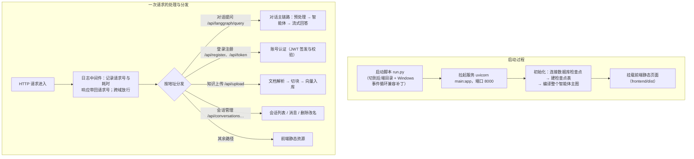
```mermaid
flowchart TB
    subgraph Startup["启动过程"]
        S1["启动脚本 run.py<br/>（切到后端目录 + Windows 事件循环兼容补丁）"]
        S2["拉起服务 uvicorn main:app，端口 8000"]
        S3["初始化：连接数据库检查点 → 建检查点表<br/>→ 编译整个智能体主图"]
        S4["挂载前端静态页面（frontend/dist）"]
        S1 --> S2 --> S3 --> S4
    end
    subgraph Request["一次请求的处理与分发"]
        R1["HTTP 请求进入"] --> R2["日志中间件：记录请求号与耗时<br/>响应带回请求号；跨域放行"]
        R2 --> R3{"按地址分发"}
        R3 -->|"对话提问 /api/langgraph/query"| R4["对话主链路：预处理 → 智能体 → 流式回答"]
        R3 -->|"登录注册 /api/register、/api/token"| R5["账号认证（JWT 签发与校验）"]
        R3 -->|"知识上传 /api/upload"| R6["文档解析 → 切块 → 向量入库"]
        R3 -->|"会话管理 /api/conversations…"| R7["会话列表 / 消息 / 删除改名"]
        R3 -->|"其余路径"| R8["前端静态资源"]
    end
```

**关键实现点**：

- **全项目唯一进程**：根目录 `main.py` 仅是 pyproject 占位 stub；Docker Compose 只编排 PostgreSQL/Redis 两个基础服务，应用在宿主机以 `python run.py` 运行（`llm_backend/` 内，README §运行）。
- **启动期依赖**：LangGraph 检查点（PostgresSaver）必须在事件循环内构造，故连接池 + `setup()` + `compile()` 全部推迟到 `lifespan`；请求期经 `_LazyGraph` 代理首次访问即解析真实 graph，未初始化时抛明确错误。
- **中间件**：`LoggingMiddleware`（uuid → contextvar → 回写 `X-Request-ID`，结构化日志 `http_request`）；CORS 全放开。
- **端点鉴权现状**：除 `GET /api/users/me` 外全部端点**不校验 JWT**，`user_id` 由请求体/query 直接信任（缺陷记录见 §10）。
- **遗留死端点**：`POST /chat-rag`（无 `/api` 前缀）引用未定义的 `RAGChatService`，调用即 500——前端不调用，属历史残留。

### 4.2 前置处理模块：入口指代消解 + 语义缓存

**模块职责**：在主图执行前完成两件事——(1) 多轮指代/省略句补全为自包含完整问题；(2) 语义缓存检索，命中则短路返回不进图。模块由 `main.py` 的入口段 + `pronoun_detector` / `pronoun_resolver` / `redis_semantic_cache` 组成，消解器以鸭子类型依赖 LLM 服务（`DeepseekService`/`OllamaService` 均可）。

**模块总运行流程图**：

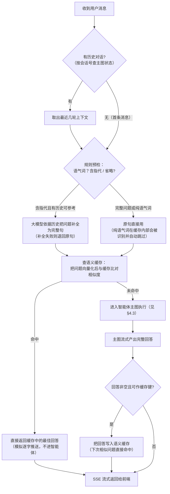
```mermaid
flowchart TD
    A["收到用户消息"] --> B{"有历史对话?<br/>（按会话号查主图状态）"}
    B -->|"有"| C1["取出最近几轮上下文"]
    B -->|"无（首条消息）"| C2
    C1 --> C2{"规则预检：<br/>语气词？含指代 / 省略?"}
    C2 -->|"含指代且有历史可参考"| D["大模型依据历史把问题补全为完整句<br/>（补全失败则退回原句）"]
    C2 -->|"完整问题或纯语气词"| D2["原句直接用<br/>（纯语气词在缓存内部会被识别并自动跳过）"]
    D --> E
    D2 --> E["查语义缓存：<br/>把问题向量化后与缓存比对相似度"]
    E -->|"命中"| HIT["直接返回缓存中的最佳回答<br/>（模拟逐字推送，不进智能体）"]
    E -->|"未命中"| G["进入智能体主图执行（见 §4.3）"]
    G --> G2["主图流式产出完整回答"]
    G2 --> WB{"回答非空且可作缓存键?"}
    WB -->|"是"| UP["把回答写入语义缓存<br/>（下次相似问题直接命中）"]
    WB -->|"否"| OUT
    HIT --> OUT["SSE 流式返回给前端"]
    UP --> OUT
```

**子图①：指代检测三层判定**（`pronoun_detector.detect_pronoun`，纯字符串规则、无 LLM）：

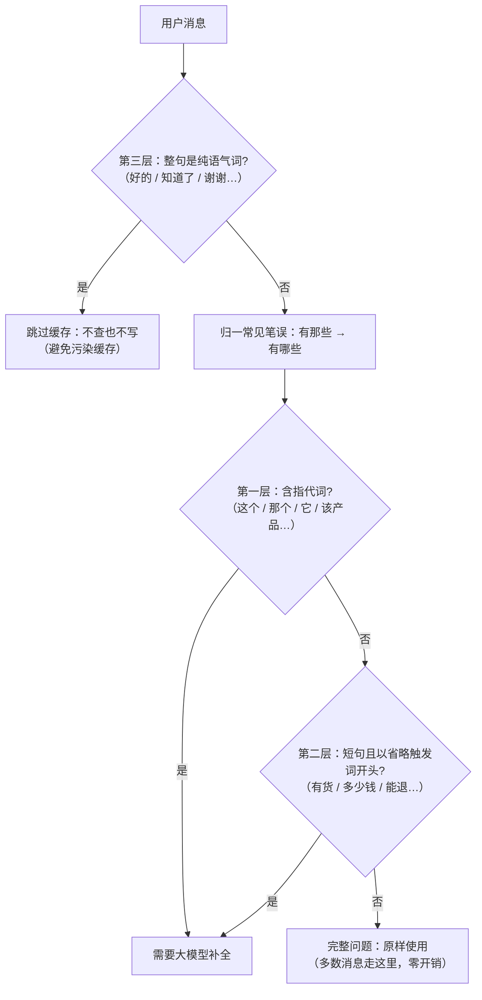
```mermaid
flowchart TD
    A["用户消息"] --> B{"第三层：整句是纯语气词?<br/>（好的 / 知道了 / 谢谢…）"}
    B -->|"是"| C["跳过缓存：不查也不写<br/>（避免污染缓存）"]
    B -->|"否"| P["归一常见笔误：有那些 → 有哪些"]
    P --> Q{"第一层：含指代词?<br/>（这个 / 那个 / 它 / 该产品…）"}
    Q -->|"是"| R["需要大模型补全"]
    Q -->|"否"| S{"第二层：短句且以省略触发词开头?<br/>（有货 / 多少钱 / 能退…）"}
    S -->|"是"| R
    S -->|"否"| T["完整问题：原样使用<br/>（多数消息走这里，零开销）"]
```

**子图②：语义缓存读写与索引维护**（`redis_semantic_cache.py`，key 均基于**消解后**消息 MD5）：

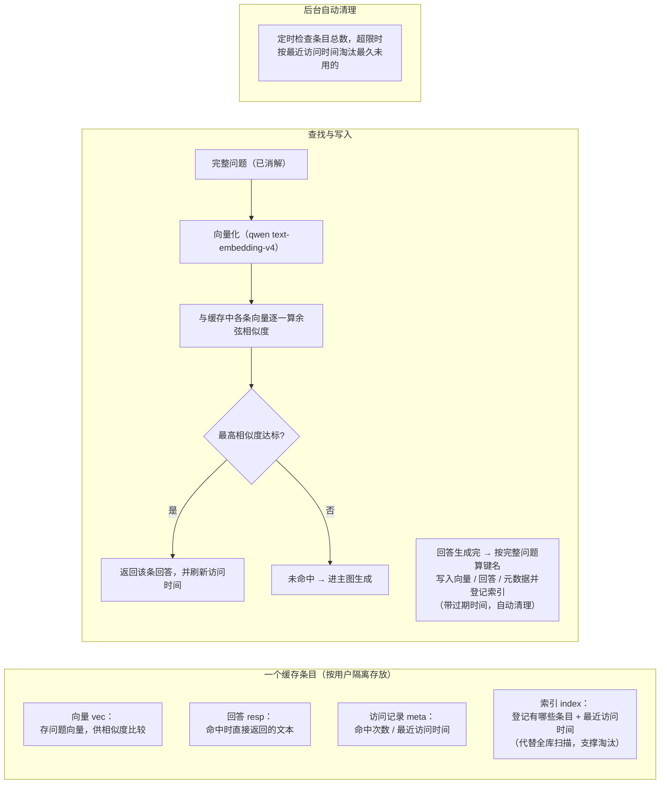
```mermaid
flowchart LR
    subgraph Keys["一个缓存条目（按用户隔离存放）"]
        V["向量 vec：<br/>存问题向量，供相似度比较"]
        R["回答 resp：<br/>命中时直接返回的文本"]
        M["访问记录 meta：<br/>命中次数 / 最近访问时间"]
        Z["索引 index：<br/>登记有哪些条目 + 最近访问时间<br/>（代替全库扫描，支撑淘汰）"]
    end
    subgraph ReadWrite["查找与写入"]
        L1["完整问题（已消解）"] --> L2["向量化（qwen text-embedding-v4）"]
        L2 --> L3["与缓存中各条向量逐一算余弦相似度"]
        L3 --> L4{"最高相似度达标?"}
        L4 -->|"是"| L5["返回该条回答，并刷新访问时间"]
        L4 -->|"否"| L6["未命中 → 进主图生成"]
        U1["回答生成完 → 按完整问题算键名<br/>写入向量 / 回答 / 元数据并登记索引<br/>（带过期时间，自动清理）"]
    end
    subgraph Cleanup["后台自动清理"]
        C1["定时检查条目总数，超限时<br/>按最近访问时间淘汰最久未用的"]
    end
```

**要点**：

- 两个独立实例池：语义缓存 `RedisSemanticCache.get_instance(prefix, user_id)` 按用户池化（每用户一个实例 + 一个清理任务）；记忆摘要缓存 `MemoryCache` 按会话（§4.6）。
- 分级门控把 LLM 消解调用控制在约 15% 含指代消息（日志佐证），温度 0 + 2s 超时（`.env` 建议 ≥15s）+ 失败降级原句；语气词既不消解也不写缓存。
- 缓存命中判定为**逐条线性余弦比较**（ZSET 仅提供条目清单与清理排序，非 ANN），命中后 `update_metadata` 刷新 score，支撑 LRU 淘汰。
- 向量化通道由 `EMBEDDING_TYPE` 决定：现网日志为 qwen text-embedding-v4（DashScope，1024 维 + L2 归一化），可切 ollama/local 兜底（`embed_in_batches` 承担索引侧分批重试）。
- 总开关：`SEMANTIC_CACHE_ENABLED=false`（查与写全关）、`RESOLVE_ENABLED=false`（退化无消解行为），用于调试一键回滚。

### 4.3 主图模块：LangGraph 双维意图识别与路由

**模块职责**：系统的调度中枢。`lg_builder.py` 定义 9 节点 StateGraph，单次 LLM 低温结构化输出同时判定**场景 type + 风险 risk** 两个维度（risk 拦截优先级最高），按结果条件路由到业务节点；会话状态由 PostgresSaver 检查点持久化（thread_id 维度）。

**模块运行流程图**（拓扑 + 请求期执行）：

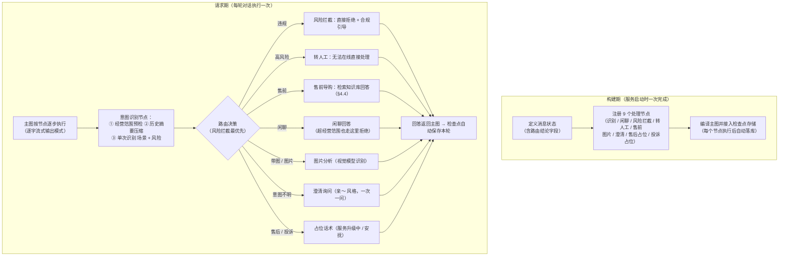
```mermaid
flowchart TB
    subgraph Compile["构建期（服务启动时一次完成）"]
        C1["定义消息状态<br/>（含路由结论字段）"]
        C2["注册 9 个处理节点<br/>（识别 / 闲聊 / 风险拦截 / 转人工 / 售前<br/>图片 / 澄清 / 售后占位 / 投诉占位）"]
        C3["编译主图并接入检查点存储<br/>（每个节点执行后自动落库）"]
        C1 --> C2 --> C3
    end
    subgraph Serve["请求期（每轮对话执行一次）"]
        E["主图按节点逐步执行<br/>（逐字流式输出模式）"] --> A["意图识别节点：<br/>① 经营范围预检 ② 历史摘要压缩<br/>③ 单次识别 场景 + 风险"]
        A --> R{"路由决策<br/>（风险拦截最优先）"}
        R -->|"违规"| N1["风险拦截：直接拒绝 + 合规引导"]
        R -->|"高风险"| N2["转人工：无法在线直接处理"]
        R -->|"售前"| N3["售前导购：检索知识库回答（§4.4）"]
        R -->|"闲聊"| N4["闲聊回答<br/>（超经营范围也走这里拒绝）"]
        R -->|"带图 / 图片"| N5["图片分析（视觉模型识别）"]
        R -->|"意图不明"| N6["澄清询问（亲～ 风格，一次一问）"]
        R -->|"售后 / 投诉"| N7["占位话术（服务升级中 / 安抚）"]
        N1 --> CKPT["回答返回主图 → 检查点自动保存本轮"]
        N2 --> CKPT
        N3 --> CKPT
        N4 --> CKPT
        N5 --> CKPT
        N6 --> CKPT
        N7 --> CKPT
    end
```

**子图①：意图识别节点运行流程**（`analyze_and_route_query`）：

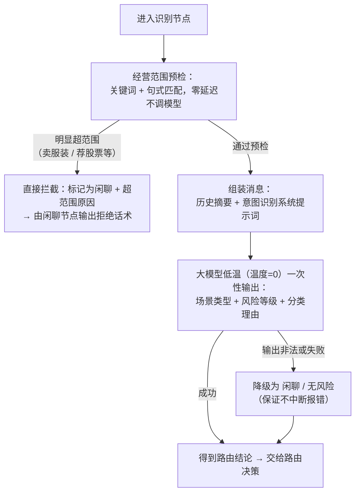
```mermaid
flowchart TD
    A["进入识别节点"] --> B["经营范围预检：<br/>关键词 + 句式匹配，零延迟不调模型"]
    B -->|"明显超范围<br/>（卖服装 / 荐股票等）"| C["直接拦截：标记为闲聊 + 超范围原因<br/>→ 由闲聊节点输出拒绝话术"]
    B -->|"通过预检"| D["组装消息：<br/>历史摘要 + 意图识别系统提示词"]
    D --> E["大模型低温（温度=0）一次性输出：<br/>场景类型 + 风险等级 + 分类理由"]
    E -->|"输出非法或失败"| F["降级为 闲聊 / 无风险<br/>（保证不中断报错）"]
    E -->|"成功"| G["得到路由结论 → 交给路由决策"]
    F --> G
```

**子图②：路由决策流程**（`route_query`，risk 优先于场景；`image_path` 存在时图片优先于 type）：

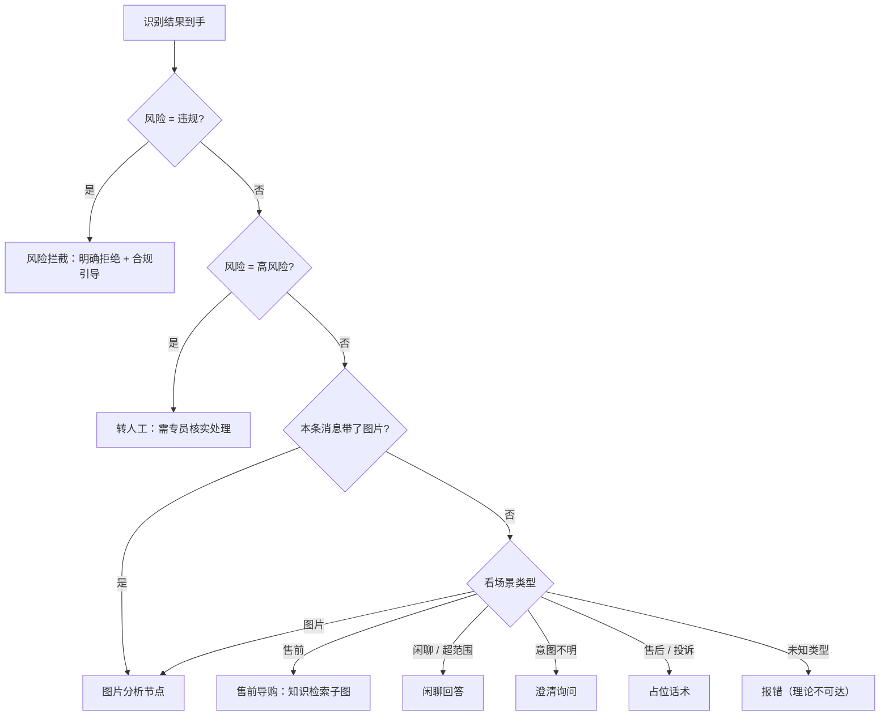
```mermaid
flowchart TD
    A["识别结果到手"] --> R1{"风险 = 违规?"}
    R1 -->|"是"| N1["风险拦截：明确拒绝 + 合规引导"]
    R1 -->|"否"| R2{"风险 = 高风险?"}
    R2 -->|"是"| N2["转人工：需专员核实处理"]
    R2 -->|"否"| R3{"本条消息带了图片?"}
    R3 -->|"是"| N3["图片分析节点"]
    R3 -->|"否"| R4{"看场景类型"}
    R4 -->|"售前"| N4["售前导购：知识检索子图"]
    R4 -->|"闲聊 / 超范围"| N5["闲聊回答"]
    R4 -->|"图片"| N3
    R4 -->|"意图不明"| N6["澄清询问"]
    R4 -->|"售后 / 投诉"| N7["占位话术"]
    R4 -->|"未知类型"| N8["报错（理论不可达）"]
```

**Router 输出结构与路由表**（`lg_states.py`）：

| 维度 | 取值 | 说明 |
|------|------|------|
| `type` | presale / aftersale / complaint / general / image / clarify | 场景维度（6 类）；售后子场景（退货/物流/订单）不在识别层判定，下沉业务 Agent |
| `risk` | none / violation / high_risk | 风险维度；violation=违规拦截（解除限速/改装电池/越狱等），high_risk=转人工 |
| `logic` | str | 分类理由/次要意图，注入应答节点 prompt |

- 路由质量受控：golden set 46 条（单轮 41 + 多轮 5）二维准确率实测 46/46（`llm_backend/scripts/eval_intent_golden.py`，跑真实 Router 结构化输出）。
- 多轮上下文由检查点承载：`thread_id`（前端 `X-Conversation-ID` 回传）→ `aget_state` 恢复 → 追加本轮 → 节点执行后自动写回；`lg_agent/main.py` 提供同图 CLI 调试入口。
- 子图 `Send` map-reduce 与 PostgresSaver 序列化冲突（`Object of type Send is not JSON serializable`）已在售前节点规避（见 §4.4）。

### 4.4 售前导购模块：MultiTool 子图 + ragTool 检索工具链（总 — 分）

**模块职责**：承接 `type=presale`（商品参数/价格/推荐/使用咨询）。模块由三层组成：主图节点 `create_research_plan`（容器）→ **Multi-Tool 工作流子图**（planner → 并行检索 → summarize → final_answer 的 map-reduce 编排）→ **检索工具层**（向量检索节点直接消费 `RAGRetrieverService` 混合检索管线；另有两枚 langchain `@tool` 薄封装 `rag_retrieval` / `product_stock_lookup` 已按"动态查库 + 静态查知识"互补协议落地并单测，**生产链路当前未 bind_tools**，接入售前/售后 Agent 时即按 §4.4.3/§4.4.4 流程运行）。其中 ragTool 指向的**混合检索管线**运行流程最为复杂，按"总 → 分"拆解如下。

#### 4.4.1 模块总运行流程图（节点容器层）

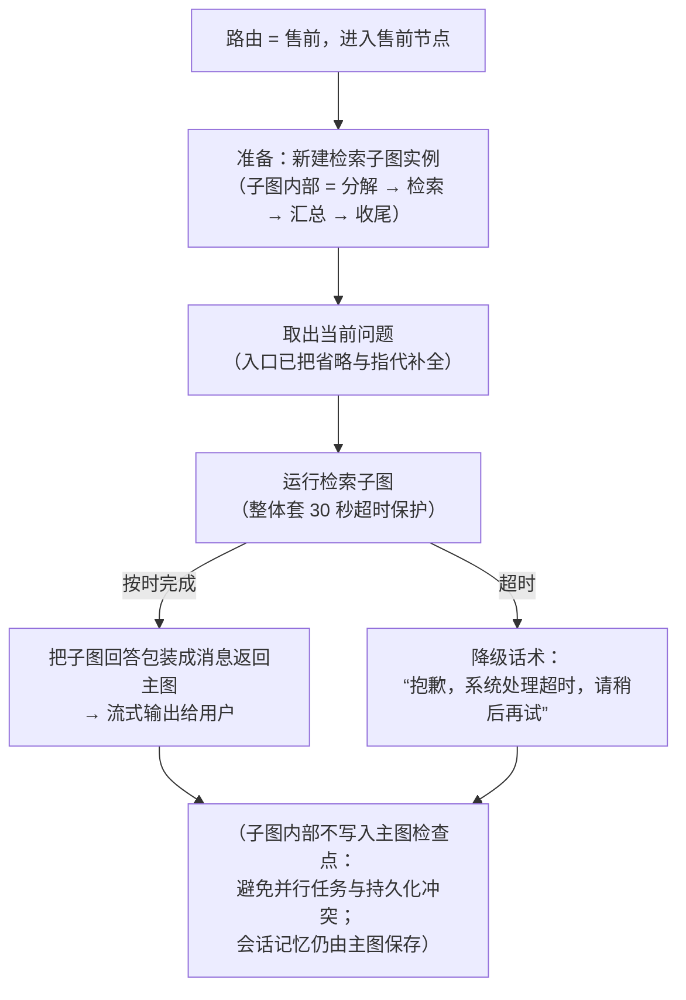
```mermaid
flowchart TD
    A["路由 = 售前，进入售前节点"] --> B["准备：新建检索子图实例<br/>（子图内部 = 分解 → 检索 → 汇总 → 收尾）"]
    B --> C["取出当前问题<br/>（入口已把省略与指代补全）"]
    C --> D["运行检索子图<br/>（整体套 30 秒超时保护）"]
    D -->|"按时完成"| E["把子图回答包装成消息返回主图<br/>→ 流式输出给用户"]
    D -->|"超时"| F["降级话术：<br/>“抱歉，系统处理超时，请稍后再试”"]
    E --> G["（子图内部不写入主图检查点：<br/>避免并行任务与持久化冲突；<br/>会话记忆仍由主图保存）"]
    F --> G
```

#### 4.4.2 子图①：Multi-Tool 工作流运行流程

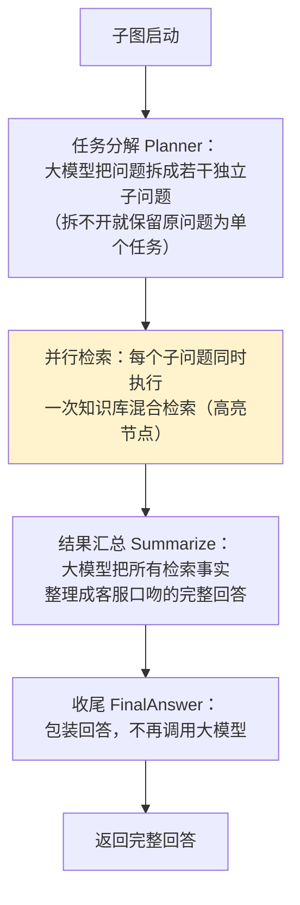
```mermaid
flowchart TD
    START["子图启动"] --> P["任务分解 Planner：<br/>大模型把问题拆成若干独立子问题<br/>（拆不开就保留原问题为单个任务）"]
    P --> VS["并行检索：每个子问题同时执行<br/>一次知识库混合检索（高亮节点）"]
    VS --> SZ["结果汇总 Summarize：<br/>大模型把所有检索事实<br/>整理成客服口吻的完整回答"]
    SZ --> FA["收尾 FinalAnswer：<br/>包装回答，不再调用大模型"]
    FA --> OUT["返回完整回答"]
    style VS fill:#fff3cd
```

- **planner**：问题拆分为独立子任务（规则：不依赖/去重/合并相互依赖），并行度即任务数。
- **检索节点**（`customer_tools/node.py`）：每个子任务调一次 `RAGRetrieverService.search(task)`，结果以 `records.result`（拼接文本）与 `records.hybrid_docs` 进 `searches` 状态（`Annotated add` 聚合）。
- **summarize**：同一模型实例（tags=`research_plan`）；要求仅基于检索事实、不道歉、不用"根据系统"机械表达、亲和口吻（亲～/emoji）。
- 无结果时 `summary="No data to summarize."`，final_answer 原样透传（无显式兜底话术，属已知边界）。

#### 4.4.3 子图②：检索工具层现状（生产节点直连 + 两枚 @tool 待接入）

| 检索入口 | 位置 | 现状 |
|---------|------|------|
| `vector_search_query` 节点 | `customer_tools/node.py` | **生产在用**（§4.4.2 子图的检索环节），直连 `RAGRetrieverService.search()`，无三态协议，异常记 errors 列表 |
| `rag_retrieval`（@tool） | `app/tools/rag_tool.py` | 已落地 + 三态协议 + 单测（`tests/test_rag_tool.py`），**生产未 bind**（全仓无 `bind_tools` 调用） |
| `product_stock_lookup`（@tool） | `app/tools/product_stock_tool.py` | 同上（`tests/test_product_stock_tool.py`）；数据源 `product_price_stock` 表（§4.9.3） |

两枚 @tool 的目标用法（`llm.bind_tools([rag_retrieval, product_stock_lookup])` 的 LLM 工具编排、降级链与 SKU 对齐演进）见 `docs/spec_plan/已完成/SPEC_RAG_TOOL_OPTIMIZATION.md` 与 `SPEC_PRODUCT_STOCK_TOOL.md`——工具已就绪，Agent 编排层待接入。

#### 4.4.4 子图③：ragTool（`rag_retrieval` @tool）运行流程

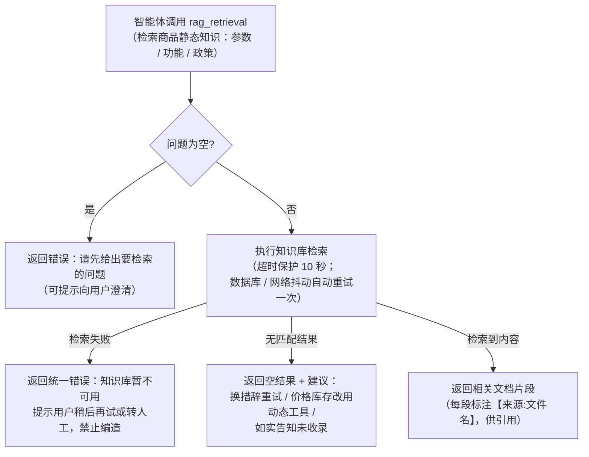
```mermaid
flowchart TD
    A["智能体调用 rag_retrieval<br/>（检索商品静态知识：参数 / 功能 / 政策）"] --> B{"问题为空?"}
    B -->|"是"| E1["返回错误：请先给出要检索的问题<br/>（可提示向用户澄清）"]
    B -->|"否"| C["执行知识库检索<br/>（超时保护 10 秒；<br/>数据库 / 网络抖动自动重试一次）"]
    C -->|"检索失败"| E2["返回统一错误：知识库暂不可用<br/>提示用户稍后再试或转人工，禁止编造"]
    C -->|"无匹配结果"| E3["返回空结果 + 建议：<br/>换措辞重试 / 价格库存改用动态工具 /<br/>如实告知未收录"]
    C -->|"检索到内容"| OK["返回相关文档片段<br/>（每段标注【来源:文件名】，供引用）"]
```

#### 4.4.5 子图④：ragTool 核心——RAGRetrieverService 混合检索管线运行流程

生产检索节点与 `rag_retrieval` @tool 共用同一入口 `RAGRetrieverService.search(query)`，唯一检索入口（门面）。内部结构：

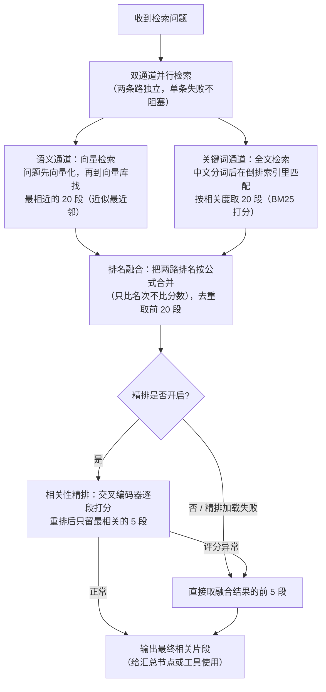
```mermaid
flowchart TB
    Q["收到检索问题"] --> P["双通道并行检索<br/>（两条路独立，单条失败不阻塞）"]
    P --> V["语义通道：向量检索<br/>问题先向量化，再到向量库找<br/>最相近的 20 段（近似最近邻）"]
    P --> K["关键词通道：全文检索<br/>中文分词后在倒排索引里匹配<br/>按相关度取 20 段（BM25 打分）"]
    V --> F["排名融合：把两路排名按公式合并<br/>（只比名次不比分数），去重取前 20 段"]
    K --> F
    F --> R{"精排是否开启?"}
    R -->|"是"| RE["相关性精排：交叉编码器逐段打分<br/>重排后只留最相关的 5 段"]
    R -->|"否 / 精排加载失败"| D1["直接取融合结果的前 5 段"]
    RE -->|"评分异常"| D1
    RE -->|"正常"| OUT2["输出最终相关片段<br/>（给汇总节点或工具使用）"]
    D1 --> OUT2
```

**关键参数与降级设计**：

| 环节 | 参数（config 默认） | 降级 |
|------|---------------------|------|
| 向量候选 | `HYBRID_RETRIEVAL_TOP_N=20` | Embedding API 失败 → 该路空 |
| BM25 候选 | `BM25_TOP_K=20` | SQL 异常 → 该路空 |
| 融合 | `RRF_TOP_K=20`、`RRF_FUSION_K=60`，去重键 `chunk_id`（内容确定性，跨环境稳定） | 仅成功路参与融合 |
| 精排 | `RERANKER_TOP_K=5`；模型 `BAAI/bge-reranker-v2-m3`（本地权重 `llm_backend/models/`，logs 佐证 cuda+fp16 实测加载） | 开关关/加载失败 → 融合 top-5 |

### 4.5 业务应答节点模块群

**模块职责**：路由表命中的各终端应答节点（§4.3 路由的落点）。先总后分：LLM 型节点（general/clarify/image）与静态话术节点（risk/转人工/售后/投诉占位）两大类。

| 节点 | 触发 | 走 LLM? | 输出 |
|------|------|--------|------|
| `respond_to_general_query` | type=general（含 ScopeGuard 超范围降级） | ✅ | 闲聊/超范围拒绝话术 |
| `risk_intercept` | risk=violation | ❌ | 静态：违规拒绝 + 合规引导（对应福客 D5） |
| `transfer_human` | risk=high_risk | ❌ | 静态：无法在线处理，转人工复核（对应福客 D3/D4） |
| `aftersale_placeholder` / `complaint_placeholder` | type=aftersale / complaint | ❌ | 静态："服务升级中" / 安抚话术（接口预留，子图就位仅换路由目的地） |
| `clarify_node` | type=clarify | ✅（失败模板兜底） | 电商统一风格针对性澄清（一次一问） |
| `create_image_query` | image_path 存在或 type=image | ✅（Vision API 先行） | 图片内容客服回复 |

**general 节点运行流程**：

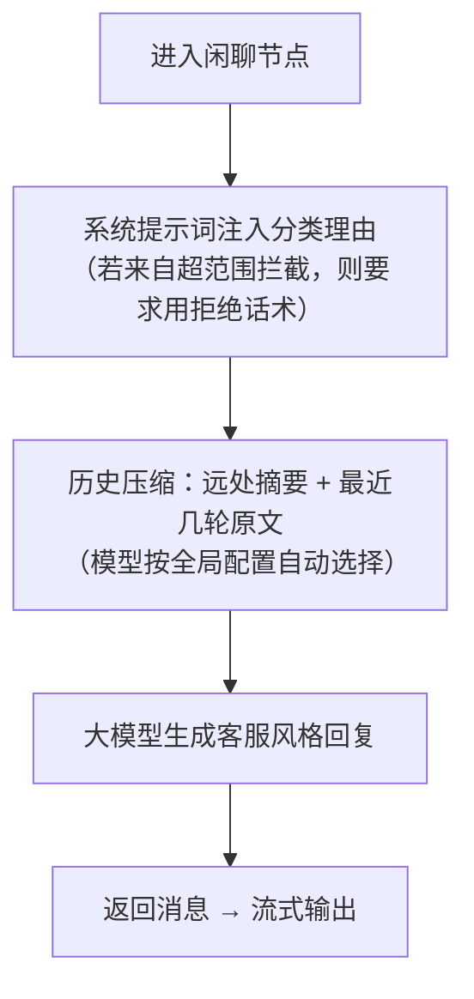
```mermaid
flowchart TD
    A["进入闲聊节点"] --> B["系统提示词注入分类理由<br/>（若来自超范围拦截，则要求用拒绝话术）"]
    B --> C["历史压缩：远处摘要 + 最近几轮原文<br/>（模型按全局配置自动选择）"]
    C --> D["大模型生成客服风格回复"]
    D --> E["返回消息 → 流式输出"]
```

**clarify 节点运行流程**（电商"亲～"风格，一次只问一个）：

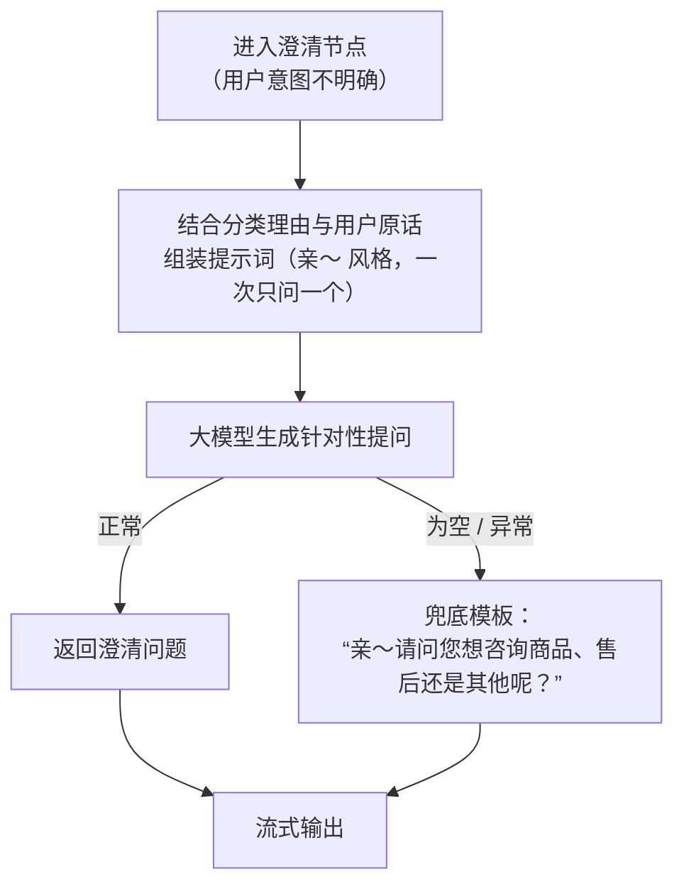
```mermaid
flowchart TD
    A["进入澄清节点<br/>（用户意图不明确）"] --> B["结合分类理由与用户原话<br/>组装提示词（亲～ 风格，一次只问一个）"]
    B --> C["大模型生成针对性提问"]
    C -->|"正常"| D["返回澄清问题"]
    C -->|"为空 / 异常"| E["兜底模板：<br/>“亲～请问您想咨询商品、售后还是其他呢？”"]
    D --> F["流式输出"]
    E --> F
```

**image 节点运行流程**（PIL 压缩 → Qwen-VL → 客服 LLM 二次生成）：

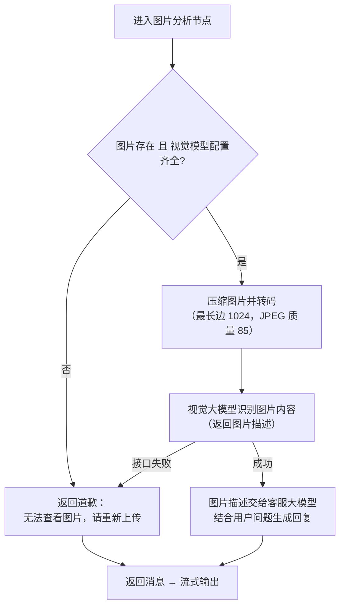
```mermaid
flowchart TD
    A["进入图片分析节点"] --> B{"图片存在 且 视觉模型配置齐全?"}
    B -->|"否"| E1["返回道歉：<br/>无法查看图片，请重新上传"]
    B -->|"是"| C["压缩图片并转码<br/>（最长边 1024，JPEG 质量 85）"]
    C --> D["视觉大模型识别图片内容<br/>（返回图片描述）"]
    D -->|"接口失败"| E1
    D -->|"成功"| F["图片描述交给客服大模型<br/>结合用户问题生成回复"]
    E1 --> G["返回消息 → 流式输出"]
    F --> G
```

**静态话术节点组运行流程**（risk_intercept / transfer_human / aftersale_placeholder / complaint_placeholder，共用模式）：

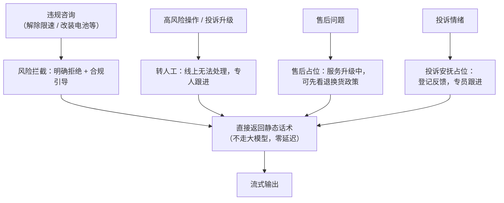
```mermaid
flowchart TD
    E1["违规咨询<br/>（解除限速 / 改装电池等）"] --> M1["风险拦截：明确拒绝 + 合规引导"]
    E2["高风险操作 / 投诉升级"] --> M2["转人工：线上无法处理，专人跟进"]
    E3["售后问题"] --> M3["售后占位：服务升级中，<br/>可先看退换货政策"]
    E4["投诉情绪"] --> M4["投诉安抚占位：<br/>登记反馈，专员跟进"]
    M1 --> O["直接返回静态话术<br/>（不走大模型，零延迟）"]
    M2 --> O
    M3 --> O
    M4 --> O
    O --> OUT["流式输出"]
```

### 4.6 记忆管理模块（三层压缩 + Redis 增量缓存）

**模块职责**：被识别节点与各 LLM 业务节点调用（`MemoryManager(llm, cache=MemoryCache())` 每次调用新建），把完整 `state.messages` 压缩到 token 预算内：最近 N 轮原文 + 老消息两级摘要。

**模块总运行流程图**（`MemoryManager.manage`）：

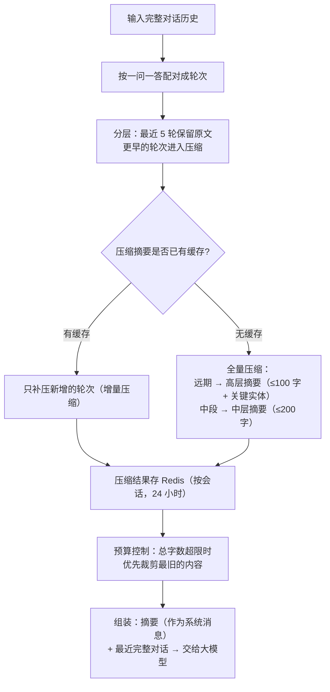
```mermaid
flowchart TD
    A["输入完整对话历史"] --> B["按一问一答配对成轮次"]
    B --> C["分层：最近 5 轮保留原文<br/>更早的轮次进入压缩"]
    C --> D{"压缩摘要是否已有缓存?"}
    D -->|"有缓存"| E["只补压新增的轮次（增量压缩）"]
    D -->|"无缓存"| F["全量压缩：<br/>远期 → 高层摘要（≤100 字 + 关键实体）<br/>中段 → 中层摘要（≤200 字）"]
    E --> G["压缩结果存 Redis（按会话，24 小时）"]
    F --> G
    G --> H["预算控制：总字数超限时<br/>优先裁剪最旧的内容"]
    H --> I["组装：摘要（作为系统消息）<br/>+ 最近完整对话 → 交给大模型"]
```

**分层与预算（代码实测值）**：

| 层 | 范围 | 处理 | 预算 |
|----|------|------|------|
| 第三层（高） | 最早轮次 | LLM 压缩 ≤100 字 + 关键实体 | history_summary 合计 800 |
| 第二层（中） | 窗口外最近 10 轮（约 6~15） | LLM 压缩 ≤200 字 + 实体/意图 | （同上） |
| 第一层（近） | 最近 5 轮完整原文 | 仅按需裁剪（最老优先丢弃） | recent_history 2000 |
| — | system prompt / 检索文档 | 固定占用 | 500 / 4000（预留回答 700，总 8000） |

**要点**：增量压缩以 `compressed_turns` 为起点只压新增轮次（省 LLM 调用）；高层压缩携带上次摘要续压；无 Redis 时内存字段兜底（`_high_summary/_medium_summary`）；TTL `MEMORY_CACHE_TTL=86400`。

### 4.7 安全护栏模块

| 护栏 | 位置 | 机制 | 效果 |
|------|------|------|------|
| **ScopeGuard** | `analyze_and_route_query` 第一步（§4.3 子图①） | 关键词 + 正则零延迟预检 | 超经营范围消息**不走 LLM**，直接降级 general 拒绝话术 |
| **TimeoutGuard** | `create_research_plan` 包售前子图 | `asyncio.wait_for(30s)` | 超时返回降级话术，不阻塞会话 |

**ScopeGuard 判定流程**（与路由层 risk 维度互补：规则先拦、LLM 精确判）：

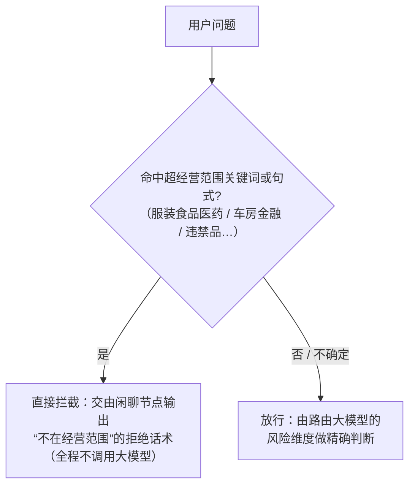
```mermaid
flowchart TD
    A["用户问题"] --> B{"命中超经营范围关键词或句式?<br/>（服装食品医药 / 车房金融 / 违禁品…）"}
    B -->|"是"| C["直接拦截：交由闲聊节点输出<br/>“不在经营范围”的拒绝话术<br/>（全程不调用大模型）"]
    B -->|"否 / 不确定"| D["放行：由路由大模型的<br/>风险维度做精确判断"]
```

**TimeoutGuard 运行流程**：

```mermaid
flowchart TD
    A["调用方：售前检索子图执行"] --> B["启动 30 秒计时"]
    B --> C{"子图是否按时返回?"}
    C -->|"是"| D["原样取回检索结果"]
    C -->|"否（超时）"| E["中止等待并记日志<br/>→ 返回降级话术给用户"]
```

实现：`wrap()` 内用 `asyncio.wait_for` 计时，超时记录日志（含会话号）后返回降级话术；未超时原样返回。设计依据：`docs/spec_plan/已完成/SPEC_REMOVE_QUERY_PREPROCESSING.md`（查询预处理管道与 BudgetGuard 已随子图简化移除，事实性保障由 Reranker + 生成 LLM 承担）。

### 4.8 LLM 服务与流式出口模块

**模块职责**：(1) `LLMFactory` 按 `CHAT_SERVICE` 提供 `generate/generate_stream` 鸭子类型服务（入口消解、语义缓存、旧 RAG 聊天链路使用）；(2) LangGraph 主图以 langchain `ChatDeepSeek`/`ChatOllama` 实例驱动节点；(3) `main.py process_stream` 把图的 `messages` 流过滤后 SSE 推送，图结束后回写语义缓存。

**LLM 服务选择**：

| 用途 | 实例化方式 | 说明 |
|------|-----------|------|
| 节点/子图推理 | `lg_builder` 内按 `AGENT_SERVICE` new `ChatDeepSeek`/`ChatOllama` | 各节点 tags 区分（router/general_query/clarify/image/research_plan），DeepSeek 侧 `extra_body thinking=disabled` |
| 路由识别 | 同上，`ROUTER_TEMPERATURE=0` | 结构化输出 |
| 入口消解/缓存消解 | `LLMFactory.create_chat_service()` → `DeepseekService`/`OllamaService` `.generate()` | 鸭子类型注入 `resolve_llm` |
| 视觉 | 独立 `VISION_*` 配置的 qwen-vl API（`aiohttp` 直连，§4.5 image） | 不经 LLMFactory |

**SSE 出口与缓存回写运行流程**（`main.py`）：

```mermaid
flowchart TD
    A["主图流式执行"] --> B["产出逐条内容"]
    B --> C{"这条内容能展示给用户?"}
    C -->|"能"| D["SSE 逐字推给前端<br/>（前端边收边渲染）"]
    C -->|"不能：工具调用 / 规划草稿等内部过程"| E["过滤丢弃"]
    D --> F{"流结束 且 回答完整?"}
    E --> F
    F -->|"是"| G["回答写入语义缓存<br/>前端同时把本轮问答存入会话库"]
    F -->|"否"| H["不写缓存"]
    G --> I["本次对话结束"]
    H --> I
```

**缓存命中时的出口**（不进图）：`_stream_cached` 每 4 字符/50ms 模拟流式，前端体验与真流式一致。

**对话落库**：LangGraph 路径的消息持久化由**前端**在流结束后调用 `POST /api/conversations/save-messages`（服务端 `ConversationService.save_message`，注意硬编码 `user_id=0`）；DB 的 `conversations`（int id）与 LangGraph `thread_id`（uuid）是两套会话标识，靠前端维护对应关系（§4.9.1/§4.9.4）。

### 4.9 支撑模块群

#### 4.9.1 会话存储与认证模块

- **ConversationService**（`app/services/conversation_service.py`，全静态方法）：`create_conversation`（初始"新会话"+`dialogue_type=NORMAL`）、`save_message`（按会话追加 user/assistant 两条 Message；`messages_count==0` 时用首条用户消息自动生成 ≤20 字标题）、`get_user_conversations`（倒序）、`get_conversation_messages`（归属校验）、`delete_conversation`、`update_conversation_name`。`DialogueType`：NORMAL / DEEP_THINKING / WEB_SEARCH / RAG。运行上属简单的表 CRUD，**持久化的"运行流程"即前端 §4.8 出口图落库一步**。
- **认证**（`api/auth.py` + `core/{security,hashing}.py`）：`POST /api/register`（email/username 双唯一，冲突 400）、`POST /api/token`（bcrypt 校验，JWT HS256，payload sub=email）、`GET /api/users/me`（唯一带 `Depends(get_current_user)` 的端点）。运行流程为常规 JWT 签发/校验，**注意**：除 users/me 外业务端点全部不校验令牌（现状缺陷，见 §10.1/§10.3.5）；OpenAPI `tokenUrl="/token"` 与真实 `/api/token` 不一致。

#### 4.9.2 知识库索引模块（docx → document_chunks）

**模块职责**：把上传文件/`knowledge_data/` 目录解析为分块 + 向量 + BM25 索引入库（`indexing_service.py` + `doc_parser.py` + `text_cleaner.py` + `mineru_client.py`），构成 §4.4.5 检索管线的语料侧。生产商品文档由 `scripts/build_smart_furniture_docx.py` / `build_jd_aftersales_docx.py` 从 TSV/政策源生成（知识分层：价格库存等动态信息不进 docx，见 §4.9.3）。

**运行流程图**：

```mermaid
flowchart TD
    A["收到知识文件<br/>（页面手动上传 / 脚本批量入库）"] --> B{"格式与大小合规?<br/>（txt / md / pdf / docx，≤30MB）"}
    B -->|"否"| E1["拒绝并提示原因（不入库）"]
    B -->|"是"| C{"文件是否重复?<br/>（按内容指纹判断）"}
    C -->|"重复"| E2["跳过（重复执行安全）"]
    C -->|"新文件"| D["解析成文本并保留章节信息：<br/>docx/txt → 本地解析；pdf → 云端版面还原"]
    D --> CL["清洗噪音后切块<br/>（每块约 500 字，相邻重叠 50 字）"]
    CL --> EM["分批向量化（每批 ≤10 块，<br/>失败自动重试）"]
    EM --> DB["一次性入库：文档记录 + 向量 + 块号"]
    DB --> RDY["检索侧自动可用：<br/>全文索引由数据库生成列自动维护，<br/>向量与倒排索引在初始化时建好"]
```

#### 4.9.3 商品动态数据模块（product_price_stock + product_stock_lookup）

**知识分层**：价格/库存属动态信息，只存表不写 docx。`llm_backend/scripts/import_product_price_stock.py` 从 `scripts/data/jd_smart_furniture.tsv` 按 `product_name` 幂等 upsert（范围价取均值、0=无货）；表结构 `product_name`(唯一) / `category` / `current_price`(Numeric) / `stock_quantity`(Integer) / `updated_at`。

**product_stock_lookup @tool 运行流程**（与 rag_retrieval 同为三态协议，现状=落地+单测，待 Agent bind）：

```mermaid
flowchart TD
    A["智能体调用 product_stock_lookup<br/>（查询商品实时价格 / 库存）"] --> B{"商品名称为空?"}
    B -->|"是"| E1["返回错误：请提供商品名称<br/>（可向用户追问）"]
    B -->|"否"| C["整理关键词：去掉空格、转义特殊符号<br/>（避免一次匹配出全部商品）"]
    C --> D["模糊查询价格库存表：<br/>名称包含匹配，可加品类过滤与条数限制<br/>（带超时保护与自动重试）"]
    D -->|"查询失败"| E2["返回统一错误：暂时查不了价格<br/>提示勿编造数字"]
    D -->|"无匹配商品"| E3["返回空 + 建议：换关键词 /<br/>静态参数改用知识库检索 / 向用户确认"]
    D -->|"找到商品"| OK["返回清单：名称、品类、现价、库存量"]
```

**意图语义**：泛查询（"有哪些 XX/卖什么"）`limit=20` 全量清单，单商品详情默认 5——LLM 编排层按查询意图取值（设计约定，随 Agent 接入生效）。

#### 4.9.4 前端模块（出口接收端）

Vue3 SFC 工程（`frontend/`，dev 由 vite 代理 `/api` → `:8000`；生产由后端将 `frontend/dist` 静态挂载于 `/`——dist 未构建则 404）。主聊天单页：登录门 → Sidebar（会话 CRUD）→ ChatArea → DocsPanel。

**SSE 流接收运行流程**（`composables/useChat.js`）：

```mermaid
flowchart TD
    A["用户点发送（可带图片）"] --> B["还没有会话则先建一个会话"]
    B --> C["发请求：问题 + 图片 + 会话号<br/>（会话号沿用上一次返回的）"]
    C --> D["记下响应头里的新会话号<br/>（后续提问复用，保住多轮记忆）"]
    D --> E["读流式响应，边收边渲染气泡"]
    E --> F{"遇到中断标记?"}
    F -->|"是"| F1["提示等待人工确认（预留能力）"]
    F -->|"否"| G{"流结束?"}
    F1 --> E
    G -->|"是"| H["把本轮一问一答存入会话库"]
    H --> I["完成，等待下一条提问"]
```

**双会话标识**：DB `conversations.id`（列表/历史/落库）与 LangGraph `thread_id`（图状态检查点）分离，由前端桥接。图片随消息以 `image` 字段直传 langgraph/query（`/api/upload/image` 端点闲置）。调用端点矩阵见 §4.1 分发图（auth/conversations/documents/upload 全套已接入）。

---

## 5. 系统运行流程

### 5.1 完整请求生命周期

```mermaid
flowchart TD
    C["客户端请求<br/>POST /api/langgraph/query"]
    C --> API["FastAPI 入口<br/>检查 thread_id"]
    API -->|"无 thread_id"| NEW["新会话<br/>生成 thread_id + InputState"]
    API -->|"已有 thread_id"| CTD["多轮会话<br/>PostgresSaver 加载检查点"]
    API -->|"存在中断"| RSM["中断恢复<br/>Command(resume) 继续人工确认"]
    NEW --> RESOLVE["入口前置指代消解<br/>规则门控 → LLM 补全<br/>（图执行前完成）"]
    CTD --> RESOLVE
    RSM --> RESOLVE

    RESOLVE --> CACHE{"语义缓存检索<br/>key=消解后消息<br/>按 user_id 隔离"}
    CACHE -->|"命中"| HIT["⚡ 短路返回缓存回答<br/>模拟流式 SSE（不进图）"]
    CACHE -->|"未命中"| STREAM["graph.astream<br/>stream_mode=messages"]
    HIT --> SSE

    STREAM --> SG["analyze_and_route_query<br/>ScopeGuard 关键词预检"]
    SG -->|"不通过"| GQ["general 闲聊节点<br/>超经营范围拒绝话术"]
    SG -->|"通过"| RT["LLM 路由器<br/>场景+风险双维识别：type + risk"]

    RT -->|"risk=violation"| RISK["5.4 风险拦截<br/>违规拒绝话术"]
    RT -->|"risk=high_risk"| TRANS["5.4 转人工<br/>无法在线处理话术"]
    RT -->|"type=general"| GEN["5.3 general 闲聊<br/>纯 LLM 闲聊"]
    RT -->|"type=presale"| KG["5.5 presale 售前<br/>向量检索子图"]
    RT -->|"type=aftersale"| PLACE["5.7 售后占位<br/>接口预留"]
    RT -->|"type=complaint"| PLACE2["5.7 投诉安抚占位<br/>接口预留"]
    RT -->|"type=clarify"| CLARIFY["5.8 意图澄清<br/>电商风格询问"]
    RT -->|"type=image"| IMG["5.6 image 图片<br/>Qwen-VL + LLM"]

    GEN --> SSE["SSE 流式返回<br/>逐 chunk 推送 data: {content}"]
    RISK --> SSE
    TRANS --> SSE
    KG --> SSE
    PLACE --> SSE
    PLACE2 --> SSE
    CLARIFY --> SSE
    IMG --> SSE
    GQ --> SSE
    KG -.->|"完整回答生成后"| WRITEBACK["语义缓存回写<br/>update（非空才写）"]
```

**关键说明**:

1. **入口三态**：同一端点根据 thread_id 区分新会话 / 多轮续聊 / 中断恢复（human-in-the-loop）
2. **入口前置指代消解**：多轮代词/省略（"那个有货吗"）在 `graph.astream` 前完成改写（规则门控 + LLM 补全），首条消息无历史直接透传；图内意图识别与检索拿到的均为完整问题
3. **入口语义缓存检索**：消解后、进图前按 user_id 查缓存（key=消解后消息），命中短路返回不进图；未命中走图，完整回答生成后回写（非空才写，语气词/失败不写）；含指代且无历史可消解时跳过缓存检索
4. **状态持久化**：PostgresSaver 检查点在每个节点执行后自动写入 PostgreSQL，服务重启不丢失
5. **流式输出**：`stream_mode="messages"` 让每个 AIMessage chunk 实时推送给前端
6. 对话记录落库（conversations/messages 表）由前端经 `/api/conversations/save-messages` 接口保存，langgraph 路径的会话状态由检查点承载

### 5.2 意图路由决策流程

```mermaid
flowchart TD
    Q["用户输入"]
    RESOLVE["入口指代消解<br/>规则门控 → LLM 补全<br/>（图执行前完成）"]
    CACHE{"语义缓存检索<br/>key=消解后消息"}
    SG["ScopeGuard<br/>关键词预检"]
    Q --> RESOLVE
    RESOLVE --> CACHE
    CACHE -->|"命中"| SHORT["⚡ 短路返回缓存回答<br/>不进图"]
    CACHE -->|"未命中"| SG
    SG -->|"不通过"| GEN["general 闲聊节点<br/>超经营范围拒绝话术"]
    SG -->|"通过"| ROUTER["LLM 路由器<br/>场景+风险双维合并识别<br/>type + risk<br/>（ROUTER_TEMPERATURE=0）"]

    ROUTER -->|"risk=violation"| RISK["风险拦截<br/>明确拒绝 + 合规引导"]
    ROUTER -->|"risk=high_risk"| TRANS["转人工<br/>无法在线直接处理"]
    ROUTER -->|"type=general"| GEN2["general 闲聊<br/>纯 LLM 电商客服风格回复"]
    ROUTER -->|"type=presale"| KG["presale 售前<br/>知识库检索子图"]
    ROUTER -->|"type=aftersale"| PLACE["售后占位<br/>（售后 Agent 接口预留）"]
    ROUTER -->|"type=complaint"| PLACE2["投诉安抚占位<br/>（安抚 Agent 接口预留）"]
    ROUTER -->|"type=clarify"| CLARIFY["意图澄清<br/>电商统一风格询问"]
    ROUTER -->|"type=image"| IMG["image 图片<br/>Qwen-VL + LLM"]

    KG --> GRAG["向量检索 vector_search_query<br/>HNSW ∥ pg_jieba BM25 → RRF → 精排"]
```

### 5.3 general 闲聊意图运行流程

节点 `respond_to_general_query`：纯 LLM 对话，不调用任何外部检索；历史消息经 MemoryManager 压缩（Redis 摘要缓存）后注入提示词。ScopeGuard 超经营范围拦截后也走本节点（注入"超出经营范围"logic 触发拒绝话术）。

```mermaid
flowchart TD
    A["进入节点<br/>respond_to_general_query"] --> B["模型选择<br/>AGENT_SERVICE: DeepSeek / Ollama"]
    B --> C["系统提示词<br/>GENERAL_QUERY_SYSTEM_PROMPT<br/>注入路由 logic（分类理由）"]
    C --> D["历史管理<br/>MemoryManager 三层压缩<br/>最近 5 轮原文 + 旧消息摘要<br/>（摘要 Redis 缓存）"]
    D --> E["LLM 生成闲聊回复"]
    E --> F["返回 {messages: [AIMessage]}"]
    F --> G["SSE 流式返回前端"]
```

### 5.4 风险拦截 / 转人工运行流程

节点 `risk_intercept`（risk=violation）与 `transfer_human`（risk=high_risk）：**静态话术节点，不走 LLM**——违规咨询明确拒绝 + 合规引导（对应福客 D5），高风险操作/投诉升级说明无法在线直接处理（对应福客 D3/D4 转人工复核）。原 additional-query 追问节点已删除（追问逻辑下沉到后续业务 Agent）。

```mermaid
flowchart TD
    A["进入节点<br/>risk_intercept / transfer_human"] --> B["静态话术常量<br/>RISK_INTERCEPT_REPLY / TRANSFER_HUMAN_REPLY"]
    B --> C["返回 {messages: [AIMessage(content=话术)]}"]
    C --> D["SSE 流式返回前端"]
```

### 5.5 presale 售前导购运行流程（原 graphrag-query）

节点 `create_research_plan`：售前场景（商品参数/价格/推荐/使用咨询）复用现有 RAG 子图，直接进入 Multi-Tool 子图（TimeoutGuard 30 秒超时保护）。入口环节（main.py `/api/langgraph/query`，图执行前）：指代消解（多轮代词/主语补全）→ 语义缓存检索——命中直接短路返回（不进图），未命中才进入本节点（query 已是完整问题），完整回答生成后回写缓存。

```mermaid
flowchart TD
    A["进入节点<br/>create_research_plan<br/>（query 已由入口消解）"] --> B["构建 Multi-Tool 子图<br/>Planner → Send 并行 → 向量检索<br/>→ Summarize → FinalAnswer"]
    A --> R["TimeoutGuard 30s 超时保护<br/>ainvoke 子图"]
    R --> S2["Planner 任务分解<br/>Send 并发派发子任务"]
    S2 --> S3["混合检索（每子任务）<br/>HNSW ∥ pg_jieba BM25 并行<br/>RRF 融合 top-20"]
    S3 --> S4["Reranker 精排<br/>bge-reranker-v2-m3 top-5"]
    S4 --> S5["Summarize 结果汇总<br/>客服风格生成"]
    S5 --> S7["FinalAnswer 组装输出<br/>写入会话历史"]
    R -->|"超时"| S1B["降级回答<br/>「抱歉，系统处理超时，请稍后再试」"]
    S1B --> OUT
    S7 --> OUT
    OUT --> END["SSE 流式返回前端"]
```

### 5.6 image-query 图片分析意图运行流程

节点 `create_image_query`：PIL 压缩 → base64 → Qwen-VL 视觉分析 → 结合图片描述由 LLM 生成客服回复。

```mermaid
flowchart TD
    A["进入节点<br/>create_image_query"] --> B{"image_path 存在?"}
    B -->|"否"| B1["返回道歉<br/>「我无法查看这张图片，请重新上传」"]
    B -->|"是"| C{"VISION_API_KEY / BASE_URL<br/>/ MODEL 配置完整?"}
    C -->|"否"| C1["返回道歉<br/>视觉模型配置不完整"]
    C -->|"是"| D["PIL 图片压缩<br/>最长边 1024px，JPEG 85%"]
    D --> E["base64 编码"]
    E --> F["Qwen-VL API 分析<br/>POST /chat/completions<br/>返回图片描述"]
    F -->|"非 200"| F1["返回道歉<br/>视觉接口调用失败"]
    F -->|"200"| G["GET_IMAGE_SYSTEM_PROMPT<br/>注入图片描述"]
    G --> H["LLM 生成客服风格回复<br/>（DeepSeek / Ollama）"]
    B1 --> I["返回 {messages: [AIMessage]}"]
    C1 --> I
    F1 --> I
    H --> I
    I --> J["SSE 流式返回前端"]
```

### 5.7 售后 / 投诉安抚占位节点

节点 `aftersale_placeholder` / `complaint_placeholder`：**业务 Agent 接口占位**——返回"服务升级中"提示（静态话术，不走 LLM）。接口与 multi_tool 子图同构（`question+history → answer`），后续售后 Agent（工作流骨架 + LLM 决策点 + RAG tool，方式 C）/ 投诉安抚 Agent 子图就位后，仅替换路由目的地，识别模块与接口形状不动。售后子场景（退货退款/物流/订单查询）由售后 Agent 工作流骨架第一步结合订单/历史上下文判断，识别层不承担。

```mermaid
flowchart TD
    A["进入节点<br/>aftersale_placeholder / complaint_placeholder"] --> B["静态话术<br/>AFTERSALE_PLACEHOLDER_REPLY<br/>/ COMPLAINT_PLACEHOLDER_REPLY"]
    B --> C["返回 {messages: [AIMessage(content=话术)]}"]
    C --> D["SSE 流式返回前端"]
```

### 5.8 意图澄清运行流程

节点 `clarify_node`（type=clarify，意图不明）：以电商统一风格（"亲～"）结合用户原话与 router logic 针对性询问真实意图；生成失败/超时降级静态模板。澄清后用户回答 → 下一轮正常重新识别（含澄清问答的消息流自然流转）。触发边界：语义无法归类才澄清（无主题词/无上文指代/碎片语气词）；明确但缺细节（议价/损坏）不澄清；risk 优先于 clarify。设计依据 `docs/spec_plan/已完成/SPEC_INTENT_CLARIFY.md`。

```mermaid
flowchart TD
    A["进入节点<br/>clarify_node"] --> B["CLARIFY_SYSTEM_PROMPT<br/>注入 logic 困惑点 + 用户原话"]
    B --> C["MemoryManager 历史管理"]
    C --> D["LLM 生成针对性澄清<br/>（亲～风格，一次一问）"]
    D -->|"成功"| E["返回 {messages: [AIMessage]}"]
    D -->|"失败/为空"| F["静态模板兜底<br/>CLARIFY_FALLBACK_REPLY"]
    E --> G["SSE 流式返回前端"]
    F --> G
```

---

## 6. 设计模式应用

| 设计模式 | 应用位置 | 具体实现 |
|---------|---------|---------|
| **工厂模式** | `LLMFactory` | `create_chat_service()` 根据配置返回不同实例 |
| **策略模式** | `config.py` 服务选择 | `CHAT_SERVICE` / `REASON_SERVICE` / `AGENT_SERVICE` 分别选择 DeepSeek/Ollama |
| **状态图模式** | `lg_builder.py` | LangGraph `StateGraph` + 条件边实现多路由 Agent 编排 |
| **观察者/回调模式** | `deepseek_service.py` | `on_complete` 回调触发消息持久化，解耦 LLM 和存储 |
| **建造者模式** | `lg_builder.py` | `builder.add_node().add_edge().compile()` 构建状态图 |
| **单例模式** | `checkpointer_pool`（AsyncConnectionPool） | LangGraph PostgresSaver 全局持久化存储 |
| **模板方法模式** | 提示词模板 | 预定义提示词 + 动态参数注入 |
| **装饰器模式** | `LoggingMiddleware` | FastAPI 中间件统一日志 |
| **门面模式** | `RAGRetrieverService` | 唯一检索入口：HNSW ∥ BM25 并行 → RRF → 精排，graph 节点与 @tool 共用 |

---

## 7. 数据流转

### 7.1 用户消息存储

```
用户消息 + AI回复 → ConversationService.save_message()
  → PostgreSQL: conversations 表 (会话元信息)
  → PostgreSQL: messages 表 (用户消息 + 助手回复)
  → 首条消息自动生成会话标题 (前 20 字)
```

### 7.2 语义缓存存储

```
用户问题 → 分级指代消解 → EmbeddingProvider → Redis:
  {prefix}:vec:{md5}  → JSON 向量（md5 基于消解后消息）
  {prefix}:resp:{md5} → 回复文本
  {prefix}:meta:{md5} → 访问元数据
  {prefix}:index      → ZSET 有序索引（member=hash_id, score=last_access）
                        替代 keys() 全库扫描；cleanup 按 score 升序淘汰
```

### 7.3 标准 RAG 索引管道

```
原始文档 (PDF/DOCX/TXT)
  → 文档解析 (PyPDF2 / python-docx / TXT)
  → 文本清洗
  → RecursiveCharacterTextSplitter 分块 (500/50)
  → Embedding (EmbeddingProvider, qwen text-embedding-v4 API 1024 维, 分批 ≤10 条/请求)
  → pgvector 入库 (document_chunks 表, HNSW 索引)
  → BM25 侧自动就绪：content_tsv 生成列（jiebacfg 精确模式分词）+ GIN 倒排索引
    （CREATE EXTENSION pg_jieba；生成列随 INSERT 自动维护，无重建窗口）
```

---

## 8. 项目亮点深度分析

### 8.1 🌟 场景+风险双维合并意图识别路由

**创新点**: 一次 LLM 低温结构化输出同时判定**场景意图 + 风险意图**两个维度，risk 拦截优先级最高（违规/高风险消息不进入任何业务处理路径），场景驱动路由并预留业务 Agent 接口。

```python
class Router(TypedDict):
    """Classify user query: scenario + risk."""
    logic: str                      # 分类理由（多意图时简述次要意图）
    type: Literal[
        "presale",                  # 售前：商品咨询/参数/价格活动/推荐导购
        "aftersale",                # 售后：退货退款/物流异常/订单查询
        "complaint",                # 投诉安抚：情绪不满/投诉（情绪主导）
        "general",                  # 闲聊
        "image",                    # 图片
        "clarify",                  # 意图不明：语义无法归类 → 澄清节点
    ]
    risk: Literal[
        "none", "violation", "high_risk",
    ]                               # violation=违规咨询拦截；high_risk=高风险操作转人工
```

**技术价值**:

- 原 4 类技术路由合并进场景体系（graphrag-query→presale，additional-query 删除——追问下沉到业务 Agent）
- 多意图取主导意图（句首发/最强烈者；risk/complaint 永远优先），次要意图记入 logic
- 售后子场景（退货/物流/订单）不由识别层判断——判断需订单/历史上下文，下沉到售后 Agent 工作流骨架第一步（简化设计 2026-08-27）
- 售后/投诉安抚占位节点接口与 RAG 子图同构，业务 Agent（售前/售后/安抚）就位后仅改路由目的地
- 结构化输出校验失败降级 general/none 不抛异常；golden set 评测（46 条，含意图澄清/意图模糊/多意图/超范围/图片风险/多轮上下文）二维准确率 100%（脚本 `llm_backend/scripts/eval_intent_golden.py`）
- 设计依据与演进方向（任务分配器/多 Agent 协同/主 Agent 汇总/并行规则）见 `docs/spec_plan/已完成/SPEC_INTENT_RECOGNITION_OPTIMIZATION.md` §8.3

### 8.2 🌟 混合检索 + RRF 融合 + Reranker 精排

**创新点**: 不是简单的 BM25+向量双路检索，而是一个**4 步闭环**（两路检索全部下沉数据库，应用层只发 SQL 收排名）：

1. **pg_jieba BM25 SQL 精确匹配**（ts_rank_cd + GIN 倒排索引，jiebacfg 精确模式与查询同源，DB 内增量维护）
2. **pgvector HNSW 向量语义匹配**（qwen text-embedding-v4 API 编码，ORDER BY 距离触发 ANN 索引）
3. **RRF 倒数排名融合**（不依赖绝对分数，数学上更鲁棒；两路 `asyncio.gather` 并行，耗时 = max 非 sum）
4. **bge-reranker-v2-m3 精排**（CrossEncoder 拼接 (query, doc) 打分，top-20 → top-5；替代原 LLM 相关性评分，GPU/fp16 加速，失败自动降级为融合 top-K）

```python
# RRF 融合公式
score(doc) = Σ 1/(k + rank_i)  # k=60, rank_i 是文档在第 i 路检索中的排名
```

**技术价值**: 融合了关键词精确匹配和语义理解的优势，精排用交叉编码器做最终把关，防止不相关结果污染 LLM 上下文；检索计算全部下沉 PostgreSQL（应用内存零语料驻留），语料规模增长不再线性放大应用侧成本。

### 8.3 🌟 三层记忆管理 + Redis 增量缓存

**创新点**: 不仅压缩历史对话，还实现了**增量式摘要更新**和**Redis 缓存跨会话复用**：

```
第一层: 最近 5 轮 (完整原文)
第二层: 轮次 6-15 (压缩为 ~200 字摘要)
第三层: 轮次 16+ (压缩为 ~100 字摘要 + 关键实体)
```

**技术价值**:

- 增量压缩：新轮次只压缩未处理的，不从零开始
- Redis 缓存：跨请求复用摘要，避免重复 LLM 调用
- Token 预算控制：动态裁剪确保不超限
- 关键实体追踪：保留产品名称等关键信息不丢失

### 8.4 🌟 语义缓存的工程化实现

**创新点**: 不是简单的键值缓存，而是基于 **Embedding 向量余弦相似度**的语义级缓存：

```
"扫地机器人多少钱" ≈ "这个扫地机什么价格"
→ 向量余弦相似度 0.95 ≥ 0.90 → 缓存命中
```

**工程细节**:

- 按用户隔离缓存 (`prefix:user_id:...`)
- **分级指代消解**：三层规则引擎（显性指代 / 省略主语 / 纯语气词）先过滤，80% 完整问题零开销透传、15% 含指代消息才调 LLM 补全（temperature=0 保证确定性、2s 超时失败降级透传）、纯语气词不查不写避免污染
- **lookup/update 同源消解**：缓存 key 基于消解后消息 MD5，保证"那个有货吗"与"扫地机器人X1有货吗"命中同一缓存
- **graphrag 入口前置检索**：`/api/langgraph/query` 消解后、进图前查缓存，命中短路跳过整个图流程；未命中走图、完整回答后回写（两条链路共享按 user_id 的缓存池）
- **ZSET 有序索引** + `redis.asyncio` 异步客户端 + 实例池化（消除 keys 全库扫描与事件循环阻塞）
- LRU 自动清理（ZSET score 排序）+ 访问次数统计
- 模拟流式返回保持前端体验一致

### 8.5 🌟 Docker Compose 一键部署 + Healthcheck

**创新点**: 3 个服务 (PostgreSQL/Redis/App) 通过 `depends_on` + `condition: service_healthy` 确保启动顺序：

```yaml
app:
  depends_on:
    postgres:
      condition: service_healthy   # pg_isready
    redis:
      condition: service_healthy   # redis-cli ping
```

**技术价值**: 避免了常见的 "服务启动但数据库未就绪" 的竞态问题，开箱即用。

---

## 9. 项目优点

### 9.1 架构设计

| 优点 | 说明 |
|------|------|
| **模块化清晰** | 配置/服务/Agent/组件分层明确，职责单一 |
| **高可扩展性** | 工厂模式 + 策略模式，新增 LLM 只需添加服务类 |
| **Agent 编排成熟** | LangGraph StateGraph 提供可视化的状态流转 |
| **会话持久化** | PostgresSaver + thread_id 实现多轮对话状态管理（重启不丢失） |
| **SSE 流式响应** | 所有 LLM 接口统一使用 Server-Sent Events，用户体验好 |
| **Human-in-the-Loop** | 支持中断/恢复机制，实现人工确认流程 |

### 9.2 技术深度

| 优点 | 说明 |
|------|------|
| **检索质量闭环** | 混合检索 → Reranker 精排，DB 内检索 + 交叉编码器把关 |
| **多层护栏** | 范围预检 + 超时保护，层层保障 |
| **内存管理成熟** | 三层摘要 + Token 预算 + Redis 缓存，处理长对话 |
| **成本控制意识** | 语义缓存降本 + 入口指代消解门控（仅约 15% 含指代消息调 LLM） |

### 9.3 工程实践

| 优点 | 说明 |
|------|------|
| **配置管理规范** | Pydantic Settings 类型安全，60+ 项配置集中管理 |
| **日志系统完善** | 结构化日志，按服务分级，请求追踪 |
| **Docker 部署完善** | Multi-service + healthcheck + 数据持久化 |
| **文档规范** | README 清晰，API 端点完整列举 |
| **知识库丰富** | 内置产品文档 + FAQ + 真实客服对话数据 |

---

## 10. 项目缺点与改进建议

### 10.1 严重问题 🔴

#### 10.1.1 硬编码的凭据信息

`docker-compose.yml` 中包含明文数据库密码：

```yaml
POSTGRES_PASSWORD: smartcs_agent_pwd
```

**影响**: 如果仓库公开，凭据泄露风险。

**建议**: 使用 Docker Secrets 或 `.env` 文件管理敏感信息，在 docker-compose 中通过 `${VAR}` 引用。

### 10.2 中等问题 🟡

#### 10.2.1 单元测试覆盖不足（已部分缓解）

已建立 pytest 测试体系（`app/test/`：`test_entry_cache.py` / `test_fastapi.py` / `test_pronoun_resolve.py`，当前 9 项全通过），意图识别路由另有 golden set 评测脚本 `scripts/eval_intent_golden.py`（46 条二维准确率）。但向量检索、语义缓存、混合检索等核心模块仍无 pytest 覆盖。

**建议**:

- 为向量检索、语义缓存、混合检索添加 pytest 测试
- 集成 LangGraph 的测试工具进行 Agent 行为验证

#### 10.2.2 前端过于简单

前端已重构为 Vue3 SFC 工程（frontend），chat.html 已并入。原 chat.html 单文件实现缺少：

- 用户登录 UI
- 会话列表展示
- 图片上传交互
- 加载状态/错误处理
- 移动端适配

**建议**: 使用现代前端框架（React/Vue SPA）重构或集成到 FastAPI Jinja2 模板。

#### 10.2.3 init_db 每次启动清空业务表

```python
# scripts/init_db.py 每次启动先 drop_all 再 create_all
await conn.run_sync(Base.metadata.drop_all)
await conn.run_sync(Base.metadata.create_all)
```

**影响**: 每次启动（含容器重启）清空用户/会话/消息/document_chunks 业务表数据（LangGraph 检查点表不受影响）。

**建议**: 改为 create-only（仅建表 + 扩展 + 索引），表结构演进交给 Alembic 管理。

#### 10.2.4 缺少 API 限流

所有 API 端点都没有速率限制。

**影响**: 恶意或异常高频调用可能导致 LLM API 费用失控。

**建议**: 集成 `slowapi` 或 Redis 令牌桶实现 IP/用户级别限流。

#### 10.2.5 历史上的 GraphRAG 源码内嵌问题（已迁移解决）

历史上 `llm_backend/app/graphrag/` 直接包含了 Microsoft GraphRAG 的完整源码（约 80+ 文件），存在以下问题：

- 增加仓库体积
- 难以跟随上游更新
- 版本管理混乱
- 索引构建耗时 5-30 分钟/次，LLM 成本高
- Local/Global/DRIFT/Basic 检索能力对电商客服场景过剩（实体关系类查询由知识库文档检索承担）

**解决**: 已迁移为标准 RAG 管道（pgvector 向量检索），删除 `llm_backend/app/graphrag/` 源码目录、`scripts/build_graphrag_index.py` 与 graphrag 依赖，索引构建降至秒级，事实查询效果持平。

#### 10.2.6 缺少输入校验

`main.py` 中的请求模型缺少字段级别校验：

```python
class ChatMessage(BaseModel):
    messages: List[Dict[str, str]]  # 没有长度限制
    user_id: int                     # 没有范围校验
    conversation_id: int             # 没有存在性校验
```

**建议**: 添加 `Field(min_length=1, max_length=50)` 等约束。

### 10.3 改进建议 🟢

#### 10.3.1 引入异步任务队列

文件上传和索引构建 (`IndexingService`) 是 CPU 密集型操作，当前直接阻塞请求线程。

**建议**: 引入 Celery + Redis 或 ARQ 异步任务队列处理。

#### 10.3.2 添加监控和可观测性

**建议**:

- 集成 OpenTelemetry 追踪 LLM 调用链
- 添加 Prometheus metrics (请求延迟、缓存命中率、LLM Token 消耗)
- 设置 LLM API 调用告警

#### 10.3.3 实现 A/B 测试框架

当前策略选择（简单/中等/复杂）依赖硬编码阈值。

**建议**: 实现配置化的 A/B 测试，对比不同策略的效果，数据驱动优化。

#### 10.3.4 添加降级策略

当 DeepSeek API 不可用时，当前直接抛出 500 错误。

**建议**: 实现 fallback 链：DeepSeek → Ollama → 预定义回复。

#### 10.3.5 数据隐私增强

用户上传的图片/文件直接存储在本地文件系统。

**建议**:

- 敏感图片自动脱敏
- 定期清理过期文件
- 实现访问控制（当前 `/api/conversations/{id}/messages` 的 `user_id` 通过 query 参数传递，不安全）

---

## 11. 部署架构

### 11.1 Docker Compose 拓扑

```mermaid
graph TB
    subgraph "Docker Network: smartcs-agent_default（仅基础服务）"
        PG["smartcs-agent-postgres<br/>自定义镜像 pgvector + pg_jieba :5432<br/>（docker/postgres/Dockerfile 编译 cppjieba）<br/>healthcheck: pg_isready"]
        REDIS["smartcs-agent-redis<br/>Redis 7-alpine :6379<br/>healthcheck: redis-cli ping"]
    end

    subgraph "本地运行（非 Docker）"
        APP["应用：uvicorn main:app :8000<br/>Python 3.13（run.py 启动）"]
    end

    subgraph "Volumes"
        V1["pg_data"]
        V2["redis_data"]
    end

    Browser -->|":8000"| APP
    APP -->|"DB_HOST=localhost"| PG
    APP -->|"REDIS_HOST=localhost"| REDIS
    PG --- V1
    REDIS --- V2
```

### 11.2 启动流程

```mermaid
sequenceDiagram
    participant DC as Docker Compose
    participant M as PostgreSQL
    participant R as Redis
    participant A as App (本地)

    DC->>M: 启动 PostgreSQL(pgvector) 容器
    M->>M: pg_isready (每10s)
    M-->>DC: healthy ✓

    DC->>R: 启动 Redis 容器
    R->>R: redis-cli ping (每10s)
    R-->>DC: healthy ✓

    A->>A: cd llm_backend && python -m scripts.init_db (建表 + pgvector/pg_jieba 扩展 + HNSW/GIN 索引 + content_tsv 生成列)
    A->>A: python run.py（Windows 事件循环补丁 + uvicorn main:app --reload :8000）
    A-->>DC: 服务就绪 ✓
```

---

## 12. 综合评价

### 12.1 技术成熟度矩阵

| 维度 | 评分 | 说明 |
|------|------|------|
| 架构设计 | ⭐⭐⭐⭐⭐ | 分层清晰，模块解耦，设计模式运用恰当 |
| 技术深度 | ⭐⭐⭐⭐⭐ | 混合检索+评分、三层记忆管理、语义缓存均为业界前沿实践 |
| 代码质量 | ⭐⭐⭐⭐ | 整体结构良好，部分模块缺失、硬编码问题需修复 |
| 测试覆盖 | ⭐ | 完全缺失，需从零建立测试体系 |
| 文档完善 | ⭐⭐⭐⭐ | README 详尽，API 文档完整，缺少开发者指南 |
| 部署运维 | ⭐⭐⭐⭐ | Docker 一键部署完善，缺少监控和告警 |
| 安全性 | ⭐⭐ | 凭据硬编码、缺少限流和输入校验 |
| 可扩展性 | ⭐⭐⭐⭐⭐ | 工厂模式+策略模式，新增功能成本低 |

### 12.2 适用场景

| 场景 | 适合度 | 说明 |
|------|--------|------|
| 电商客服原型 | ⭐⭐⭐⭐⭐ | 开箱即用，多轮对话+知识库完善 |
| 学习 LangGraph | ⭐⭐⭐⭐⭐ | 完整的 StateGraph + 子图 + 多工具编排案例 |
| 学习标准 RAG | ⭐⭐⭐⭐⭐ | pgvector 向量管道 + 混合检索的实际应用 |
| 学习 RAG 优化 | ⭐⭐⭐⭐ | 语义缓存、Reranker 精排、混合检索等最佳实践 |
| 生产部署 | ⭐⭐⭐ | 需补充测试、限流、监控后才能上生产 |

### 12.3 总结

SmartCS-Agent 是一个**技术深度优秀、工程完整性良好但生产就绪度不足**的 AI 客服系统。它在以下方面展现了较强的技术实力：

1. **Agent 编排**: LangGraph StateGraph 的运用成熟，子图嵌套、条件路由、会话持久化、中断恢复等技术点处理得当
2. **检索增强**: 混合检索（HNSW ∥ pg_jieba BM25）+ RRF 融合 + Reranker 精排形成完整的检索质量保障链路
3. **工程降本**: 语义缓存的实现精细（按用户隔离、LRU清理、流式模拟），三层记忆管理的 Token 预算控制
4. **系统思维**: 入口指代消解 + 语义缓存前置（图执行前完成上下文处理与缓存短路），子图保持精简，冗余 LLM 调用持续收敛

主要短板在于**测试缺失**和**生产级运维特性不足**（日志监控、限流降级、凭据管理），建议在这些方面投入改进后再用于生产环境。

---

> **分析工具**: Claude Code
> **分析范围**: 全项目 Python 服务，配置化管理，3 Docker 服务
> **核心模块覆盖率**: 100%
