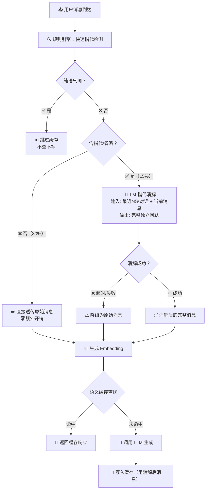

# 语义缓存分级指代消解 详细实施规格
> **归档状态**: ✅ 已完成（2026-09-02 审计，依据 main 代码与 git 历史）
> 语义缓存分级指代消解落地：4882018（redis_semantic_cache.py lookup/update 同源 _resolve_message + pronoun_detector/resolver），RESOLVE_* 五配置在案（config.py L76-80）。

> **用途**: 解决多轮对话中指代/省略导致语义缓存命中率塌陷的问题  
> **技术栈**: Redis + Embedding 向量 + LLM 指代消解 + 规则引擎  
> **状态**: ✅ **已实施**（2026-08-19，分支 `refactor/anaphora-resolution`）。  
> **前置条件**: 三项缺陷已同步修复——① `redis_semantic_cache.py` 改 `redis.asyncio` 异步客户端（消除事件循环阻塞）；② `lookup`/`_auto_cleanup` 的 `keys()` 全库扫描改为按用户分桶的 ZSET 有序索引（`{prefix}:index`，member=hash_id, score=last_access，存量键 scan_iter 一次性重建兜底）；③ `__init__` 内 `create_task` 任务泄漏移除，改 `start_cleanup()` 幂等启动 + `get_instance()` 实例池化（每用户唯一实例/唯一清理任务）。  
> **验证**: §10.1 全部用例通过（`llm_backend/app/test/test_pronoun_resolve.py`，41 项断言，含真实 Redis 全链路冒烟）。  
> **关联文档**: [[PROJECT_ANALYSIS.md]] [[SPEC_CONTEXT_ENGINEERING.md]] [[SPEC_ENTITY_PARALLEL_RAG.md]]

---

## 目录

1. [问题定义](#1-问题定义)
2. [核心设计原则](#2-核心设计原则)
3. [架构总览](#3-架构总览)
4. [指代检测器设计](#4-指代检测器设计)
5. [指代消解模块设计](#5-指代消解模块设计)
6. [缓存层集成方案](#6-缓存层集成方案)
7. [配置与开关设计](#7-配置与开关设计)
8. [性能模型](#8-性能模型)
9. [关键约束与避坑清单](#9-关键约束与避坑清单)
10. [验证方案](#10-验证方案)

---

## 1. 问题定义

### 1.1 问题场景

多轮对话中，用户频繁使用指代词或省略主语，导致语义缓存无法命中：

```
第1轮: 用户: "iPhone 15 256G多少钱？"   → 缓存写入: vec("iPhone 15 256G多少钱？")
        助手: "iPhone 15 256G售价2999元"

第2轮: 用户: "那个有货吗？"              → 缓存查找: vec("那个有货吗？")
        → 与 vec("iPhone 15 256G多少钱？") 余弦相似度 ≈ 0.2
        → 缓存 MISS ❌  （本应 HIT）
```

**根本原因**：语义缓存只取最后一条用户消息生成 Embedding，不做任何上下文消解。含指代的消息向量与完整问题的向量之间语义鸿沟巨大，无法通过余弦相似度阈值匹配。

### 1.2 问题分类

| 类型 | 示例 | 原始消息 | 期望消解结果 |
|------|------|---------|-------------|
| 显性指代 | 指示代词 | "那个有货吗" | "iPhone 15 256G有货吗" |
| 显性指代 | 人称代词 | "它支持快充吗" | "iPhone 15 256G支持快充吗" |
| 省略主语 | 短问句 | "能退吗" | "扫地机器人X1能退吗" |
| 省略主语 | 追问 | "还有吗" | "还有类似的扫地机器人吗" |
| 纯语气词 | 确认/反馈 | "好的" | —（跳过缓存） |

### 1.3 影响范围

```
受影响的场景:
  ├─ 多轮对话中第2轮及以后的用户消息
  ├─ 含代词/省略的追问型消息
  └─ 占比: 约 15-20% 的用户消息

不受影响的场景:
  ├─ 单轮对话 / 首条消息
  ├─ 含完整主语的独立问题
  └─ 占比: 约 80-85% 的用户消息
```

---

## 2. 核心设计原则

### 原则一：检测先于消解，零开销透传

```
┌──────────────────────────────────────────────────────────────┐
│                    分级处理策略                               │
├────────────────────┬─────────────────────────────────────────┤
│  80% 正常消息       │  规则引擎快速判定 → 直接透传，零额外开销  │
│  15% 含指代消息     │  规则引擎命中 → LLM 消解 → 缓存查找/写入 │
│  5% 纯语气词        │  规则引擎识别 → 跳过缓存（不查不写）     │
└────────────────────┴─────────────────────────────────────────┘
```

- 规则引擎是纯字符串匹配，O(n) 复杂度，毫秒级完成
- 只有当规则引擎判定"含指代/省略"时，才触发 LLM 消解
- 纯语气词（"好的""嗯""OK"）不产生缓存条目，避免缓存污染

### 原则二：消解失败不阻塞，降级透传

消解是**增强功能**，不是**必需功能**。LLM 调用超时或失败时，降级为使用原始消息，保证缓存流程不中断。

```
try:
    resolved = await llm_resolve(raw, context)
except (TimeoutError, LLMError):
    resolved = raw   # 降级
    log.warning("消解失败，降级为原始消息")
```

### 原则三：lookup 和 update 同源消解

缓存的写入和查找必须使用同一套消解逻辑，保证消解后的消息在写入和查询时生成相同的向量，从而能命中：

```
写入: 原始消息("那个有货吗") → 消解("iPhone 15 256G有货吗") → Embedding → Redis
查找: 原始消息("那个有货吗") → 消解("iPhone 15 256G有货吗") → Embedding → 相似度匹配 ✅ HIT
```

### 原则四：消解模块与缓存核心解耦

消解模块是独立的功能单元，与 Embedding 模型、LLM 后端、缓存存储均无耦合：

```
┌──────────────┐    ┌──────────────┐    ┌──────────────┐
│  LLM 后端     │    │  消解模块     │    │  Embedding   │
│ (DeepSeek/   │◄───│  (独立单元)   │───►│  (qwen/      │
│  Ollama/...) │    │              │    │  bge-m3 分支) │
└──────────────┘    └──────────────┘    └──────────────┘
```

---

## 3. 架构总览

### 3.1 整体数据流



### 3.2 模块分层

```
┌─────────────────────────────────────────────────────────────┐
│                     应用层                                   │
│  DeepseekService / ChatService                              │
│  → 调用 RedisSemanticCache.lookup / update                  │
├─────────────────────────────────────────────────────────────┤
│                     缓存层                                   │
│  RedisSemanticCache                                         │
│  → lookup(): 消解 → Embedding → 相似度匹配 → 返回           │
│  → update(): 消解 → Embedding → Redis 存储                  │
├─────────────────────────────────────────────────────────────┤
│                     消解层（新增）                            │
│  PronounDetector: 规则引擎，快速检测                         │
│  PronounResolver: 调用 LLM，指代消解                         │
├─────────────────────────────────────────────────────────────┤
│                     基础设施层                               │
│  Redis (向量存储 + 响应存储 + 元数据)                        │
│  EmbeddingProvider (local/ollama/qwen)                      │
│  LLM Client (DeepSeek/Ollama/...)                           │
└─────────────────────────────────────────────────────────────┘
```

---

## 4. 指代检测器设计

### 4.1 三层检测架构

```
                    ┌─────────────────────────┐
                    │    has_pronouns(text)     │
                    │    总入口                  │
                    └────────────┬────────────┘
                                 │
           ┌─────────────────────┼─────────────────────┐
           ▼                     ▼                     ▼
┌──────────────────┐  ┌──────────────────┐  ┌──────────────────┐
│ 第一层：显性指代  │  │ 第二层：省略主语  │  │ 第三层：纯语气词  │
│ (字典匹配)       │  │ (启发式规则)     │  │ (字典匹配)       │
├──────────────────┤  ├──────────────────┤  ├──────────────────┤
│ 指示代词:        │  │ 触发条件:        │  │ 确认类:          │
│ 那个/这个/那件/  │  │ 长度 < 15字      │  │ 好的/行/可以/OK/ │
│ 这件/那款/这款/  │  │ AND              │  │ 对/是的/嗯/哦    │
│ 那种/这种/       │  │ 以特定词开头:    │  │                  │
│ 那些/这些        │  │ 有货/多少钱/     │  │ 策略:            │
│                  │  │ 能退/支持/怎么/  │  │ 跳过缓存          │
│ 人称代词:        │  │ 还有/包邮/保修/  │  │ (不查不写)       │
│ 它/他/她/它们/   │  │ 可以/能不能/多久 │  │                  │
│ 他们/她们        │  │                  │  │                  │
│                  │  │                  │  │                  │
│ 书面指代:        │  │                  │  │                  │
│ 该产品/该商品/   │  │                  │  │                  │
│ 其/上述          │  │                  │  │                  │
└──────────────────┘  └──────────────────┘  └──────────────────┘
```

### 4.2 检测规则详解

#### 第一层：显性指代词匹配

维护一个中文指代词词典，O(n) 子串匹配。字典覆盖：

| 类别 | 词条 | 说明 |
|------|------|------|
| 近指代词 | 这个、这件、这款、这种、这些 | 指代上文刚提到的内容 |
| 远指代词 | 那个、那件、那款、那种、那些 | 指代上文提到的内容 |
| 单数人称 | 它、他、她 | 指代上文提到的实体 |
| 复数人称 | 它们、他们、她们 | 指代上文提到的多个实体 |
| 书面指代 | 该产品、该商品、其、上述 | 电商客服场景常见书面语 |

**设计决策**：宁可多检测（假阳性），不能漏检测（假阴性）。假阳性只多一次 LLM 消解调用，假阴性会导致缓存永久失效。

#### 第二层：省略主语检测

省略主语的消息通常是短句，以疑问词或动作词开头，缺少主语。采用启发式规则：

```
检测条件（AND 关系）:
  1. 文本长度 ≤ 15 字
  2. 以省略触发词开头

省略触发词列表:
  有货、有卖、多少钱、价格、能退、能换、支持、兼容、
  怎么、为什么、还有、再、可以、能不能、包邮、保修、
  多久、什么时候、哪里、怎么样
```

举例：
- `"有货吗"` → 长度 3 字，以"有货"开头 → **触发消解**
- `"iPhone 15 256G 蓝色有现货吗"` → 长度 14 字但有明确主语 → **不触发**（长度临界，但以"iPhone"开头，不在省略触发词中）

#### 第三层：纯语气词过滤

| 类别 | 词条 | 处理策略 |
|------|------|---------|
| 确认 | 好的、行、可以、OK、ok、对、是的、好 | 跳过缓存 |
| 反馈 | 嗯、哦、知道了、明白了 | 跳过缓存 |
| 结束 | 谢谢、再见、拜拜 | 跳过缓存 |

**处理逻辑**：纯语气词既不需要消解，也不需要缓存。这些消息的回复通常也是固定模板（如"不客气"），不缓存反而避免缓存污染。

### 4.3 检测器接口定义

```
输入: 原始文本字符串 (最后一条用户消息)
输出: 决策结果

决策枚举:
  - PASS_THROUGH: 不含指代，直接透传
  - NEED_RESOLVE: 含指代/省略，需要 LLM 消解
  - SKIP_CACHE: 纯语气词，跳过缓存
```

---

## 5. 指代消解模块设计

### 5.1 消解 Prompt 设计

核心原则：**只做补全，不做扩展**。

```
SYSTEM: 你是一个多轮对话的指代消解专家。
你的任务是根据对话历史，把用户当前问题中的指代词（如"那个""它""这个"）
和省略信息补全为完整、独立的问题。

规则：
1. 如果当前问题包含代词（他/她/它/那个/这个/那件/这件等），用历史中的实体替换
2. 如果当前问题是省略句（如"有货吗""多少钱""能退吗"），从历史中补全主语
3. 如果当前问题已经完整、不依赖上下文，直接返回原问题
4. 不要添加历史中没出现过的信息，只做补全，不做扩展
5. 只输出消解后的完整问题文本，不要任何解释

对话历史:
{history}

当前问题: {current_query}

请输出消解后的完整问题：
```

### 5.2 上下文构造

消解需要给 LLM 提供对话历史作为上下文，但不是全量：

| 参数 | 默认值 | 说明 |
|------|:---:|------|
| `max_turns` | 5 | 最近 N 轮对话（1轮 = 1用户 + 1助手） |
| `max_chars_per_msg` | 200 | 每条消息截断长度，防止 prompt 过长 |

```
格式化规则:
  用户: {content[:200]}
  助手: {content[:200]}
  用户: {content[:200]}
  助手: {content[:200]}
  ...
  当前问题: {raw_query}
```

### 5.3 LLM 调用参数

| 参数 | 值 | 原因 |
|------|:---:|------|
| `temperature` | 0.0 | 确定性输出，同输入必同输出，保证缓存一致 |
| `max_tokens` | 200 | 只需返回一个问题文本 |
| `timeout` | 2000ms | 消解不应成为瓶颈 |

### 5.4 降级策略

```
消解调用:
  ├─ 成功 → 返回消解后消息
  ├─ 超时（2s） → 降级为原始消息，记录 warning
  ├─ LLM 返回空 → 降级为原始消息
  └─ LLM 异常 → 降级为原始消息，记录 error
```

**降级后的行为**：使用原始消息走正常缓存流程。虽然命中率可能低，但不会阻塞用户请求。

---

## 6. 缓存层集成方案

### 6.1 改动范围

缓存层只改动两个入口方法，改动面积极小：

| 方法 | 原逻辑 | 新逻辑 |
|------|--------|--------|
| `lookup` | `get_last_user_message()` → Embedding → 相似度匹配 | `resolve()` → Embedding → 相似度匹配 |
| `update` | `get_last_user_message()` → Embedding → Redis 存储 | `resolve()` → Embedding → Redis 存储 |

**其他方法不变**：`_auto_cleanup`、`_remove_cache_item`、`_update_metadata` 等均不受影响。

### 6.2 集成流程（lookup 为例）

```
lookup(messages):
  1. raw = get_last_user_message(messages)
  2. decision = detect(raw)
  3. if decision == SKIP_CACHE: return None
  4. if decision == NEED_RESOLVE:
       resolved = await resolve_pronouns(llm, messages, raw)
       // 失败时降级为 raw
  5. else: resolved = raw
  6. vector = await embed(resolved)
  7. 遍历缓存向量，计算余弦相似度
  8. if max_similarity >= threshold: return cached_response
  9. return None
```

### 6.3 集成流程（update 为例）

```
update(messages, response):
  1. raw = get_last_user_message(messages)
  2. decision = detect(raw)
  3. if decision == SKIP_CACHE: return  // 不写缓存
  4. if decision == NEED_RESOLVE:
       resolved = await resolve_pronouns(llm, messages, raw)
  5. else: resolved = raw
  6. vector = await embed(resolved)
  7. 存入 Redis: {prefix}:vec:{md5(resolved)} / resp / meta
```

### 6.4 缓存 Key 设计

**关键变化**：缓存 Key 的生成基于**消解后的消息**，而非原始消息。

```
消解前:
  原始消息 "那个有货吗"       → MD5 → key: vec:abc123
  原始消息 "iPhone 15有货吗" → MD5 → key: vec:def456
  → 两个不同的 key，无法命中 ❌

消解后:
  原始消息 "那个有货吗"       → 消解 → "iPhone 15 256G有货吗"
                              → MD5 → key: vec:xyz789
  原始消息 "iPhone 15有货吗" → 消解 → "iPhone 15 256G有货吗"（原样）
                              → MD5 → key: vec:xyz789
  → 同一个 key，命中 ✅
```

---

## 7. 配置与开关设计

### 7.1 配置项

| 配置项 | 类型 | 默认值 | 作用 |
|--------|------|:---:|------|
| `resolve_enabled` | bool | `true` | 总开关 |
| `resolve_max_turns` | int | `5` | 消解时参考的最大对话轮数 |
| `resolve_llm_temperature` | float | `0.0` | 消解 LLM 温度 |
| `resolve_timeout_ms` | int | `2000` | 消解调用超时时间 |
| `resolve_skip_filler` | bool | `true` | 是否跳过纯语气词 |

### 7.2 开关策略

```
resolve_enabled = true:
  → 启用分级消解 → 80%消息零开销，15%消息触发消解

resolve_enabled = false:
  → 完全退化为现有行为 → 所有消息直接透传
  → 一键回滚，零风险
```

### 7.3 灰度发布建议

```
阶段 1: resolve_enabled=false → 部署，验证无回归
阶段 2: resolve_enabled=true, 仅输出日志不实际消解 → 观察检测器准确率
阶段 3: resolve_enabled=true → 全量开启 → 监控命中率变化
```

> ✅ 实施说明（2026-08-19）：已按阶段 3 落地（`RESOLVE_ENABLED` 默认 `true`）。
> 一键回滚能力保留——设为 `false` 即完全退化为原始行为（对应阶段 1 的无回归状态）；
> 检测器准确率可通过日志中的"指代消解/纯语气词跳过缓存"观测（对应阶段 2）。

---

## 8. 性能模型

### 8.1 延迟分析

| 场景 | 额外操作 | 额外延迟 | 占比 |
|------|---------|:---:|:---:|
| 不含指代（80%） | 字符串匹配 | < 0.1ms | 80% |
| 含指代（15%） | 字符串匹配 + LLM 消解 | ~200-500ms | 15% |
| 纯语气词（5%） | 字符串匹配 + 跳过 | < 0.1ms | 5% |

**加权平均额外延迟**：`0.80 × 0 + 0.15 × 350 + 0.05 × 0 ≈ 52ms`

### 8.2 收益模型

```
假设:
  - LLM 调用平均耗时: 2000ms
  - 缓存命中耗时: 10ms
  - 消解 LLM 调用耗时: 350ms

一次缓存命中的净收益: 2000 - 10 = 1990ms
一次消解的成本: 350ms

盈亏平衡点: 350 / 1990 ≈ 17.6%

即: 只要消解后的缓存命中率 > 17.6%，净收益为正
```

### 8.3 缓存命中率预期

| 场景 | 消解前命中率 | 消解后命中率 | 提升 |
|------|:---:|:---:|:---:|
| 含指代/省略消息 | ~5% | ~60-80% | **12-16x** |
| 正常消息 | ~40% | ~40% | 不变 |
| 纯语气词 | ~0%（不缓存） | — | 消除污染 |

---

## 9. 关键约束与避坑清单

| 编号 | 约束 | 严重程度 | 说明 |
|:----:|------|:--------:|------|
| 1 | ❌ 消解不能阻塞缓存主流程 | 🔴 致命 | 超时/失败必须降级，不能抛异常 |
| 2 | ❌ lookup 和 update 必须用同一套消解逻辑 | 🔴 致命 | 否则写入和查找的向量不一致，永远无法命中 |
| 3 | ❌ 缓存 Key 必须基于消解后消息生成 | 🔴 致命 | 如果用原始消息的 MD5，消解后无法匹配已有缓存 |
| 4 | ❌ 检测器不能漏检指代词 | 🟡 重要 | 宁可假阳性（多一次 LLM 调用），不能假阴性（缓存永久失效） |
| 5 | ❌ 消解 LLM 的 temperature 不能 > 0 | 🟡 重要 | 非确定性输出会导致同一问题消解结果不同，缓存无法命中 |
| 6 | ❌ 纯语气词不能写入缓存 | 🟡 重要 | 纯语气词缓存毫无共享价值，只会污染缓存空间 |
| 7 | ✅ 省略主语检测规则需保守 | 🟢 注意 | 长度阈值和触发词列表需根据实际场景调优 |

---

## 10. 验证方案

### 10.1 功能验证

> ✅ 已实现为 `llm_backend/app/test/test_pronoun_resolve.py`（2026-08-19）：下表 10 个用例 + 检测器边界词、
> 消解器 4 条降级路径（超时/空/异常/参数）、缓存层 mock 集成、真实 Redis 全链路冒烟共 **41 项断言全部通过**。
> 运行：`cd llm_backend && ../.venv/Scripts/python.exe app/test/test_pronoun_resolve.py`

| 测试用例 | 历史对话 | 当前消息 | 期望检测结果 | 期望消解结果 | 期望缓存行为 |
|---------|---------|---------|:---:|---------|:---:|
| 显性指代-指示代词 | "iPhone 15多少钱"→"2999" | "那个有货吗" | NEED_RESOLVE | "iPhone 15有货吗" | 命中/写入消解后 |
| 显性指代-人称代词 | "扫地机器人X1介绍"→"..." | "它支持快充吗" | NEED_RESOLVE | "扫地机器人X1支持快充吗" | 命中/写入消解后 |
| 省略主语-短问句 | "这个订单怎么退"→"..." | "能退吗" | NEED_RESOLVE | "这个订单能退吗" | 命中/写入消解后 |
| 省略主语-追问 | "推荐的还有别的吗"→"..." | "还有吗" | NEED_RESOLVE | "还有别的推荐吗" | 命中/写入消解后 |
| 无指代-完整问题 | — | "iPhone 15 256G价格" | PASS_THROUGH | 原样返回 | 正常查找 |
| 无指代-长句 | — | "iPhone 15 256G蓝色有现货吗" | PASS_THROUGH | 原样返回 | 正常查找 |
| 纯语气词-确认 | "这个多少钱"→"2999" | "好的" | SKIP_CACHE | — | 不查不写 |
| 纯语气词-反馈 | "已发货"→"..." | "知道了" | SKIP_CACHE | — | 不查不写 |
| 消解降级 | — | "那个..." | NEED_RESOLVE | LLM 超时→降级为原始 | 正常流程 |
| 首条消息 | 无历史 | "iPhone 15价格" | PASS_THROUGH | 原样返回 | 正常查找 |

### 10.2 质量验证

> ⏳ 待线上观测（需真实流量数据，随灰度监控进行）

| 指标 | 测量方式 | 目标值 |
|------|---------|:---:|
| 含指代场景缓存命中率 | 消解前 vs 消解后对比 | 提升 > 10x |
| 不含指代场景延迟 | 消解前 vs 消解后对比 | 增加 < 1ms |
| 消解准确率 | 人工抽检 100 条消解结果 | > 90% |
| 假阳性率 | 检测器判定 NEED_RESOLVE 但实际不需要消解 | < 10% |
| 假阴性率 | 检测器判定 PASS_THROUGH 但实际需要消解 | < 2% |
| 纯语气词缓存污染 | 消解前 vs 消解后缓存条目数对比 | 减少约 5% |

### 10.3 压测场景

构造 50 轮多轮对话，模拟真实客服场景：

```
轮次分布:
  - 第1-5轮: 建立上下文（产品咨询、价格、规格）
  - 第6-10轮: 密集指代追问（"那个""它""还有吗"）
  - 第11-15轮: 混合（含指代 + 完整问题 + 语气词）

验证点:
  1. 消解后缓存命中率 vs 消解前
  2. P50/P95/P99 延迟变化
  3. 消解 LLM 调用次数
  4. Redis 内存占用变化
```

---

## 附录 A：与其他模块的关系

```
                    ┌──────────────────────────────┐
                    │      LG Agent 查询改写        │
                    │  context_aware_rewrite        │
                    │  (已存在，不改动)              │
                    │  用于 RAG 检索的查询改写       │
                    └──────────────────────────────┘
                                   │
                                   │ 互不干扰，各自独立
                                   │
                    ┌──────────────┴───────────────┐
                    │      语义缓存消解模块          │
                    │      (本规格，新增)            │
                    │      用于缓存命中率提升        │
                    └──────────────────────────────┘
```

**与现有 LG Agent 的 `context_aware_rewrite` 的关系**：

- LG Agent 的消解用于 **RAG 检索**，改写后的问题送入检索管道
- 本方案消解用于 **语义缓存**，改写后的问题用于缓存查找/写入
- 两者**互不干扰**，可以复用相同的 Prompt 设计思路，但运行在不同代码路径上

---

## 附录 B：设计决策记录

| 决策 | 选项 | 选择 | 理由 |
|------|------|:---:|------|
| 消解时机 | lookup 前 / update 前 / 两者都做 | **两者都做** | 保证写入和查找的向量一致性 |
| 检测方式 | 规则引擎 / 小模型 / LLM | **规则引擎** | 80% 的消息不需要消解，规则引擎延迟最低 |
| 消解 Prompt | 简单指令 / 复杂指令 / few-shot | **简单指令** | 消解任务简单，复杂指令反而增加延迟和不确定 |
| 降级策略 | 抛异常 / 返回空 / 返回原始 | **返回原始** | 保证可用性，缓存 miss 比请求失败好 |
| 纯语气词 | 缓存 / 不缓存 | **不缓存** | 纯语气词无共享价值，不缓存反而减少污染 |
| 缓存 Key | 基于原始消息 / 基于消解后消息 | **基于消解后消息** | 保证消解后能命中已有缓存 |