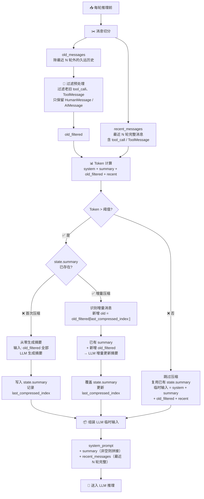
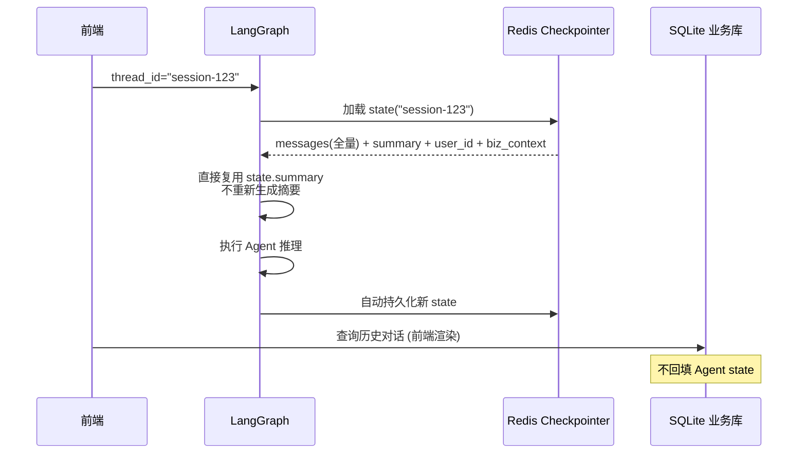
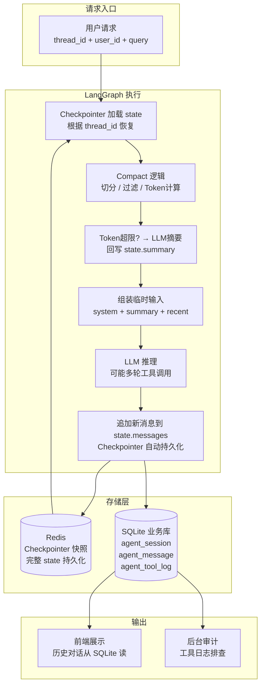

# LangGraph 客服 Agent Context 工程完整实施规格
> **归档状态**: ⏳ 待实施（2026-09-02 审计，依据 main 代码与 git 历史）
> 仅前置条件落地：PostgresSaver Checkpointer（lg_builder.py L491-494）。目标设计（Token 阈值触发压缩 / state.summary 独立字段 / last_compressed_index 增量 / keep_last_n）在代码零痕迹——memory/ 组件仍为轮次驱动旧实现（dced945 初始时代）。

> **用途**: 多轮 RAG-Agent 智能客服，解决长会话 Token 膨胀、上下文溢出、工具消息累积、服务重启会话恢复、对话归档  
> **技术栈**: LangGraph + PostgresSaver（已落地）+ PostgreSQL 业务库（现状）；本文方案原选型 RedisSaver + SQLite 业务库，**Checkpointer 选型已被 PostgresSaver 替代**（见 §3 更新）  
> **状态**: 设计规格，待实施（前置条件 Checkpointer 已就绪：PostgresSaver + PostgreSQL）  
> **关联文档**: [[PROJECT_ANALYSIS.md]] [[PLAN_GraphRAG_TO_StandardRAG.md]]

---

## 目录

1. [核心设计原则](#1-核心设计原则)
2. [State 结构设计](#2-state-结构设计)
3. [Checkpointer 配置](#3-checkpointer-配置)
4. [SQLite 业务数据库设计](#4-sqlite-业务数据库设计)
5. [Compact 上下文压缩逻辑](#5-compact-上下文压缩逻辑)
6. [会话重启恢复逻辑](#6-会话重启恢复逻辑)
7. [关键约束与避坑清单](#7-关键约束与避坑清单)
8. [验证方案](#8-验证方案)
9. [整体数据流](#9-整体数据流)
10. [与现有项目适配对照](#10-与现有项目适配对照)

---

## 1. 核心设计原则

### 原则一：两套存储职责分离

```
┌──────────────────────────────────────────────────────────────┐
│                     存储职责边界                              │
├────────────────────┬─────────────────────────────────────────┤
│  Redis (Checkpointer)│  SQLite (业务库)                       │
├────────────────────┼─────────────────────────────────────────┤
│ Agent 运行快照       │ 业务镜像                               │
│ Graph 会话恢复       │ 前端展示对话                           │
│ 完整消息 + 内部状态  │ 后台审计                               │
│ 禁止做业务查询       │ RAGAS 评测                             │
│                     │ 不作为 Agent 运行时数据源                │
└────────────────────┴─────────────────────────────────────────┘
```

**Checkpointer**：保存 Agent 运行快照，用于 Graph 会话恢复，完整保留全部消息与内部状态；禁止直接解析该存储做业务查询。

**SQLite 业务库**：业务镜像，用于前端展示对话、后台审计、RAGAS 评测；不作为 Agent 运行时数据源。

### 原则二：原始 State 只读原则

`state["messages"]` **永远保存完整原始消息流**。

- ✅ 压缩、过滤工具消息仅在构造 LLM 输入时生成内存临时副本
- ❌ 不修改、不删除 state 内部消息
- ❌ 不改动 Checkpoint 快照中的消息
- ❌ **禁止使用 `RemoveMessage` 删除历史消息**（会破坏会话断点恢复）

### 原则三：Token 阈值驱动压缩

不同于当前项目的**纯轮次驱动**（固定 `DEFAULT_RECENT_WINDOW=5`、`DEFAULT_MEDIUM_TURNS=10`），改为**纯 Token 阈值驱动**：

- 久远历史压缩为摘要存入独立 state 字段
- 保留最近 `keep_last_n` 轮完整原始消息（含 tool_result），保证 Agent 工具调用链路正常
- 唯一的压缩触发条件是 Token 超限，不做轮次兜底

### 原则四：检索侧、生成侧上下文解耦

```
检索侧：RAG 查询改写独立处理 → 改动的是检索入参，不改动 state
生成侧：Prompt 上下文压缩独立处理 → 改动的是 LLM 输入，不改动 state
```

两套逻辑互不干扰。

---

## 2. State 结构设计

继承 `MessagesState`；`thread_id` 不属于 state，放在 graph invoke 的 `config` 参数，由 Checkpointer 管理会话隔离。

```python
from langgraph.graph import MessagesState
from typing import Annotated, Optional
from langchain_core.messages import BaseMessage
from langgraph.graph.message import add_messages


class CustomerServiceAgentState(MessagesState):
    """
    MessagesState 内置字段:
        messages: Annotated[list[BaseMessage], add_messages]
        完整消息流：HumanMessage / AIMessage / ToolMessage
        只追加，禁止删除原始消息
    """

    summary: Optional[str]
    """长会话压缩摘要，compact 触发后回写；由 Checkpointer 持久化；不插入 messages 列表"""

    user_id: str
    """业务用户 ID，用于业务落库"""

    retrieved_docs: Optional[list[dict]]
    """本轮 RAG 检索文档，每轮覆盖，不累积"""

    turn_count: int
    """对话轮次计数器（仅用于日志/监控，不参与压缩触发判断）"""

    last_compressed_index: int
    """上次压缩时 messages 被压缩到的位置索引，用于增量压缩判断"""

    biz_context: Optional[dict]
    """业务元数据：订单 ID、账号信息等，按需注入 prompt"""

    need_transfer_human: bool
    """转人工标记"""
```

### 字段说明

| 字段 | 类型 | 写入时机 | 读取时机 | 说明 |
|------|------|---------|---------|------|
| `messages` | `list[BaseMessage]` | 每轮追加 | LLM 输入构造 | 完整会话消息流，使用 `add_messages` reducer 追加；**禁止使用 `RemoveMessage` 删除** |
| `summary` | `Optional[str]` | compact 触发时覆盖 | LLM 输入构造、会话恢复 | 久远对话压缩摘要，不加入 messages 数组 |
| `user_id` | `str` | 会话创建时 | 业务落库 | 业务用户 ID |
| `retrieved_docs` | `Optional[list[dict]]` | 每轮 RAG 检索后覆盖 | 本轮 LLM 输入 | 仅保存当前轮检索结果，每轮覆盖 |
| `turn_count` | `int` | 每轮递增 | 日志/监控 | 轮次计数器，仅用于日志和监控，不参与压缩触发判断 |
| `last_compressed_index` | `int` | compact 后更新 | compact 时读取 | 上次压缩时 messages 被压缩到的位置，用于识别增量消息 |
| `biz_context` | `Optional[dict]` | 按需注入 | prompt 组装 | 订单、会员等业务信息 |
| `need_transfer_human` | `bool` | 意图识别后 | 路由判断 | 转人工标记 |

---

## 3. Checkpointer 配置

### 禁止事项

```
❌ 生产禁止使用 InMemorySaver
   → 进程重启状态全部丢失，仅用于本地调试
```

### 生产选型（✅ 已落地：PostgresSaver）

| 方案 | 适用场景 | 本项目现状 |
|------|---------|:--------:|
| **RedisSaver** | 已有 Redis 基础设施 | 曾为推荐方案，因 PostgreSQL 为单一持久化来源而弃用 |
| PostgresSaver | 已有 PostgreSQL | ✅ **已落地**（`lg_builder.py` AsyncPostgresSaver + psycopg 连接池，lifespan 初始化） |

### RedisSaver 配置要点

```python
from langgraph.checkpoint.redis import RedisSaver

DB_URL = "redis://localhost:6379/0"
checkpointer = RedisSaver.from_conn_string(DB_URL)
```

**运行机制**：

```
graph.astream(input, config={"configurable": {"thread_id": "session-123"}})
  → Checkpointer 自动加载 thread_id="session-123" 的完整 state
  → 节点执行过程中 state 变更自动快照
  → graph 执行结束，最新 state 自动持久化到 Redis
```

**运维要求**：

| 事项 | 说明 |
|------|------|
| Redis 持久化 | 必须开启 RDB/AOF，防止 Redis 重启丢失全部会话 |
| Key 过期策略 | 配置合理 TTL，避免 Redis 无限膨胀 |
| 数据恢复 | Key 过期后 Agent 状态丢失，走 SQLite 业务库降级兜底 |
| 禁止业务查询 | Redis 内部序列化数据不做业务查询，业务查询全部走 SQLite |

### 与当前项目对比（现状已更新）

```
当前：PostgresSaver（PostgreSQL，已落地）
  → 服务重启无损恢复
  → 检查点与业务数据同一持久化来源（PostgreSQL）
  → 表：checkpoints / checkpoint_blobs / checkpoint_writes / checkpoint_migrations
  → 注意：子图禁用 checkpointer（Send map-reduce 序列化兼容，__pregel_checkpointer=None）

目标（本文档原方案）：RedisSaver
  → 服务重启无损恢复
  → Redis RDB/AOF 持久化
  → 生产可用
```

---

## 4. SQLite 业务数据库设计

### 设计定位

```
SQLite 职责：
  ✅ 前端对话历史展示
  ✅ 后台会话审计
  ✅ RAGAS 评测数据集
  ❌ 不作为 Agent 运行时数据源
  ❌ 正常会话恢复不回填 state（仅故障降级）
```

**适配说明**：SQLite 适合单机部署，多并发高并发场景后续迁移 MySQL/PostgreSQL。现状业务库为 **PostgreSQL**（`conversations` + `messages` 表已存在），若实施本文档方案无需新建 SQLite，直接复用现有表结构。

### 表结构设计

#### agent_session（会话主表）

| 字段 | 类型 | 说明 |
|------|------|------|
| `session_id` | TEXT PRIMARY KEY | 与 LangGraph `thread_id` 一一对应 |
| `user_id` | TEXT NOT NULL | 用户 ID |
| `create_time` | DATETIME DEFAULT CURRENT_TIMESTAMP | 会话创建时间 |
| `update_time` | DATETIME DEFAULT CURRENT_TIMESTAMP | 最后更新时间 |

```sql
CREATE TABLE IF NOT EXISTS agent_session (
    session_id TEXT PRIMARY KEY,
    user_id TEXT NOT NULL,
    create_time DATETIME DEFAULT CURRENT_TIMESTAMP,
    update_time DATETIME DEFAULT CURRENT_TIMESTAMP
);
```

#### agent_message（用户可见对话表）

仅存储用户可见内容，**不存储 tool 内部消息**。

| 字段 | 类型 | 说明 |
|------|------|------|
| `id` | INTEGER PRIMARY KEY AUTOINCREMENT | 自增主键 |
| `session_id` | TEXT NOT NULL | 关联会话 |
| `role` | TEXT NOT NULL | `user` / `assistant` |
| `content` | TEXT NOT NULL | 对话文本 |
| `create_time` | DATETIME DEFAULT CURRENT_TIMESTAMP | 时间 |

```sql
CREATE TABLE IF NOT EXISTS agent_message (
    id INTEGER PRIMARY KEY AUTOINCREMENT,
    session_id TEXT NOT NULL,
    role TEXT NOT NULL CHECK(role IN ('user', 'assistant')),
    content TEXT NOT NULL,
    create_time DATETIME DEFAULT CURRENT_TIMESTAMP,
    FOREIGN KEY (session_id) REFERENCES agent_session(session_id)
);

CREATE INDEX idx_agent_message_session ON agent_message(session_id, create_time);
```

#### agent_tool_log（工具日志表）

开发排查用，前端不展示。

| 字段 | 类型 | 说明 |
|------|------|------|
| `id` | INTEGER PRIMARY KEY AUTOINCREMENT | 自增主键 |
| `session_id` | TEXT NOT NULL | 会话 ID |
| `tool_call_id` | TEXT NOT NULL | 工具调用唯一 ID |
| `tool_name` | TEXT NOT NULL | 工具名称 |
| `tool_call_args` | TEXT | 调用参数 JSON |
| `tool_result` | TEXT | 工具返回原始 JSON |
| `create_time` | DATETIME DEFAULT CURRENT_TIMESTAMP | 时间 |

```sql
CREATE TABLE IF NOT EXISTS agent_tool_log (
    id INTEGER PRIMARY KEY AUTOINCREMENT,
    session_id TEXT NOT NULL,
    tool_call_id TEXT NOT NULL,
    tool_name TEXT NOT NULL,
    tool_call_args TEXT,
    tool_result TEXT,
    create_time DATETIME DEFAULT CURRENT_TIMESTAMP,
    FOREIGN KEY (session_id) REFERENCES agent_session(session_id)
);
```

### 落库规则

```
节点执行完成
  ├─ 最终 AIMessage（无 tool_calls）→ 增量写入 agent_message
  │   保存本轮用户提问 + 助手回答
  │
  └─ ToolNode 执行完成 → 写入 agent_tool_log
      保存 tool_call_id + tool_name + args + result
```

### SQLite 运维注意

| 事项 | 说明 |
|------|------|
| WAL 模式 | `PRAGMA journal_mode=WAL;` 提升并发读写 |
| 事务控制 | 避免长事务，及时 commit |
| JSON 字段 | 直接存 TEXT，读取时 `json.loads()` |
| 单机限制 | 多实例部署需迁移 MySQL/PostgreSQL（现状业务库即 PostgreSQL，无需迁移） |

---

## 5. Compact 上下文压缩逻辑

### 5.1 核心区别：Token 驱动 vs 轮次驱动

```
当前项目（纯轮次驱动）:
  触发: total_turns > 5 → 开始压缩
  保留: recent_window=5 轮完整原文
  压缩: 6-15轮 → 中等摘要(~200字), 16轮+ → 高层摘要(~100字)
  问题: 消息长度不一，短消息浪费 LLM 调用，长消息可能超预算

本规格（纯 Token 驱动）:
  触发: 输入 Token > 模型窗口 × 0.4 → 触发压缩
  保留: keep_last_n 轮完整原文（含 tool 消息）
  压缩: 超出 keep_last_n 的旧消息 → 生成单层摘要
  优势: 自适应消息长度，精确控制 Token 消耗，不因消息变短而浪费压缩调用
```

### 5.2 参数配置

统计对象：送入 LLM 的全部输入 Token

```
总量 = system_prompt + summary + 对话消息 + RAG 检索文档 + 工具返回结果
```

| 模型窗口 | 总窗口 | 触发压缩阈值 | 硬安全上限 |
|---------|--------|:----------:|:--------:|
| 8K | 8,192 | 3,500-4,000 | 6,000 |
| 32K | 32,768 | 16,000 | 24,000 |
| 128K | 131,072 | 64,000 | 96,000 |

> **阈值公式**: `模型最大上下文 × 0.4 ~ 0.5`，预留输出与工具调用 Buffer。

**辅助配置**: `keep_last_n = 3-5`，最近 N 轮完整保留原始消息（含 tool_call、tool_result）。

### 5.3 执行流程



### 5.4 关键规则

| 规则 | 说明 |
|------|------|
| **全部切分/过滤操作只在内存临时副本** | `state["messages"]` 保持原样 |
| **摘要不插入 messages** | 使用独立 `state.summary` 字段 |
| **首次压缩** | `state.summary` 为空时，从零生成：全部 `old_filtered` → LLM 摘要 |
| **增量压缩** | `state.summary` 已存在时，只处理新增部分：`已有摘要 + 新增 old` → LLM 更新 |
| **增量识别** | `new_old = old_filtered[last_compressed_index:]`，只取上次压缩后新变旧的消息 |
| **摘要复用** | 下一轮 Token 未超限，直接复用已有 summary，不调用摘要 LLM |
| **摘要覆盖** | 每次压缩完整覆盖 `state.summary`，而非拼接追加 |
| **recent_messages 不过滤** | 最近 N 轮保留完整 tool_call + ToolMessage，保证工具链路正常 |
| **last_compressed_index 追踪** | 压缩完成后更新为 `len(messages) - keep_last_n`，标记下次增量起点 |

### 5.5 RAG 检索侧上下文

检索 Query 改写独立处理，与 Prompt 压缩解耦：

```
检索侧（不改 state）:
  完整对话 → 查询改写 → 生成检索 query → RAG 检索 → 结果写入 state.retrieved_docs

生成侧（不改 state）:
  state.messages → 压缩 → 临时消息 → 送入 LLM
```

### 5.6 增量压缩核心逻辑

```python
KEEP_LAST_N = 5


def compact(state):
    """Token 阈值驱动的上下文压缩，增量更新。

    关键点:
    1. 只从 state.messages 读取原始消息，不修改
    2. 摘要写入独立 state.summary 字段，不插入 messages
    3. 首次从零生成，后续增量更新（避免重复压缩旧内容）
    4. last_compressed_index 追踪增量起点
    """
    messages = state["messages"]

    # ──── 1. 切分 ────
    old_messages = messages[:-KEEP_LAST_N]
    recent_messages = messages[-KEEP_LAST_N:]

    if not old_messages:
        return  # 对话太短，不压缩

    # ──── 2. 过滤旧消息中的 tool 消息 ────
    old_filtered = [
        m for m in old_messages
        if not isinstance(m, ToolMessage)
        and not (isinstance(m, AIMessage) and m.tool_calls)
    ]

    # ──── 3. Token 计算 ────
    total_tokens = count_tokens(system_prompt)
    total_tokens += count_tokens(state.get("summary", ""))
    total_tokens += count_tokens(format(old_filtered))
    total_tokens += count_tokens(format(recent_messages))
    total_tokens += count_tokens(state.get("retrieved_docs", []))

    if total_tokens <= TOKEN_THRESHOLD:
        # 不压缩，复用已有摘要
        return  # 临时输入 = system + summary + old_filtered + recent

    # ──── 4. 触发压缩 ────
    last_idx = state.get("last_compressed_index", 0)

    if state.get("summary") is None:
        # 首次压缩：从零生成
        summary = llm.invoke("""
            总结以下客服对话，保留:
            - 用户的核心诉求和偏好
            - 已确认的订单、商品、故障信息
            - 已做出的决策和承诺
            禁止复述工具名称、JSON 数据、API 返回内容。
        """, format(old_filtered))
    else:
        # 增量压缩：只处理新增部分
        new_old = old_filtered[last_idx:]
        if not new_old:
            return  # 没有新增，不必压缩
        summary = llm.invoke(f"""
            已有摘要：{state['summary']}

            新增对话：{format(new_old)}

            请将新增内容合并进已有摘要，更新为一份完整摘要。
            同样禁止复述工具名和 JSON 数据。
        """)

    # ──── 5. 回写 state ────
    state["summary"] = summary
    state["last_compressed_index"] = len(old_messages)
```

### 5.7 增量压缩效果对比

```
假设 50 轮对话，每轮 ~200 Token，keep_last_n=5，阈值 4000

轮次驱动（旧）:
  第 6 轮起每次都做三层压缩 → 约 45 次 LLM 压缩调用
  每次输入 ~9000 Token → 总消耗 ~405K Token

Token 驱动 + 增量（新）:
  第 20 轮首次触发（~4400 Token） → 1 次从零生成
  第 35 轮再次触发 → 1 次增量更新（仅新增~15轮）
  第 50 轮再次触发 → 1 次增量更新（仅新增~15轮）
  → 总共 3 次压缩，每次输入~2000 Token → 总消耗 ~6K Token

节省: ~98.5% 的压缩 Token 消耗
```

---

## 6. 会话重启恢复逻辑

### 场景 1：Checkpointer（Redis）数据完好



### 场景 2：Checkpointer 数据丢失（Redis 清空/故障）

```
损失:
  ❌ Agent 内部状态全丢
  ❌ ToolMessage 全丢
  ❌ summary 摘要全丢
  → 无法无损恢复会话

降级方案:
  1. 读取 SQLite agent_message 表历史对话
  2. 新建 thread_id
  3. 历史对话作为新会话初始输入

代价:
  ⚠️ 丢失全部工具调用上下文
  ⚠️ 依赖历史工具结果的问答会异常
  ⚠️ 仅作为故障兜底
```

---

## 7. 关键约束与避坑清单

| 编号 | 约束 | 严重程度 | 当前项目状态 |
|:----:|------|:--------:|:-----------:|
| 1 | ❌ 生产禁止使用 `InMemorySaver` | 🔴 致命 | **已解决**（PostgresSaver 已落地，见 §3） |
| 2 | ❌ 不要修改/删除 `state["messages"]` 原始消息 | 🔴 致命 | 当前未修改 |
| 3 | ❌ 不要解析 Checkpointer 内部序列化数据做业务查询 | 🟡 重要 | 当前用 PostgresSaver（已符合） |
| 4 | ❌ 不要把摘要作为消息追加进 messages 列表 | 🟡 重要 | 当前以 SystemMessage 追加（待改） |
| 5 | ❌ 不要将业务库对话记录回填 state 做正常会话恢复 | 🟡 重要 | N/A |
| 6 | ✅ 阈值不要贴近模型最大窗口 | 🟡 重要 | 当前 TokenBudget=8000 偏低 |
| 7 | ✅ 业务库单机限制，多实例需迁移 | 🟢 注意 | 业务库已为 PostgreSQL（conversations/messages 表） |

---

## 8. 验证方案

### 8.1 功能验证

| 测试用例 | 验证点 | 通过标准 |
|---------|--------|---------|
| 短会话（低 Token） | Token < 阈值，不触发压缩 | messages 完整保留 |
| 长会话（高 Token） | Token > 阈值，触发 compact | state.summary 非空，messages 不变 |
| 摘要复用 | Token 再次未超限 | 不重复调用摘要 LLM，复用已有 summary |
| 跨工具调用会话 | recent_messages 含 tool 消息 | 工具调用链路正常 |
| 服务重启 + Redis 正常 | 会话恢复 | summary + messages 完整恢复 |
| 服务重启 + Redis 丢失 | 降级恢复 | SQLite 历史对话加载成功 |
| RAG 检索 + 压缩并行 | 两套逻辑互不干扰 | 检索结果正确，压缩不影响检索 |

### 8.2 质量验证

构造多轮依赖历史信息的客服测试用例：

1. **对比开启/关闭 compact 压缩前后的 `answer_correctness` 指标**
2. **问题定位矩阵**：

| 现象 | 原因 | 修复 |
|------|------|------|
| 指标下降 | 摘要丢失业务信息 | 优化摘要 Prompt，或调大 `keep_last_n` |
| 出现幻觉 | Token 阈值过高 | 检查老旧 tool 消息是否完成过滤 |
| 回复偏题 | 摘要覆盖了错误信息 | 检查 `compress_high` 的 `previous_summary` 合并逻辑 |

---

## 9. 整体数据流



---

## 10. 与现有项目适配对照

| 维度 | 当前实现 | 目标规格 | 改造动作 |
|------|---------|---------|---------|
| **Checkpointer** | `PostgresSaver`（已落地，lg_builder.py AsyncPostgresSaver） | 持久化 Checkpointer（原方案 RedisSaver） | 已就绪，无需替换 |
| **记忆管理** | 三层轮次驱动 + Token 预算 | Token 阈值驱动 compact（单层摘要） | 重写 `MemoryManager` → `CompactManager` |
| **摘要存储** | SystemMessage 插入 messages | 独立 `state.summary` 字段 | State 增加字段，Prompt 注入逻辑调整 |
| **Tool 消息过滤** | 未处理 | compact 时过滤老旧 tool 消息 | compact 流程中增加过滤器 |
| **业务库** | PostgreSQL (只存 user→conversation→message) | 增加 tool_log | 新增 `agent_tool_log` 表 |
| **会话恢复** | PostgresSaver 持久化恢复 | 持久化恢复（原方案 SQLite 降级） | 恢复逻辑实现（Checkpointer 已满足） |
| **RAG 上下文** | 查询预处理管道（5步，⚠️ 已删除 2026-08-21，主链路以入口消解后问题直进子图，见 SPEC_REMOVE_QUERY_PREPROCESSING.md） | 保持不变 + 与 compact 解耦 | 无冲突，独立运行 |
| **State 字段** | 当前 `AgentState` | 增加 `summary`/`biz_context`/`need_transfer_human` | State 扩展 |

### 实施优先级建议

| 优先级 | 改造项 | 工时 | 原因 |
|:------:|--------|:----:|------|
| P0 | MemorySaver → RedisSaver | 1h | 解决重启丢状态 |
| P1 | 摘要独立字段 + 不插入 messages | 2h | 影响 compact 质量 |
| P1 | Token 阈值驱动 compact | 4h | 替换固定轮次驱动 |
| P2 | 增加 agent_tool_log 表 | 1h | 开发排查 |
| P2 | 工具消息过滤 | 2h | 减少老旧 tool 消息膨胀 |
| P3 | 会话降级恢复 | 3h | 故障兜底 |
| P3 | biz_context 注入 | 2h | 减少业务信息重复塞入 messages |

---

> **文档版本**: 1.0  
> **关联文档**: `PROJECT_ANALYSIS.md`、`PLAN_GraphRAG_TO_StandardRAG.md`
